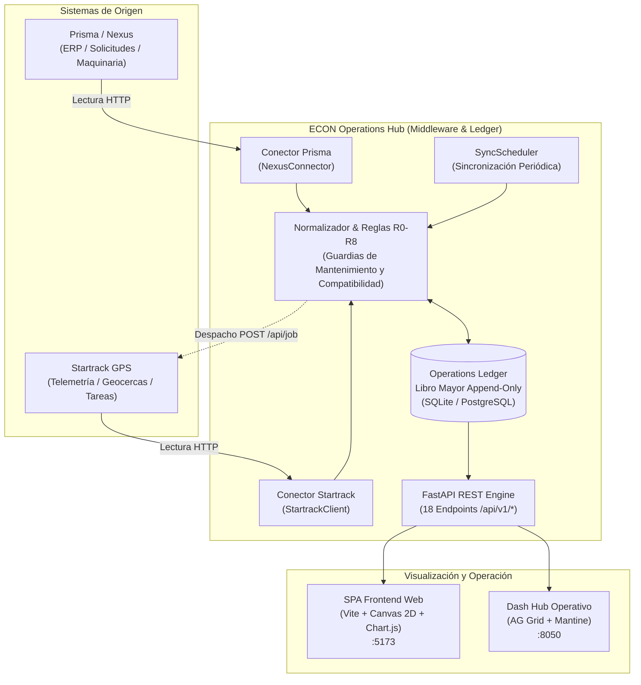
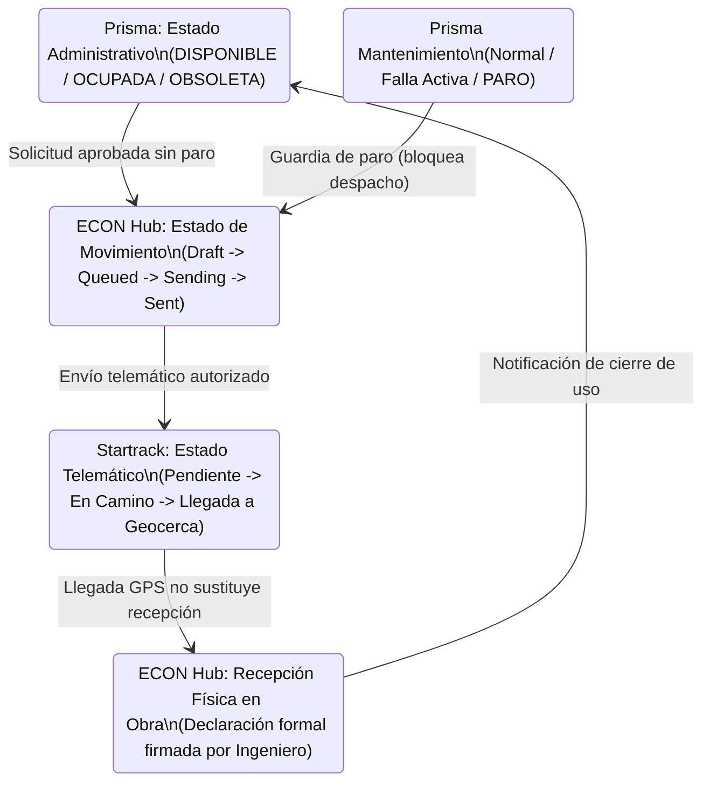

# Dossier Oficial de Entregables · Hackathon Grupo ECON 2026
**Proyecto**: ECON Operations Hub  
**Equipo**: Los Filósofos  
**Fecha límite de entrega**: Domingo 13 de Septiembre, 10:00 AM  
**Repositorio Oficial**: [https://github.com/Los-Filosofos/econ-operations](https://github.com/Los-Filosofos/econ-operations)  

---

## 🎙️ EL PITCH: "El Sistema Nervioso Operativo de Grupo ECON"
*(Guión de 3 minutos de alto impacto, diseñado para convencer al CFO/Gerente General y al Arquitecto de Software/CTO)*

### 1. El Dolor (Visión de Negocio - Non-Tech)
> "En este momento, en el ERP **Prisma**, un cargador frontal de $150,000 aparece en el sistema como **'OCUPADO'** y facturando en un proyecto en La Unión. Pero si entras a la plataforma GPS **Startrack**, la tarea de transporte finalizó hace dos días... y si llamas a la obra, el ingeniero te dice que la máquina está tirada en un predio porque nadie firmó la recepción física, o peor: tiene una falla mecánica crítica de motor que Mantenimiento anotó pero Logística nunca vio.
> 
> En Grupo ECON, **Proyectos, Logística y Mantenimiento operan como tres islas ciegas**. Saber dónde está la maquinaria pesada y si realmente está produciendo cuesta horas de llamadas, WhatsApps, fletes en vano y disputas de costos."

### 2. La Solución y la Verdad Técnica (Tech & Non-Tech)
> "No venimos a pedir que tiren a la basura Prisma ni que reprogramen Startrack. Construimos **ECON Operations Hub**: una plataforma de interoperabilidad y gobernanza operativa que **se come los datos de ambos sistemas, los normaliza con rigor matemático y los pone a trabajar sincronizados en tiempo real**.
> 
> A diferencia de prototipos ingenuos que asumen que *'si el GPS se movió, la máquina está trabajando'*, ECON aplica un principio inquebrantable de **evidencia comprobada**:
> - **Grafo Operativo en Tiempo Real**: Un lienzo interactivo que mapea proyectos, máquinas y traslados con su estado real.
> - **Recomendador Inteligente de Maquinaria**: Cuando una obra solicita un equipo, ECON analiza compatibilidad exacta de clase, disponibilidad administrativa, ausencia de paros mecánicos y cercanía, recomendando la máquina óptima sin tocar Prisma a ciegas.
> - **8 Fichas de SLA y Control Operativo**: Métricas por fila auditables (tiempos de aprobación, vencimientos de uso, tareas completadas sin recepción formal) con matriz RACI asignada."

### 3. El Cierre
> "Para el equipo de TI: son 18 endpoints REST, un libro mayor (*ledger*) auditable, arquitectura desacoplada y 616 pruebas automatizadas aprobadas.
> Para la Dirección: visibilidad total del activo más costoso de la empresa y cero dinero perdido en suposiciones.
> 
> **ECON Operations Hub no es un visor más: es la infraestructura de certeza que Grupo ECON necesita.**"

---

## 1. Matriz de Mapeo de Campos (Prisma ↔ Startrack)

Conexión técnica entre el modelo de lectura de Prisma (`/api/maquinaria/*`) y el contrato de tareas de Startrack (`/api/job`), identificando explícitamente aquellos campos **sin equivalente directo**:

| Campo Prisma (Origen) | Modelo ECON (Normalizado) | Campo Startrack (Destino) | Tratamiento | Equivalencia / Justificación Técnica |
| :--- | :--- | :--- | :--- | :--- |
| `Request.id` | `RequestRecord.id` | `job.description` | **Transformado** | Embebido en la descripción (`Solicitud Prisma: {id}`) para garantizar trazabilidad bidireccional sin alterar IDs numéricos de Startrack. |
| `Request.machinery_type` | `RequestRecord.machinery_type` | `job.objective` | **Transformado** | Concatenado en el título de la tarea: `"Traslado de {asset_number} a {project_name}"`. |
| `Request.starts_on` | `RequestRecord.starts_on` | `job.start_date` | **Manual / Derivado** | **No hay equivalente directo**: El inicio de uso solicitado no es la fecha de transporte; se requiere programación de Logística. |
| `Equipment.asset_number` | `EquipmentRecord.asset_number` | `job.objective` | **Transformado** | Etiqueta operativa visible para el transportista. |
| `Project.id` | `RequestRecord.project_id` | `job.poi_id` | **Mapeado** | Correspondencia a la geocerca de destino (`POI-PROY-014`). |
| `Equipment.worker_code` | `EquipmentRecord.operators[]` | `job.assigned_user_ids` | **Mapeado** | Solo cuando el código MOT de Prisma tiene usuario registrado en Startrack; nunca por coincidencia de nombres. |
| `Equipment.machinery_status` | `EquipmentRecord.machinery_status` | *(Ninguno)* | **Sin equivalente** | Estado administrativo de ERP (`DISPONIBLE`, `OCUPADA`); no viaja a Startrack porque el transportista no administra el inventario. |
| `Equipment.project_rate` | `EquipmentRecord.project_rate` | *(Ninguno)* | **Sin equivalente** | Dato económico confidencial de Grupo ECON; no se expone a proveedores telemáticos externos. |
| `Equipment.active_failure_id` | `EquipmentRecord.maintenance_failure_id` | *(Ninguno)* | **Sin equivalente** | Diagnóstico interno de Mantenimiento; se usa en ECON como regla de guardia (*guard*) para impedir traslados. |
| *(No provisto en Prisma)* | `TransferMapping.comments` | `job.form_ids` / `required_form_ids` | **Sin equivalente** | Formularios dinámicos en app móvil de Startrack; opcionales en el prototipo. |

> **Archivos entregables disponibles en el repositorio**:
> - Hoja de cálculo completa: [`output/matrices/matrices-econ.xlsx`](file:///home/chelo/antigravity/ECON/econ-operations/output/matrices/matrices-econ.xlsx) (Pestaña: *formulario-tarea-completo*).
> - Archivo estructurado CSV: [`output/matrices/formulario-tarea-completo.csv`](file:///home/chelo/antigravity/ECON/econ-operations/output/matrices/formulario-tarea-completo.csv).
> - Diccionario técnico de datos: [`docs/diccionario-modelo-econ.md`](file:///home/chelo/antigravity/ECON/econ-operations/docs/diccionario-modelo-econ.md).

---

## 2. Matriz de Responsabilidades (RACI)

Estructurada conforme a los estándares de gobernanza para las tres gerencias clave (**Mantenimiento**, **Logística y Equipos**, **Técnica de Proyectos**) más **Control de Costos**:

| Decisión o Evento Operativo | Gerencia Técnica de Proyectos | Gerencia de Logística y Equipos | Gerencia de Mantenimiento | Control de Costos / Finanzas |
| :--- | :---: | :---: | :---: | :---: |
| **1. Solicitud de Maquinaria**: Tipo de equipo, obra destino y período de uso requerido | **R / A** | C | I | I |
| **2. Aprobación y Asignación de Unidad**: Selección de unidad física, operador y tarifa en Prisma | C | **R / A** | C | I |
| **3. Consulta de Sugerencias ECON**: Recomendación algorítmica de unidades elegibles (sin paro, clase exacta) | C | **R / A** | C | I |
| **4. Programación del Traslado**: Selección de POI de destino, vehículo transportador y fecha/hora de despacho | I | **R / A** | C | I |
| **5. Habilitación Técnica y Envío**: Validación de guardias (sin paro activo) y creación de tarea en Startrack | I | **R / A** | C | I |
| **6. Ejecución y Telemetría en Ruta**: Seguimiento GPS del traslado y confirmación de llegada a geocerca | I | **R / A** | I | I |
| **7. Paro Operativo y Diagnóstico**: Registro de falla mecánica y orden de paro que inhabilita la unidad | I | C | **R / A** | I |
| **8. Recepción Física en Obra**: Verificación en sitio y declaración formal de entrega (`receipt`) | **R / A** | C | I | I |
| **9. Liquidación Económica Posterior**: Auditoría de horas de uso reales vs períodos solicitados | C | C | I | **R / A** |

*Leyenda*: **R** = Responsable de ejecutar la acción | **A** = Quien Aprueba y responde por el resultado | **C** = Consultado previamente | **I** = Informado del resultado.

> **Archivos entregables disponibles en el repositorio**:
> - Archivo estructurado CSV: [`output/matrices/raci-propuesta.csv`](file:///home/chelo/antigravity/ECON/econ-operations/output/matrices/raci-propuesta.csv).
> - Manifiesto y tabla integrada en: [`output/matrices/matrices-econ.xlsx`](file:///home/chelo/antigravity/ECON/econ-operations/output/matrices/matrices-econ.xlsx).

---

## 3. Prototipo Navegable & Guía de Demostración en Vivo

El sistema ofrece dos modalidades de interfaz conectadas a la misma API REST backend:
1. **Frontend Web Moderno (SPA Vite + Canvas 2D + Chart.js)** en el puerto `5173`.
2. **Consola Analítica Unificada (FastAPI + Dash Mantine)** en el puerto `8050`.

### Instrucciones de Arranque Rápido
```bash
# 1. Clonar el repositorio
git clone https://github.com/Los-Filosofos/econ-operations.git
cd econ-operations

# 2. Iniciar el Backend (FastAPI en puerto 8050)
uv run --directory apps/api uvicorn app.main:app --host 127.0.0.1 --port 8050

# 3. Iniciar el Frontend Web (Vite en puerto 5173)
cd frontend
npm install
npm run dev -- --host 127.0.0.1 --port 5173
```

### Accesos para el Jurado
- **Frontend SPA**: `http://localhost:5173/` (Sin autenticación requerida en modo evaluación).
- **Backend API & Swagger interactivo**: `http://localhost:8050/docs`
- **Dashboard Integrado**: `http://localhost:8050/` (Credenciales demo: usuario `admin`, clave `admin123456` si `AUTH_REQUIRED=true`).

### Consulta Unificada: Estado y Ubicación Combinando Ambas Plataformas
Para verificar en un solo llamado el estado administrativo (Prisma) y la ubicación/traslado telemático (Startrack):
- **En la Interfaz**: Acceder a `http://localhost:5173/#/maquinaria` o hacer click en cualquier máquina en el **Grafo Operativo** (`http://localhost:5173/#/`).
- **Por API (cURL)**:
```bash
# Consulta unificada de grafo con identidades combinadas:
curl -s "http://localhost:8050/api/v1/graph?mode=fixture" | jq '.nodes[] | select(.kind=="machine")'

# Consulta unificada de la traza de traslado de una solicitud:
curl -s "http://localhost:8050/api/v1/integration/nexus:request:46d2573e-08d3-4855-971d-2fbf9564e135?mode=fixture" | jq '{solicitud: .request_label, maquinaria: .equipment_label, etapas: [.stages[] | {etapa: .title, estado: .state}]}'
```

---

## 4. Diagrama de Arquitectura y "Dónde Vive Cada Estado"

### Arquitectura de Componentes y Flujo de Datos


### Ubicación de los Estados del Equipo ("Dónde Vive Cada Estado")


> **Diagramas vectoriales de alta resolución generados**:
> - `docs/assets/entregables/diagrama-actual.svg` / `.png`
> - `docs/assets/entregables/diagrama-estados.svg` / `.png`
> - `docs/assets/entregables/diagrama-proceso.svg` / `.png`
> - `docs/assets/entregables/diagrama-sincronizacion.svg` / `.png`

---

## 5. Documento de Decisiones Técnicas (Resumen Ejecutivo)

*Documento formal de 2 páginas exportado a PDF en [`output/pdf/ECON-decisiones-tecnicas.pdf`](file:///home/chelo/antigravity/ECON/econ-operations/output/pdf/ECON-decisiones-tecnicas.pdf).*

### Principales Definiciones Técnicas:
1. **Identidad Estricta por Fuente**: Preservación de UUIDs de Prisma e IDs numéricos de Startrack. Queda prohibido unificar registros por coincidencia aproximada de nombres o matrículas no validadas.
2. **Desacoplamiento de Estados**: "Ocupada" (administrativo) y "Completada" (tarea telemática) coexisten sin contradecirse; representan dimensiones distintas de la realidad.
3. **Guardias de Mantenimiento**: Una unidad con paro operativo (`active_failure_is_paro = true`) bloquea automáticamente la creación de traslados en ECON.
4. **Campos Fuera de Alcance Justificados**:
   - *Ventanas horarias y plazos límite*: No existen en la API pública de Startrack (`/api/job`).
   - *Tarifas por hora*: Datos financieros internos confidenciales.
   - *Tiempo muerto por velocidad cero*: Una excavadora estática puede estar operando su pluma o en ralentí; medir inactividad por GPS induce a errores de liquidación.
5. **Idempotencia y Resiliencia**: El libro mayor local utiliza transacciones atómicas. Ante fallos de red con Startrack, el sistema concilia por relectura antes de reenviar peticiones POST duplicadas.

---

## 6. Índice de Reportes PDF Oficiales Listos para Entrega

| Documento | Ubicación en el Repositorio | Páginas | Descripción |
| :--- | :--- | :---: | :--- |
| **Decisiones Técnicas** | [`output/pdf/ECON-decisiones-tecnicas.pdf`](file:///home/chelo/antigravity/ECON/econ-operations/output/pdf/ECON-decisiones-tecnicas.pdf) | 2 | Alcance, mapeo selectivo, justificación de exclusiones y arquitectura de resiliencia. |
| **Dossier Visual y Diagramas** | [`output/pdf/ECON-entregables-visuales.pdf`](file:///home/chelo/antigravity/ECON/econ-operations/output/pdf/ECON-entregables-visuales.pdf) | 16 | Diagramas de proceso, flujos de sincronización, estados del equipo y gráficas de cobertura. |
| **Manual de Mapeo y Diccionario** | [`output/pdf/ECON-diccionario-mapeo-y-manual-integracion.pdf`](file:///home/chelo/antigravity/ECON/econ-operations/output/pdf/ECON-diccionario-mapeo-y-manual-integracion.pdf) | 34 | Diccionario completo de datos, inventario de entidades y manual de procedimientos. |
| **Libro de Matrices en Excel** | [`output/matrices/matrices-econ.xlsx`](file:///home/chelo/antigravity/ECON/econ-operations/output/matrices/matrices-econ.xlsx) | 17 Hojas | Mapeo exhaustivo campo por campo, matriz RACI, glosario de términos y trazabilidad. |
