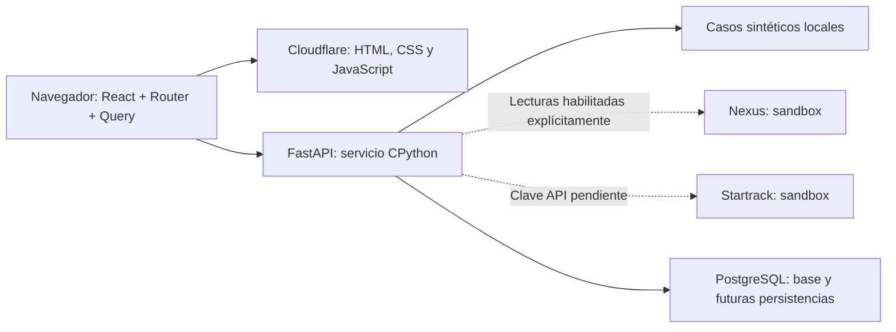

# ADR 0001 — Plataforma web del Hub de Operaciones

> Registro anterior a la migración solicitada a Dash. La arquitectura vigente
> está en [ADR 0003](0003-python-dash-hub.md). Las observaciones de negocio
> y los límites de integración se conservan con su fecha original.

Estado: aceptada para esta etapa. Fecha: **12 de septiembre de 2026**.

La [ADR 0002](0002-analytics-interface.md) amplía esta decisión desde la perspectiva de análisis de datos: React/FastAPI, Dash, Streamlit y herramientas de BI.

## Decisión

Usar **React + TypeScript + Vite**, **TanStack Router** para navegación, **TanStack Query** para consultas y **shadcn/ui con preset `b0`** para componentes. El frontend vive en `apps/web`; FastAPI, SQLModel, Alembic y PostgreSQL permanecen en `apps/api`. Cada aplicación conserva su propio archivo de dependencias bloqueadas.

El destino web es **Cloudflare Workers Static Assets**. FastAPI utiliza CPython en un servicio o contenedor con una URL HTTPS propia. La interfaz consume su contrato HTTP. No se implementan cuentas, login ni sesiones de usuarios del hub en esta etapa; la autenticación ante proveedores pertenece exclusivamente al backend.

## Contexto

El producto es un panel operativo navegable que relaciona maquinaria, solicitudes, traslados y mantenimiento. El trabajo actual requiere búsqueda, filtros, estados de carga/error, procedencia y relaciones pendientes. No se ha identificado una necesidad de SEO, renderizado en servidor o funciones de servidor en TypeScript. FastAPI ya contiene la frontera de integración con los proveedores.

Vite y TanStack Start no son alternativas del mismo nivel: Vite construye la aplicación; Start añade un framework completo y puede utilizar Vite. Router y Query se pueden usar directamente en una SPA. La documentación de Start describe SSR, streaming, rutas y funciones de servidor, y contempla Router por separado cuando no se necesitan esas capacidades. [TanStack Start: alcance y elección](https://tanstack.com/start/latest/docs/framework/react/overview).

## Alternativas evaluadas

| Alternativa | Qué aporta | Encaje en este proyecto |
| --- | --- | --- |
| **React + Vite + Router + Query** | Navegación y consultas desde el navegador; compilación estática independiente de FastAPI | Elegida: cubre el panel actual y deja una sola API de negocio |
| **TanStack Start sobre Vite** | Router más SSR, streaming y funciones/rutas de servidor; Cloudflare documenta su plugin y entrada de Worker | Válida si aparecen necesidades de SSR o una capa de servidor web; hoy introduciría un segundo runtime de aplicación sin requisito concreto |
| **Next.js en Cloudflare** | Convenciones full stack, renderizado en servidor y componentes de servidor; requiere elegir la ruta de compatibilidad de Cloudflare | Válida, pero esas funciones no justifican cambiar el panel ni el backend existentes |

Cloudflare documenta tanto [React + Vite](https://developers.cloudflare.com/workers/framework-guides/web-apps/react/) como [TanStack Start](https://developers.cloudflare.com/workers/framework-guides/web-apps/tanstack-start/). Esta elección responde al alcance de ECON; no es una comparación de rendimiento.

**Precisión temporal:** la guía de Cloudflare consultada hoy recomienda **vinext** para nuevas aplicaciones Next.js en Workers; lo identifica como beta y pide revisar compatibilidad. Vinext reimplementa la superficie de API de Next.js sobre Vite. No sería correcto presentar OpenNext como la única vía o la recomendación principal actual. [Next.js en Cloudflare](https://developers.cloudflare.com/workers/framework-guides/web-apps/nextjs/).

**OpenNext** continúa documentado para aplicaciones existentes que necesitan esa ruta: adapta la salida de `next build` para Workers y tiene sus propias limitaciones de compatibilidad. No se instala en este repositorio. [Guía oficial de OpenNext](https://developers.cloudflare.com/workers/framework-guides/web-apps/opennext/).

## Consecuencias

El navegador administra la navegación y consulta FastAPI; los estados de carga, error, falta de configuración y ausencia de relaciones son parte del producto. La clave de caché debe distinguir modo de datos y filtros. Un fallo en la consulta real nunca se convierte silenciosamente en datos de demostración.

La plantilla shadcn utilizada es `vite`, inicializada con el preset `b0` solicitado. La opción `start` habría creado TanStack Start y su capa de servidor. Los componentes generados se versionan; no hace falta ejecutar de nuevo el inicializador para trabajar con la aplicación.

En la revisión posterior del mismo día, el usuario pidió personalizar esa base con superficies más cuadradas y la identidad de ECON. Ese cambio de tokens, tipografía y composición no cambia la elección de Vite ni de Base UI. La [arquitectura del frontend](../frontend-architecture.md) documenta el tema y la separación de componentes; la [investigación de manuales](../investigacion-manuales-y-diseno.md) explica el recorrido operativo.

El diagrama separa destinos y dependencias. La disponibilidad de PostgreSQL no implica que ya exista sincronización persistente del hub. La [revisión de contexto](../revision-contexto.md) distingue lo construido de lo pendiente.

Cloudflare sí admite FastAPI en Python Workers. Ese soporte no demuestra compatibilidad directa del conjunto SQLModel/psycopg y sus conexiones actuales: los paquetes y clientes HTTP tienen restricciones de WebAssembly y asincronía. Se conserva el runtime convencional hasta validar una migración específica. [FastAPI en Python Workers](https://developers.cloudflare.com/workers/languages/python/packages/fastapi/), [paquetes soportados](https://developers.cloudflare.com/workers/languages/python/packages/).

Reabrir esta decisión si se requiere SSR, funciones de servidor web, unificación del backend en TypeScript o despliegue exclusivo de todos los servicios dentro de Workers. Los pasos de ejecución y publicación están en [desarrollo](../desarrollo.md) y [Cloudflare](../deploy-cloudflare.md).
