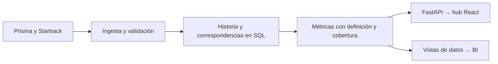

# ADR 0002 — Interfaz operativa, Python y herramientas de BI

> Registro anterior a la migración solicitada a Dash. La arquitectura vigente
> está en [ADR 0003](0003-python-dash-hub.md). Las observaciones de negocio
> y los límites de integración se conservan con su fecha original.

Fecha: **12 de septiembre de 2026**. Estado: se mantiene la plataforma del hub definida en ADR 0001; incorporar BI es una alternativa de evolución, no un despliegue autorizado ni implementado.

## Decisión para el alcance actual

Conservar **React + FastAPI** para la consulta operativa integrada de ECON. Evaluar una herramienta de **BI** sobre datos comunes si el objetivo principal pasa a ser que analistas o gerencias creen y exploren reportes sin programar cada pantalla. La elección depende del trabajo del usuario y de quién mantendrá el producto, no del hecho de que el procesamiento use Python.

El [brief y los casos](../analitica-decisiones.md) combinan consulta de registros, relaciones entre plataformas, restricciones y evidencia. Para ese recorrido la interfaz personalizada resulta apropiada. Si el requisito se redujera a reportes mensuales, filtros y comparaciones, construir todo desde React requeriría justificar el trabajo adicional frente a BI.

## Alternativas

| Opción | Encaje propuesto | Coste de mantenimiento o condición |
| --- | --- | --- |
| React + FastAPI | Hub con navegación y detalle adaptados a solicitudes, unidades, tareas, mantenimiento y evidencia | Mantener aplicación web y API; los gráficos y recorridos se desarrollan en código |
| Dash | Aplicación analítica mantenida por un equipo principalmente Python, con gráficos Plotly y cálculos interactivos | Diseñar callbacks, caché y trabajos largos; requiere un servicio Python activo |
| Streamlit | Exploración interna, validación de hipótesis y herramientas de analistas construidas rápidamente en Python | Entender reruns, estado de sesión y caché; los fragments permiten actualizar partes independientes |
| Power BI / Metabase / Superset | Reportes, exploración de indicadores y construcción de visualizaciones por analistas | Preparar un modelo de datos fiable y evaluar operación, acceso, licencias y capacidades del equipo; no se presupone que ECON ya use alguno |

Esta tabla expresa nuestro juicio de encaje, no un benchmark. La documentación de [Dash](https://dash.plotly.com/layout) muestra componentes configurados en Python y una interfaz basada en React. Sus [guías de rendimiento](https://dash.plotly.com/performance) incluyen caché, actualizaciones parciales y callbacks en segundo plano: elegir Python no elimina la necesidad de diseñar el procesamiento.

[Streamlit](https://docs.streamlit.io/develop/concepts/architecture/caching) documenta caché de datos y recursos; sus [fragments](https://docs.streamlit.io/develop/concepts/architecture/fragments) permiten reruns parciales. Es una opción válida para aplicaciones internas; la decisión debe considerar el tipo de interacción y el equipo responsable, sin descalificarla como una herramienta solo de demostración.

[Power BI](https://learn.microsoft.com/en-us/power-bi/fundamentals/power-bi-overview), [Metabase](https://www.metabase.com/docs/latest/questions/introduction) y [Superset](https://superset.apache.org/) ofrecen creación y exploración de visualizaciones. Superset [consulta una base SQL existente](https://superset.apache.org/user-docs/using-superset/creating-your-first-dashboard/), no reemplaza el almacenamiento de los datos empresariales. No se instalaron estas herramientas ni se analizaron todavía los costes concretos para ECON.

## Capacidad de análisis y gráficos

Python/SQL pueden preparar agregaciones, percentiles, comparaciones y modelos, y la API puede entregar resultados a React. React Query administra solicitudes y caché de la interfaz; no es el motor analítico. [FastAPI](https://fastapi.tiangolo.com/features/) expone contratos HTTP basados en OpenAPI y JSON Schema, sin exigir un framework particular de frontend.

Se utiliza Recharts para las barras y columnas actuales. Una necesidad posterior de visualización estadística más especializada puede evaluarse con [Plotly para React](https://plotly.com/javascript/react/) sin migrar toda la aplicación a Dash. La disponibilidad de una librería no demuestra rendimiento para cualquier tamaño de datos: hay que medir volumen, cardinalidad, concurrencia y frecuencia de actualización reales.

Para una serie de 30 días, la API debería entregar los puntos o agregados necesarios, junto con población, cobertura y corte. Los millones de observaciones subyacentes, si llegan a existir, deben procesarse en la capa de datos. Paginación, agregación y reducción de puntos conservando extremos dependen del análisis; no basta con cambiar el componente que dibuja.

## Evolución de datos propuesta

Este diagrama es una **propuesta futura**. Hoy existe una proyección de lectura acotada y ejemplos, sin ingesta histórica persistente ni conexión de BI. Las reglas operativas de elegibilidad pertenecen a la API. Las agrupaciones visuales de una respuesta pequeña pueden resolverse mediante selectores puros; una métrica corporativa compartida debe tener una definición común en la capa de datos/API.

La prioridad antes de prometer tendencias es confirmar IDs y catálogos, obtener lecturas autorizadas completas para el ámbito, conservar eventos o cortes comparables y definir métricas con las áreas. El diseño visual recargado se corrige en la interfaz; cambiar de framework no produce historia ni mejora por sí solo la interpretación.

## Cuándo reconsiderar

- ECON requiere principalmente reportes que sus analistas puedan crear: priorizar una prueba acotada de BI con una pregunta y un conjunto representativo.
- El equipo que mantendrá la aplicación trabaja casi exclusivamente en Python y necesita cálculos interactivos: comparar un recorrido real en Dash con el coste de mantener React.
- Predomina exploración o experimentación interna: evaluar Streamlit con caché, sesiones y concurrencia representativas.
- El hub conserva el recorrido operativo y necesita reportes gerenciales adicionales: compartir el modelo de datos entre la aplicación y BI, evitando dos definiciones de un mismo indicador.

Mantener el despliegue actual: frontend estático en Cloudflare y backend Python Docker aparte. Dash y Streamlit introducirían una aplicación Python servida dinámicamente; no serían un reemplazo directo del artefacto estático de Vite.
