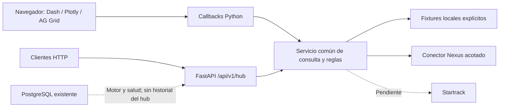

# ADR 0003 — Hub Python con Dash y FastAPI

Fecha: **12 de septiembre de 2026**. Estado: **aceptada e implementada** por
solicitud expresa del usuario. Reemplaza la interfaz de ADR 0001 y ADR 0002.

## Decisión

El usuario quiere completar un hub de análisis operativo en una hackathon y
prefiere Python para tablas y gráficos. No requiere conservar la plantilla
React. Se elige **Dash con FastAPI nativo**, Plotly y Dash AG Grid Community,
todos en `apps/api`. Se reduce el número de aplicaciones y herramientas;
no se afirma un ahorro de horas medido ni mayor capacidad por cambiar framework.

Versiones resueltas en el lockfile: Dash 4.4.1, Plotly 6.9.0 y Dash AG Grid
35.3.0. Dash documenta FastAPI nativo y ejecución con Uvicorn:
[Server backends](https://dash.plotly.com/server-backends).

## Implementación y consecuencias

Se conservan objetos, IDs, procedencia, nulabilidad y modos. Las reglas pasan
del router HTTP a un servicio común. Dash no llama a su propia API ni duplica
catálogos de mantenimiento. La interfaz incluye navegación, búsqueda, filtros,
gráficos, estados de fuentes y evidencia.

Se retiraron `apps/web`, npm/Vite/Cloudflare y el job web de CI. Por solicitud
del usuario, también se eliminaron la copia local de React, las copias de trabajo
del frontend anterior y de integración, y el entorno Python antiguo de la raíz.
La aplicación vigente y su entorno están en `apps/api`; el historial Git conserva
las versiones anteriores ya versionadas. Se mantienen las bases de datos, la
configuración privada y los documentos fuente.

- Un entorno uv y un contenedor sirven interfaz y API; no hay build de Vite.
- Cloudflare Static Assets deja de ser el destino de la aplicación dinámica.
- Estado por navegador; consultas bloqueantes en threadpool.
- PostgreSQL y su volumen permanecen. No se añade historial, sincronización
  continua, login ni conexión autenticada a Startrack. (El login y los roles
  se incorporaron después en [ADR 0005](0005-session-auth-and-roles.md); la
  interfaz pasó a dash-mantine-components sin cambiar esta decisión.)
- Las métricas se limitan a los registros recibidos, con cobertura visible.

La operación futura requiere validar contratos, correspondencias, carga,
actualización y acceso. No se atribuyen esas capacidades al framework.

Referencias: [navegación](https://dash.plotly.com/urls),
[estado compartido](https://dash.plotly.com/sharing-data-between-callbacks),
[AG Grid Community](https://dash.plotly.com/dash-ag-grid/getting-started).
