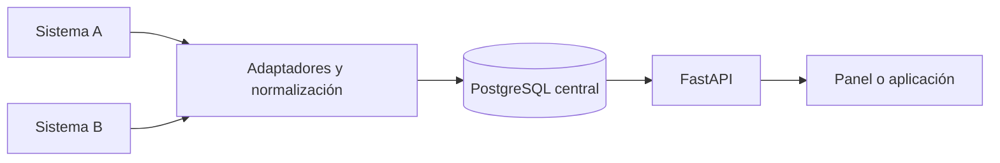

# Elección inicial: FastAPI

> Decisión histórica previa a la recepción del kit y a la integración inicial. Para la arquitectura vigente del monorepo consultar [ADR 0001](adr/0001-web-platform.md); para ejecutarlo, [desarrollo](desarrollo.md). Las observaciones actuales de acceso están en [revisión de contexto](revision-contexto.md).

Para el escenario descrito, FastAPI es una buena elección provisional: una API
central en Python que consulte o reciba datos de dos sistemas, los normalice y
los sirva al panel o a una futura aplicación. Todavía no podemos demostrar que
sea la mejor opción sin conocer los accesos, volúmenes, equipo y requisitos.

## Comparación práctica

| Necesidad principal | Opción que evaluaría |
| --- | --- |
| API propia, reglas de integración y procesamiento de datos en Python | FastAPI |
| Aplicación administrativa con ORM, formularios y panel de administración integrados | Django |
| Solo copiar datos periódicamente para análisis, sin API propia | Pipeline de extracción y transformación; FastAPI podría ser innecesario |

FastAPI ofrece validación, OpenAPI y operaciones síncronas/asíncronas. Django
incluye un ORM y un administrador generado a partir de modelos. La elección
de arriba es un juicio de arquitectura, no un benchmark de rendimiento.

## Qué significa centralizar

**Consulta en vivo:** la API consulta las plataformas cuando el cliente pide
datos. Reduce la duplicación, pero la respuesta depende de su disponibilidad y
latencia. No produce un historial por sí sola.

**Copia sincronizada:** adaptadores traen cambios a PostgreSQL y la API consulta
esa base. Permite construir historial y consultas comunes, pero requiere acordar
retraso aceptable, reintentos y resolución de conflictos. Para indicadores
históricos sería mi punto de partida si las fuentes permiten extraer sus datos.

El diagrama representa una propuesta futura, no funcionalidades ya implementadas.
No es necesario reescribir los dos backends para crear esta capa común.

## Lo que habrá que confirmar

1. **Acceso:** APIs, webhooks, archivos o acceso autorizado a las bases; permisos,
   límites y frecuencia de actualización. No asumimos qué tecnología usa Prisma.
2. **Identidad:** cómo vincular el mismo objeto entre sistemas. Un identificador
   externo necesita el contexto del sistema de origen; el nombre no basta.
3. **Autoridad:** qué fuente manda para cada campo y quién resuelve discrepancias.
   Conviene empezar leyendo las fuentes y validar antes de escribirles cambios.
4. **Calidad:** conservar procedencia y datos originales cuando corresponda;
   señalar campos faltantes sin inventarlos y decidir cuáles bloquean el ingreso.
5. **Sincronización:** importaciones idempotentes, bajas en origen, reintentos,
   historial y visibilidad de la última actualización. Los procesos duraderos
   necesitarán un trabajador o planificador; no depender de la petición HTTP.
6. **Acceso de usuarios:** roles y responsabilidades reales antes de diseñar
   permisos para gerencias, motoristas u operadores.

El framework y el ORM no resuelven automáticamente ninguna de estas reglas.
El scaffold permite posponerlas sin fijar un modelo de negocio imaginario.

## Fuentes oficiales consultadas

- [FastAPI: bases SQL y SQLModel](https://fastapi.tiangolo.com/tutorial/sql-databases/)
- [SQLModel: relación con SQLAlchemy y Pydantic](https://sqlmodel.tiangolo.com/)
- [FastAPI: concurrencia y operaciones síncronas](https://fastapi.tiangolo.com/async/)
- [Django: ORM y administrador](https://docs.djangoproject.com/en/5.2/intro/overview/)
- [Alembic: migraciones](https://alembic.sqlalchemy.org/en/latest/tutorial.html)
- [uv: gestión de proyectos](https://docs.astral.sh/uv/guides/projects/)
