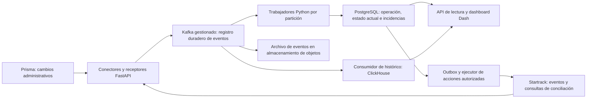

# Arquitectura propuesta para miles de vehículos

Fecha: 12 de septiembre de 2026. Propuesta para ampliar el objetivo de ECON a
miles de vehículos y telemetría continua. **No implementada ni validada mediante
pruebas de carga.** No modifica infraestructura, proveedores ni datos existentes.

## Supuesto de dimensionamiento

El volumen depende de vehículos, frecuencia, tamaño de evento, retención y
usuarios simultáneos. Estos escenarios suponen un evento por intervalo, actividad
24 horas al día y 1 KB decimal (1.000 bytes) por evento.

| Vehículos | Intervalo | Eventos/s medios | Eventos/día | Contenido/día |
| ---: | ---: | ---: | ---: | ---: |
| 1.000 | 30 s | 33,3 | 2,88 millones | 2,88 GB |
| 5.000 | 30 s | 166,7 | 14,4 millones | 14,4 GB |
| 10.000 | 10 s | 1.000 | 86,4 millones | 86,4 GB |

Fórmula: `vehículos × 86.400 / intervalo_en_segundos`. El escenario mayor produce
2,592 TB de contenido en 30 días. Es un cálculo antes de compresión, índices,
metadatos, registros transaccionales, réplicas y copias; no es una estimación de
disco contratado. El tamaño físico se debe medir. Mensajes agrupados pueden
reducir solicitudes HTTP sin reducir el número de eventos que hay que procesar.

## Arquitectura objetivo

Para telemetría continua e historial masivo, proponemos separar recepción,
procesamiento, operación y analítica. Se conservan Python, FastAPI y Dash.

El dibujo expresa responsabilidades; los consumidores de histórico y archivo
también son procesos de trabajo. Se despliegan independientemente para que una
consulta analítica o una exportación no detenga la detección de incidencias.

| Pieza | Función y criterio de escala |
| --- | --- |
| Receptores FastAPI detrás de un balanceador | Instancias sin estado compartido en memoria; validar y confirmar solo después de la aceptación duradera del evento |
| Kafka gestionado | Amortiguar ráfagas, conservar eventos durante una ventana acordada y permitir consumidores independientes y reprocesamiento |
| Trabajadores Python | Procesar entidades distintas en paralelo, escribir por lotes donde proceda y evaluar únicamente operaciones afectadas |
| PostgreSQL gestionado | IDs, mapeos con vigencia, solicitudes, movimientos, recepciones, último estado observado, incidencias y outbox transaccional |
| ClickHouse | Histórico de telemetría y agregaciones sobre grandes intervalos; proyección analítica con retraso y deduplicación controlados |
| Almacenamiento de objetos | Archivo con retención acordada para auditoría y reconstrucción más allá de la ventana del registro de eventos |
| Dash y API de lectura | Consultar estado actual, tablas paginadas y resultados agregados; medir carga por sesiones de usuarios |

Kafka soporta particiones y consumidores paralelos; su orden se refiere a los
registros de cada partición. Proponemos una clave que incluya cuenta, entorno e
identidad de la entidad, con normalización explícita antes de reglas por máquina.
No proporciona por sí mismo orden cronológico de eventos tardíos ni unicidad de
efectos sobre APIs externas. [Conceptos de Kafka](https://kafka.apache.org/intro/).

ClickHouse es una base columnar orientada a analítica; su papel propuesto es
separar las consultas históricas de las transacciones operativas. La capacidad
concreta exige probar nuestro esquema y consultas.
[Documentación de ClickHouse](https://clickhouse.com/docs/get-started/about/intro).

Para un piloto con menor historial, PostgreSQL puede ser también el almacén
inicial de telemetría con particiones temporales. El contrato de eventos y los
consumidores deben permitir extraer ese histórico posteriormente. Particionar
mejora ciertos patrones y la administración de retención; no distribuye por sí
solo las escrituras entre servidores. No se puede deducir un límite de vehículos
únicamente por elegir PostgreSQL.
[Particionamiento PostgreSQL](https://www.postgresql.org/docs/current/ddl-partitioning.html).

## Procesamiento simultáneo y consistencia

Separar eventos administrativos de telemetría evita que una ráfaga GPS demore
la aprobación o revisión de un traslado. Compartir infraestructura no obliga a
compartir el mismo presupuesto de procesamiento.

Un evento GPS debe consultar el contexto local vigente de su activo y evaluar
solo las reglas afectadas. No debe consultar Prisma ni recorrer la flota entera
por cada ubicación. Los cambios administrativos actualizan ese contexto y
disparan las evaluaciones de sus movimientos relacionados.

Los eventos de la misma entidad se procesan de forma coordinada. Más trabajadores
permiten atender más particiones; no habilitan paralelismo ilimitado sobre una
única entidad. Los cambios de particionado y de relación dispositivo-máquina
requieren conservar orden, vigencia y posibilidad de reconstrucción.

Se asume entrega que puede repetirse. Persistir el resultado y su identidad de
procesamiento de forma atómica donde corresponda; confirmar el consumo después
de esa persistencia. Si el proceso cae antes de confirmar, repetir no debe
duplicar incidentes ni acciones. En histórico, las agregaciones también deben
controlar duplicados; insertar el mismo evento dos veces no puede inflar horas.

No existe una transacción global automática entre Kafka, PostgreSQL, ClickHouse
y Startrack. El outbox conserva acciones junto al cambio local; cada destino
necesita una estrategia de idempotencia y conciliación. El resultado incierto de
crear una tarea continúa en `unknown`, sin repetir ciegamente el POST.

Fechas del evento, recepción y procesamiento se mantienen separadas. Un dato
antiguo se guarda en el historial y no rejuvenece el estado actual. Los cálculos
por intervalos admiten correcciones por eventos tardíos con versión y trazabilidad.

## Restricción del proveedor

La documentación de Startrack publica 240 peticiones por IP cada dos minutos y
límites más estrictos en ciertas rutas. Consultar individualmente 10.000 unidades
cada minuto demandaría 10.000 peticiones/minuto frente a un promedio general de
120/minuto. Escalar nuestros procesos no amplía esa cuota.
[Límites Startrack](https://support.gps-platform.com/api/intro/).

La ruta preferida para telemetría es el envío de eventos habilitado por el
proveedor, complementado con consultas por lotes e historial donde los contratos
lo permitan. Hay que confirmar autorización, capacidad de envío, reintentos,
retención y recuperación. Los webhooks documentados de Startrack incluyen alertas
y ubicaciones; no acreditan eventos para cada cambio administrativo o de tarea.
[Webhooks Startrack](https://support.gps-platform.com/admin/webhooks/).

Consultar la última posición cada dos minutos no reconstruye todas las posiciones
que ocurrieron cada diez segundos. Si no hay histórico ni recuperación, un corte
puede dejar un hueco permanente que debe mantenerse visible.

## Pruebas y operación necesarias

Presupuesto inicial de pruebas para el escenario de 10.000 vehículos:

- Sostener 1.000 eventos/s con mensajes representativos y la frecuencia acordada.
- Probar una ráfaga de 10.000 eventos en un segundo, porque los dispositivos
  podrían reportar juntos; es un escenario de ensayo, no un pico observado.
- Una interrupción de consumidores de 15 minutos acumularía 900.000 eventos.
  Vaciar esa cola en otros 15 minutos mientras continúa la entrada requiere
  procesar 2.000 eventos/s en promedio durante la recuperación.
- Probar duplicados, desorden, eventos inválidos, cambios de asignación, caída
  de trabajadores, indisponibilidad de un almacén y respuestas ambiguas del API.
- Medir por separado la interfaz: 1.000 sesiones que actualizan cada 15 segundos
  generan aproximadamente 67 solicitudes/s, antes de interacciones adicionales.

Medir latencia p95/p99 de recepción a resultado, antigüedad del evento pendiente
más viejo, eventos recibidos/procesados/rechazados, pérdida o duplicación de efectos,
capacidad de recuperación, latencia del panel y costo por volumen. Los objetivos
de frescura se acuerdan por fuente y se miden desde el evento y desde su recepción;
una conexión tardía del dispositivo no es tiempo de cómputo de ECON.

El despliegue necesita réplicas, recuperación de conexiones, pools acotados de
base de datos y límites de trabajo concurrente. Una cola duradera tiene capacidad
finita: supervisar disco y retención, limitar carga aceptada conforme al contrato
y definir recuperación antes de agotar la ventana de datos. El aumento de
trabajadores debe considerar retraso y capacidad del destino, además de CPU.

Configurar alta disponibilidad y probar restauraciones de base, archivos y
estado de procesamiento. La redundancia no sustituye copias recuperables. El
acceso externo de integración necesita protección y aislamiento; este diseño no
habilita acceso público live ni modifica el alcance actual sin login de aplicación.

## Evolución del repositorio actual

La base local y el trabajador actual sirven como fundamento de la integración,
pero no demuestran esta capacidad. El siguiente trabajo debe extraer un contrato
duradero de eventos, separar ejecución de recepción/presentación, eliminar el
límite de seguimiento a las primeras páginas y construir proyecciones de lectura.

Después, ejecutar la prueba con generadores sintéticos aislados y publicar sus
resultados reproducibles antes de dimensionar infraestructura de producción.
No ampliar la muestra operativa con millones de filas inventadas ni activar
proveedores como parte de la prueba. Kafka/ClickHouse son la arquitectura objetivo
propuesta para este nuevo volumen, no dependencias instaladas por este documento.

Las reglas de discrepancias y los datos necesarios para medir trabajo siguen en
[sincronizacion-y-discrepancias.md](sincronizacion-y-discrepancias.md). El volumen
no cambia que operativa, asignada, motor encendido y trabajo productivo sean
hechos distintos, ni que el GPS del camión pruebe actividad de la máquina cargada.
