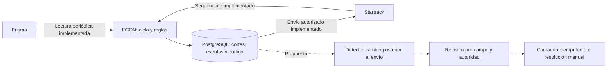

# Integración por eventos con orquestación central y consistencia eventual

ECON coordina el flujo entre Prisma y Startrack conservando la autoridad de cada
fuente. La base implementada observa cambios mediante lecturas periódicas,
guarda evidencia y procesa una cola transaccional en PostgreSQL. La extensión
propuesta convierte los cambios relevantes en asuntos y comandos trazables;
no presupone webhooks nativos ni sincronización instantánea.

## Base implementada

- Prisma aporta solicitudes, asignaciones y estado administrativo. Startrack
  aporta tarea, ejecución y observaciones de seguimiento. ECON conserva planes,
  correspondencias, cola, eventos y declaraciones de recepción.
- Un worker CLI o el scheduler opcional ejecuta ciclos acotados. El candado de
  PostgreSQL evita ciclos simultáneos; la outbox conserva el envío y su estado.
  Un resultado incierto se concilia sin repetir automáticamente el POST.
- Los vínculos conservan IDs originales, entorno y fechas de evento,
  observación y registro. La asignación y el período deben ser compatibles;
  nombres coincidentes no establecen identidad.
- Roles y permisos de sesión autorizan acciones. Las habilitaciones de lectura,
  escritura y autoencolado pertenecen al servidor; ningún control de la interfaz
  las enciende. `fixture` y `live` permanecen separados; live sigue siendo sandbox.

Las flechas continuas describen capacidades existentes, sujetas a configuración
y validación de proveedores. Las discontinuas describen trabajo pendiente. El
SDK de Startrack no implementa PATCH de tareas; el diagrama no promete esa acción.

## Extensión propuesta

1. **Observar y registrar el cambio.** Comparar cortes compatibles y producir
   un evento durable con entidad, IDs, entorno, campos modificados, valores
   anterior/nuevo y fechas. El cambio observado no equivale al instante exacto
   del cambio en el proveedor. La señal actual `movement_source_changed` del
   grafo no sustituye esa incidencia durable.
2. **Decidir por campo.** Si Prisma cambia unidad, proyecto o período después
   del envío, abrir revisión del movimiento afectado. ECON comprueba la
   asignación vigente y la autoridad del dato antes de proponer un comando.
   Startrack sigue siendo fuente de ejecución; su estado no sobrescribe
   automáticamente el estado administrativo de la maquinaria.
3. **Emitir comandos idempotentes.** Registrar intención, actor, precondición,
   versión observada, clave de deduplicación y resultado en la outbox. Revalidar
   antes de ejecutar y descartar comandos obsoletos. La deduplicación local no
   garantiza ejecución exactamente una vez en un proveedor: ante incertidumbre,
   conciliar. Una API ausente o no validada requiere resolución manual.
4. **Proyectar el estado para decidir.** Servir una lectura persistida común a
   API y Dash, con cobertura y frescura por fuente. Separar versión del contenido,
   última confirmación y momento de evaluación; una relectura sin cambios puede
   actualizar la frescura sin inventar eventos. Esta centralización de lecturas
   es propuesta, no una propiedad ya conseguida por el panel actual.

Consistencia eventual significa que durante un intervalo las fuentes pueden
mostrar versiones distintas. La interfaz debe identificar qué se observó,
qué comando está pendiente y qué requiere intervención, sin presentar ese
intervalo como pérdida de datos ni como éxito de una operación no confirmada.

## Autoridad y límites

| Hecho | Autoridad | Respuesta de ECON |
| --- | --- | --- |
| Solicitud y asignación administrativa | Prisma | Conservar el corte y revisar cambios que afecten al traslado |
| Estado y ejecución de la tarea | Startrack | Registrar la observación y relacionarla con el movimiento por ID |
| Correspondencias, plan y cola | ECON | Validar, autorizar y conservar intención y resultado |
| Recepción declarada | Persona con permiso en ECON | Registrar responsable, instante y referencia de la constancia |

No se plantea replicación bidireccional de todos los campos. Una posición GPS,
entrada de geocerca o tarea completada no declara recepción ni actualiza Prisma.
No se inventan webhooks de aprobación ni de cambio de tarea. Las operaciones
remotas futuras requieren contrato confirmado y autoridad explícita por campo.

Este documento no activa escrituras, modifica servicios ni cambia el ciclo
actual. Es una propuesta para continuar sobre la base de
[ADR 0004](adr/0004-persistent-transfer-workflow.md),
[ADR 0006](adr/0006-postgresql-unica-infraestructura-de-estado.md) y los
[límites de integración](contexto-vigente.md#contratos-de-proveedores).
