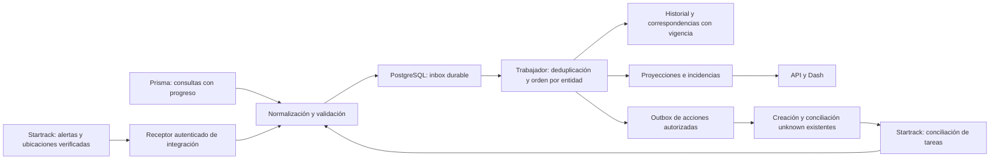

# Auditoría de arquitectura de eventos

Fecha: **12 de septiembre de 2026**. Auditoría del árbol de trabajo de la rama
`feat/operations-hub-foundation`, HEAD `e851c7e`. Los documentos pendientes del
árbol de trabajo también forman parte del contexto revisado. Este informe no
acredita despliegue, acceso live, escrituras a proveedores ni capacidad medida
de producción. Todo el caso conserva su carácter sintético.

## Resultado

ECON tiene una base útil de integración: servicios Python compartidos,
persistencia, cola transaccional de envío y conciliación de resultados inciertos.
Todavía no tiene recepción durable de eventos externos ni procesamiento
desacoplado con reproducción y proyecciones reconstruibles. El siguiente paso
recomendado es corregir cobertura y orden, y añadir una bandeja de entrada
durable sobre PostgreSQL. La infraestructura masiva se decide mediante pruebas
de carga y necesidades de retención, no por la existencia de un diagrama.

Se revisaron las instrucciones del repositorio, el índice documental, contexto
vigente, revisión de fuentes, README Python, ADR 0003/0004, arquitectura de
interfaz, propuestas de sincronización y escala, código de servicios, modelos,
adaptadores, rutas, CLI, despliegue y pruebas relacionadas.

## Arquitectura comprobada

Dash y HTTP usan `WorkflowService`. Un proceso CLI explícito ejecuta consultas
periódicas; navegar por el panel no inicia un trabajador. El hub de lectura
consulta Prisma cuando corresponde al modo live. No hay fallback entre live y
fixture. Las habilitaciones y credenciales pertenecen al servidor.

| Pieza | Implementación comprobada |
| --- | --- |
| Registro operativo | `Movement`, `OperationEvent` y `SourceSnapshot` en [models/operations.py](../apps/api/app/models/operations.py), líneas 16, 54 y 74 |
| Cola de salida | La fila del movimiento conserva payload y estado; reclamación transaccional antes del POST en [ledger.py](../apps/api/app/services/ledger.py), línea 391 |
| Recuperación de envío | `sending` interrumpido pasa a `unknown`; no vuelve automáticamente a `queued`, en `ledger.py`, línea 468 |
| Conciliación | Referencia exacta, búsqueda completa y correspondencia única de contenido en [workflow.py](../apps/api/app/services/workflow.py), línea 300 |
| Seguimiento | Consulta de tarea y visitas vinculadas, con tiempos de origen y recepción separados, en `workflow.py`, línea 300 |
| Recepción empresarial | Declaración explícita con responsable, instante con zona y referencia; no se genera por GPS ni por cierre de tarea |
| Entrada HTTP | Rutas de salud, hub y operaciones en [main.py](../apps/api/app/main.py), líneas 84–86; no hay receptor webhook |

`OperationEvent` conserva historial operativo. Su existencia no equivale a un
contrato completo de event sourcing: no hay inbox, checkpoint de consumidor,
replay, versiones de aplicación de eventos ni reconstrucción probada de todas
las proyecciones. La cola existente cumple una función de outbox para crear
tareas, aunque no tenga una tabla independiente con ese nombre.

## Hallazgos y trabajo propuesto

Las prioridades siguientes orientan el backlog; no son severidades observadas
en producción. Las líneas corresponden al árbol auditado.

| Prioridad | Hallazgo y evidencia | Resultado exigible |
| --- | --- | --- |
| P1 | `ledger.py:185,193` devuelve por defecto los 100 movimientos más recientes. `workflow.py:440,462` usa esa lista para revalidación y seguimiento. Los anteriores pueden quedar abandonados indefinidamente. | Recorrido justo con cursor o próxima revisión durable, presupuesto por ciclo y pruebas con más de 100 movimientos y reinicio. Paginar también la lectura y mostrar cobertura. |
| P1 | `ledger.py:656` ordena por fecha de evento y después observación; `:660–664` compara fecha de evento **o** de observación. No son el mismo orden. La actualización de estado tampoco tiene control de versión o bloqueo por entidad. | Política explícita para fecha ausente, empates y eventos tardíos; conservar historia y aplicar proyección atómicamente. Probar PostgreSQL y SQLite, incluyendo escritores concurrentes. |
| P1 | `workflow.py:441` revalida solo `draft/blocked`. Los movimientos enviados no vuelven a comparar su asignación, proyecto y período con Prisma. | Conservar plan original y cambios posteriores por ID exacto; incidencia persistente, deduplicada y explicada; resolución con historial sin crear otra tarea ni corregir proveedores automáticamente. |
| P1 antes de operación continua | `workflow.py:380` recorta visitas a los últimos siete días, sin cursor histórico. `:430` guarda el corte Prisma antes del seguimiento y `:125` lo usa como `last_sync_at`. Los errores de seguimiento solo modifican el mensaje devuelto por ese ciclo. | Persistir intento, éxito, error saneado y ventana cubierta por fuente/movimiento; recuperar ventanas omitidas; no presentar la fecha del corte Prisma como éxito de Startrack. La recarga debe conservar la falta de cobertura. |
| P1 para la ampliación por eventos | Los modelos y rutas actuales no incluyen inbox ni aplicación desacoplada de eventos. | Envelope versionado, aceptación durable, deduplicación atómica, mensajes inválidos aislados, reintentos acotados y replay sin repetir efectos remotos. |
| P2; P1 antes de escalar | `hub.py:268` consulta al proveedor para servir la lectura; `ledger.py:147–176,197` hidrata todo el historial por movimiento. `ledger.py:371` añade evidencia de revalidación en cada ejecución. | Proyecciones locales con frescura visible; timeline paginado; selección del trabajador sin cargar todos los eventos; política de retención y distinción entre cambio de negocio y nueva consulta. |
| P2; P1 antes de procesos múltiples | `workflow.py:70,426` coordina con un candado local. `cli/sync_operations.py:55` espera después del ciclo; no registra señal de vida durable ni coordina presupuesto entre API y CLI. | Supervisión, recuperación y coordinación por entidad o lease; presupuesto compartido y por ruta; métricas de antigüedad, errores y último éxito. Conservar la seguridad actual del envío. |

### Defecto de orden reproducido

Se usó el ledger real, los helpers de `tests/test_ledger.py` y una base SQLite
en memoria, sin cambios a archivos ni llamadas externas:

1. Evento con fecha del hecho 18:00: queda estado A.
2. Evento sin fecha del hecho, observado a las 20:00: queda estado B.
3. Evento tardío con fecha del hecho 19:00: queda estado C.

El segundo paso había promovido B usando las 20:00 como referencia, pero la
consulta siguiente vuelve a elegir el evento conocido de las 18:00. La política
de selección y la de comparación se contradicen. La reproducción no se ejecutó
contra PostgreSQL; su tratamiento de NULL en el orden también debe probarse
explícitamente. El ensayo existente en `tests/test_ledger.py:359` cubre fechas
conocidas y ejecución secuencial, no este caso mixto ni la concurrencia de
proyecciones.

## Contratos externos: capacidad documentada y validación pendiente

Startrack documenta webhooks de **alertas y ubicaciones**. La tabla de alertas
describe `date` en segundos Unix, pero los ejemplos muestran valores de trece
dígitos compatibles con milisegundos. Json 2 describe coordenadas en grados y
muestra enteros fuera de ese rango. Se debe validar el esquema real de la
cuenta, conservar el valor original y aislar datos ambiguos; no adivinar escala
o unidades. La documentación también diferencia fecha del hecho y del sistema.
[Webhooks oficiales](https://support.gps-platform.com/admin/webhooks/).

La API administrativa publica reglas de reenvío; ello no demuestra que estén
habilitadas ni que el equipo tenga permisos. Antes del receptor operativo deben
acordarse autenticación, identidad y alcance del evento, reintentos y recuperación.
[Reglas de reenvío](https://support.gps-platform.com/admin/api/webhooks/).

El API de tareas permite consulta y creación, pero la documentación revisada no
acredita un webhook general de sus cambios ni idempotencia de creación. Mantener
polling y conciliación de tareas hasta confirmar otra vía.
[Tareas](https://support.gps-platform.com/api/jobs/).

El límite general publicado es 240 solicitudes por IP cada dos minutos, con
respuesta `529` y restricciones adicionales por ruta. Aumentar trabajadores no
aumenta esa cuota. El presupuesto debe considerar los demás consumidores de la
misma IP. [Introducción API](https://support.gps-platform.com/api/intro/).

El contrato Prisma suministrado no documenta webhook de aprobaciones. Comenzar
con consultas acotadas y recorrido completo; no asumir filtros incrementales o
historial que el contrato no garantice. Si una fuente solo ofrece estado actual,
dos consultas no permiten reconstruir los cambios intermedios perdidos.

## Evolución propuesta

El receptor confirma aceptación únicamente después de persistir. El trabajador
aplica efectos locales y registra la identidad de procesamiento en una misma
transacción cuando corresponda. Repetir un mensaje no duplica incidencias ni
acciones. Los fallos agotados quedan disponibles para revisión; reprocesar una
proyección no autoriza volver a ejecutar un POST remoto. El ingreso de integración
se aísla del panel y no implica habilitar acceso público live o agregar login de
usuarios al alcance actual.

1. **Cerrar defectos actuales.** Recorrido justo, orden atómico, seguimiento de
   cambios posteriores al envío y estado durable de cobertura por fuente.
2. **Formalizar identidad y contrato.** Envelope con versión, fuente, cuenta,
   entorno, entidad, ID del evento cuando exista, fechas de hecho/recepción y
   procedencia. Confirmar deduplicación, unidades y autenticación con proveedores.
3. **Desacoplar aplicación y lectura.** Inbox PostgreSQL, trabajador supervisado,
   incidencias y proyecciones con antigüedad visible. Polling y webhooks convergen
   en las mismas reglas; el historial se consulta paginado.
4. **Medir antes de distribuir.** Pruebas sintéticas aisladas de caídas,
   duplicados, desorden, ráfagas, recuperación y retención, además de carga del
   panel y costos. No ampliar la muestra operativa para simular esas pruebas.

El UUID de maquinaria de Prisma debe conservarse como identidad de origen
estable, dentro de su fuente y entorno. El ID interno de ECON no lo reemplaza.
La relación con `vehicle_id`, `device_id` o `remote_id` de Startrack requiere
validación y fechas de vigencia. Reemplazar un dispositivo no reasigna su historia
anterior a otra máquina. No unir por nombres ni confundir GPS de transportador
con GPS de maquinaria. Se conserva separadamente solicitud, maquinaria, proyecto,
movimiento y tarea; una solicitud puede tener varios movimientos. La asignación
del kit sigue siendo RE-03/MOT-006/PROY-006, sin mezclar escenarios de prueba.

Estado administrativo, mantenimiento, asignación, tarea, posición y recepción
son hechos distintos. Un dato tardío no rejuvenece la ubicación actual. Una visita
GPS o tarea completada no acredita recepción; siguen siendo necesarios el
responsable, instante y constancia acordados con el proyecto.

La [propuesta de flota](arquitectura-escalable-flota.md) contempla Kafka,
ClickHouse y archivo en objetos para telemetría e histórico masivos. Este informe
la mantiene como etapa posterior condicionada por carga, retención, consumidores
y recuperación medidos. El repositorio no demuestra que esas dependencias sean
necesarias para su carga actual, ni que alcance ya los volúmenes propuestos.
No se requiere convertir todo el dominio a event sourcing para introducir una
bandeja durable y proyecciones útiles.

## Validación y límites

- Auditoría focal: **42 pruebas aprobadas** de `test_ledger.py` y
  `test_workflow_provider.py`, en 7,25 segundos, con adaptadores simulados y bases
  aisladas; reproducción adicional en SQLite en memoria descrita arriba.
- Validación general comunicada por el coordinador de esta revisión:
  `scripts/check.ps1 -Container` completó **308 pruebas**, Ruff, formato y
  construcción de imagen. Esa ejecución no prueba contratos live ni capacidad
  de flota masiva.
- No se modificaron proveedores, credenciales, habilitaciones, base operativa ni
  volumen. No hubo validación autenticada nueva de Startrack ni despliegue.
- Los hallazgos de concurrencia y las recomendaciones de escala necesitan pruebas
  específicas PostgreSQL/carga antes de considerarse corregidos o dimensionados.

El [contexto vigente](contexto-vigente.md), la [guía de integración](solucion-integracion.md)
y la [propuesta de discrepancias](sincronizacion-y-discrepancias.md) conservan el
detalle de proceso y responsabilidades; este informe aporta la comprobación de
código y el orden recomendado de implementación.
