# Gráficos y diagramas del reto ECON

Edición del 13 de septiembre de 2026 (añade el diagrama «dónde vive cada
estado», las matrices exportadas y el manifiesto de PDFs). Este documento es el
punto de entrada al dossier visual. Las fuentes originales de `docs/onedrive` se conservan. Los
gráficos usan únicamente la muestra proporcionada; los diagramas distinguen
proceso documental, implementación actual y ampliación propuesta.

## Paquete para revisar

- [Trazabilidad de RF/RNF y entregables](matriz-requisitos-entregables.md).
- [Matriz completa de equivalencias y RACI propuesta](equivalencias-prisma-startrack.md),
  exportada sin cambios a [CSV y XLSX](../output/matrices/MANIFEST.md) con
  `scripts/docs/exportar_matrices.py` (RNF-02; `--check` en CI).
- [Diccionario técnico y manual de operación](manual-mapeo-integracion.md).
- [Inventario de campos del modelo ECON](diccionario-modelo-econ.md), generado y
  verificado en CI con `generar_diccionario.py --check` (RF-01).
- [Indicadores calculables](indicadores-calculables.md) de `GET /api/v1/indicators`.
- [Decisiones técnicas, resumen de dos páginas](decisiones-tecnicas.md).
- [Dossier visual en PDF](../output/pdf/ECON-entregables-visuales.pdf) (16 páginas).
- [Decisiones técnicas en PDF](../output/pdf/ECON-decisiones-tecnicas.pdf) (2 páginas).
- [Manifiesto de PDFs](../output/pdf/MANIFEST.md) con fecha, páginas y SHA-256.

El PDF `ECON-diccionario-mapeo-y-manual-integracion.pdf` (34 páginas, 12/09/2026)
no tiene generador en el repositorio: se conserva sin regenerar y, para la matriz
completa, queda reemplazado por la matriz Markdown, `output/matrices` y el
diccionario generado.

El brief pide además una presentación de hasta diez diapositivas con reflexión;
este dossier no se presenta como una presentación terminada. La validación
combinada de un caso Prisma/Startrack sigue limitada por las evidencias disponibles.

## Gráficos con datos suministrados

El script [generar_graficos.py](../scripts/docs/generar_graficos.py) lee la muestra
Prisma sin modificarla. Sus resultados y huellas se conservan en
[el manifiesto](assets/entregables/manifest.json).

Los intervalos representan uso solicitado, no fechas de transporte o entrega.
Los estados de maquinaria son administrativos y no miden utilización ni
disponibilidad técnica. La cobertura corresponde al ejemplo del archivo, no al
estado actual del sandbox ni a toda la flota. Startrack carece de registros
operativos en esa muestra; no se dibuja un cero como si fuera un censo vacío.

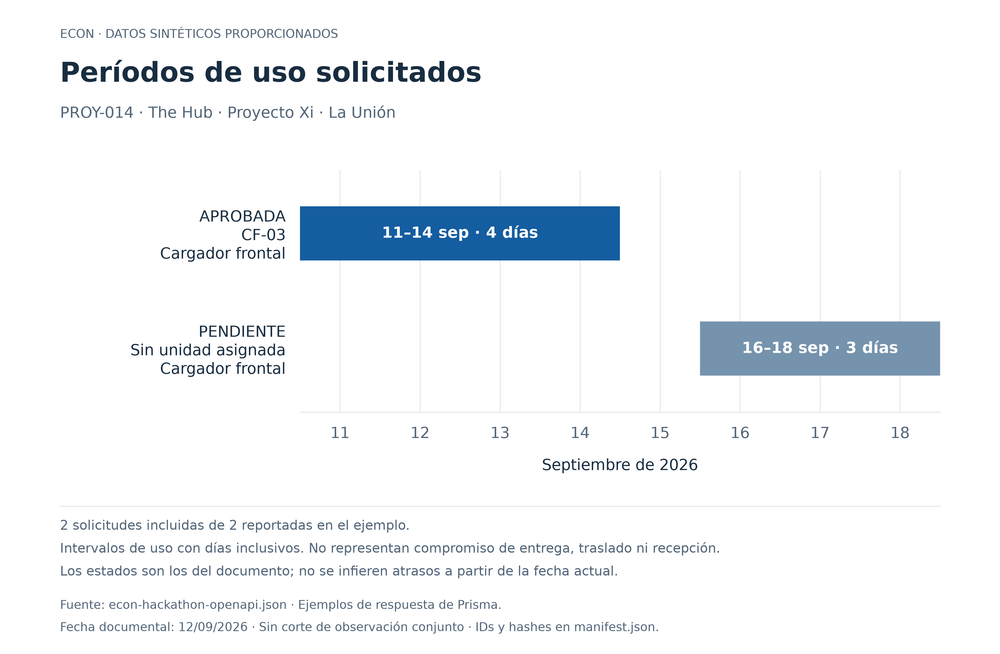

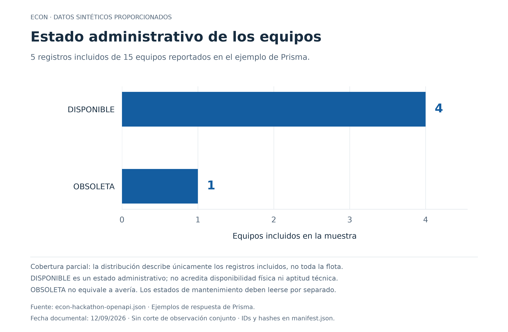

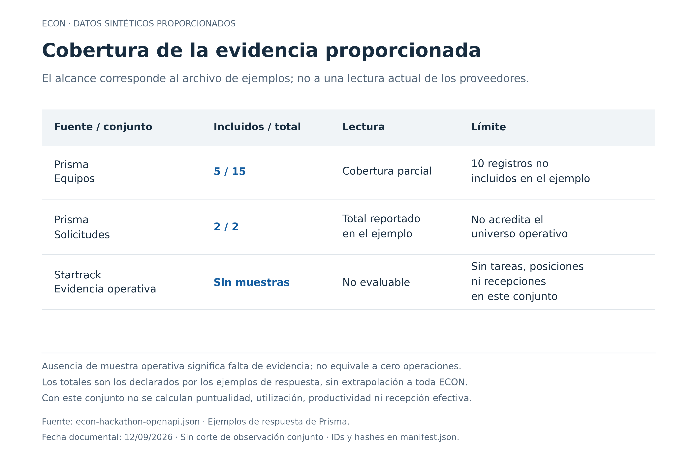

## Diagrama 1: recorrido operativo sintetizado

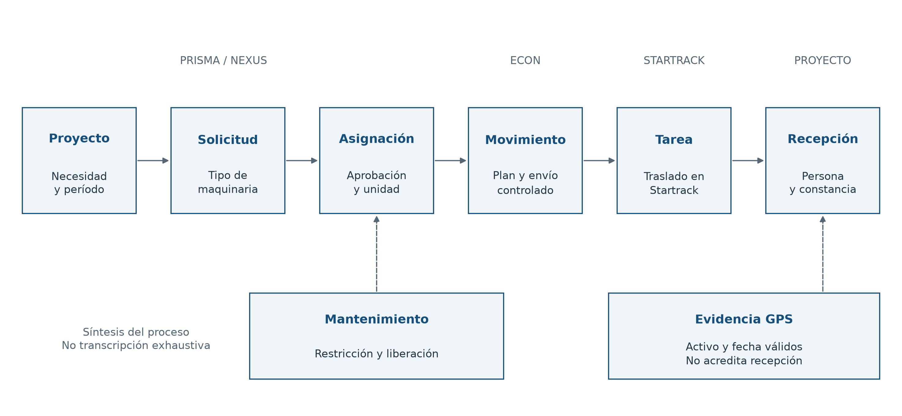

Síntesis propia del [AS-IS](onedrive/03-as-is.md), [TO-BE](onedrive/03-to-be.md) y
[casos de uso](onedrive/04-casos-de-uso.md), centrada en el alcance del prototipo.
No reemplaza las imágenes originales ni incorpora como implementada la
automatización que propone el TO-BE.

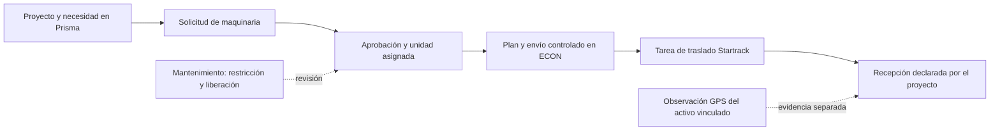

## Diagrama 2: identidad y correspondencias

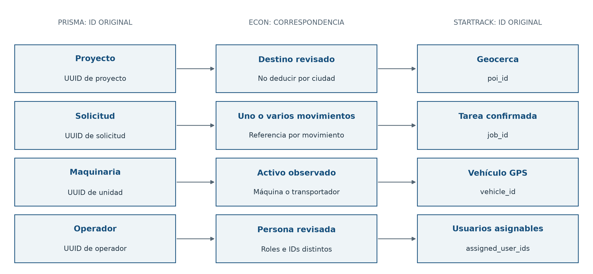

Modelo conceptual; no es un esquema físico de tablas. Las correspondencias
se revisan por ID y entorno. Las vigencias maestras son una ampliación propuesta;
actualmente el movimiento guarda su mapeo. El GPS puede pertenecer al camión que
transporta la máquina.

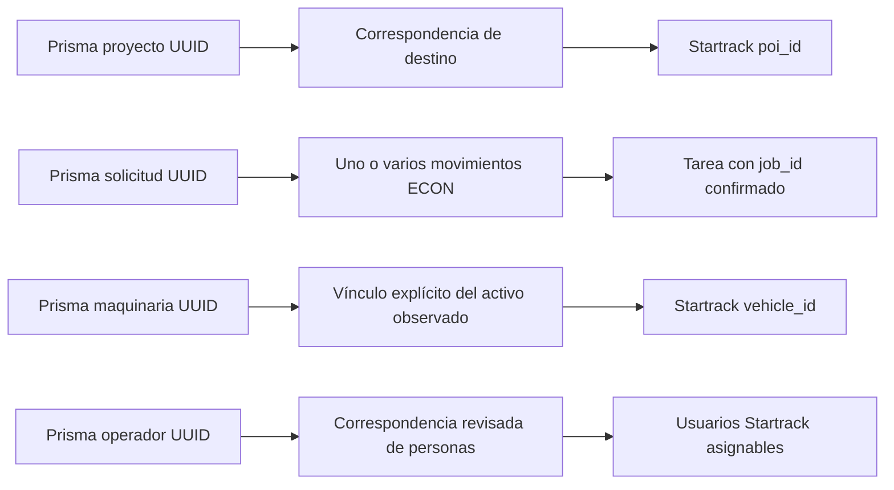

## Diagrama 3: arquitectura implementada

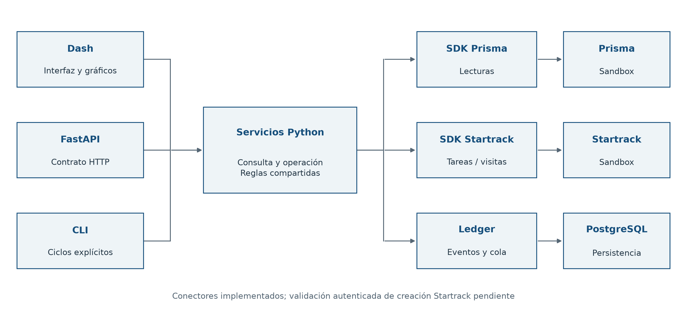

Implementación según [ADR 0004](adr/0004-persistent-transfer-workflow.md). Los
conectores están escritos; la creación autenticada en Startrack sigue pendiente
de validación. El trabajador no arranca automáticamente con el servidor.

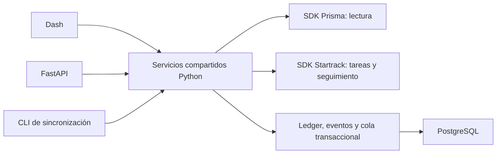

## Diagrama 4: detección de cambios y discrepancias

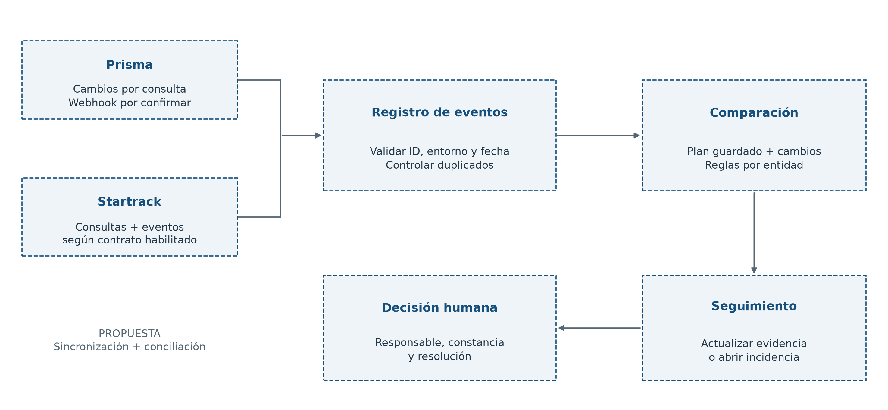

Ampliación propuesta. La recepción de webhooks depende del contrato que habilite
cada proveedor. Las consultas de conciliación siguen siendo necesarias. Esta
secuencia no promete reconstruir eventos intermedios si la fuente solo entrega
su estado actual.

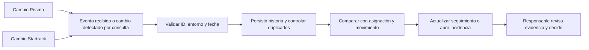

## Diagrama 5: arquitectura objetivo para miles de vehículos

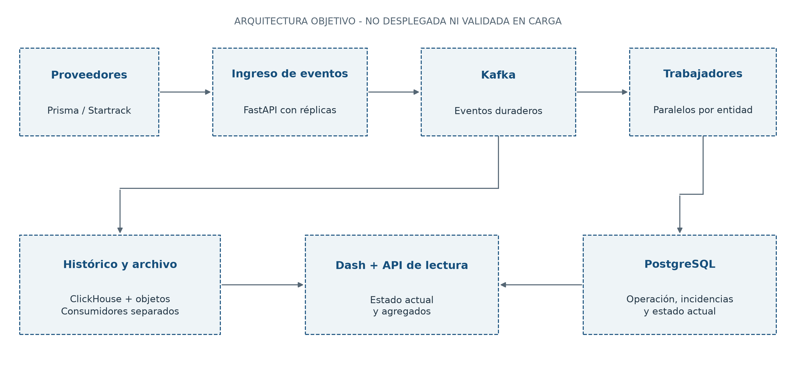

Propuesta, no despliegue. La [sección de escala](sincronizacion-y-discrepancias.md#escala-a-miles-de-vehículos-propuesta)
contiene hipótesis de carga, retención, límites de API y pruebas pendientes.

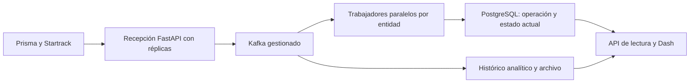

## Diagrama 6: dónde vive cada estado

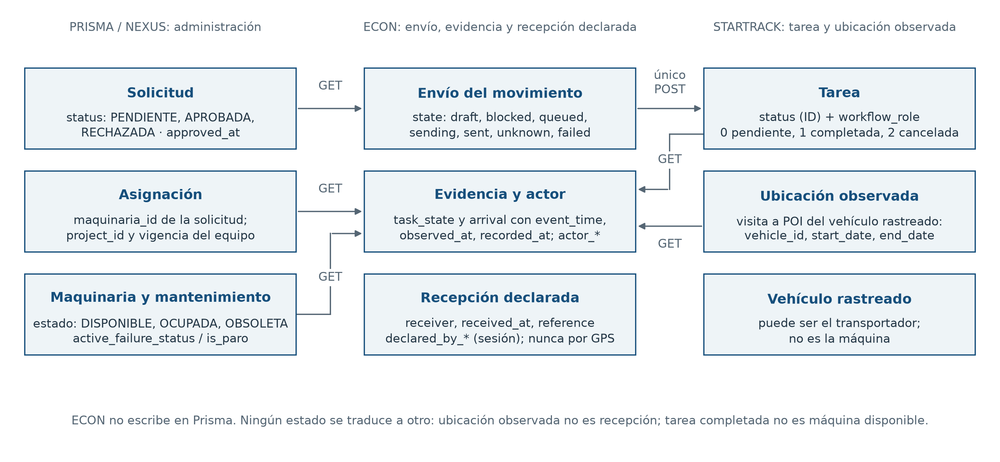

Cada estado pertenece a una plataforma y ECON no lo traduce ni lo iguala a otro.
Prisma conserva la solicitud (`status`, `approved_at`), la asignación
(`maquinaria_id` de la solicitud; `project_id` y vigencia
`fecha_inicio_uso`/`fecha_fin_uso` del equipo), la maquinaria (`estado`) y el
mantenimiento (`active_failure_status`, `active_failure_is_paro`); ECON conserva
el envío del movimiento (`Movement.state`), la recepción declarada
(`receiver`, `received_at`, `reference`, `declared_by_*` cuando hubo sesión) y el
actor de cada transición (`actor_*`); Startrack conserva la tarea (`status` como
ID más `workflow_role` 0/1/2) y la ubicación observada del vehículo rastreado
(visita a la geocerca con `vehicle_id`, `start_date` y `end_date`; el vehículo
puede ser el transportador, no la máquina). ECON solo lee Prisma, lee tareas y
visitas de Startrack y emite un único POST de creación; no escribe en Prisma.
La ubicación observada no es recepción y una tarea completada no vuelve
disponible a la máquina. Fuente:
[estados separados](equivalencias-prisma-startrack.md#fechas-unidades-y-estados-separados),
[ADR 0004](adr/0004-persistent-transfer-workflow.md) y
[ADR 0006](adr/0006-postgresql-unica-infraestructura-de-estado.md).

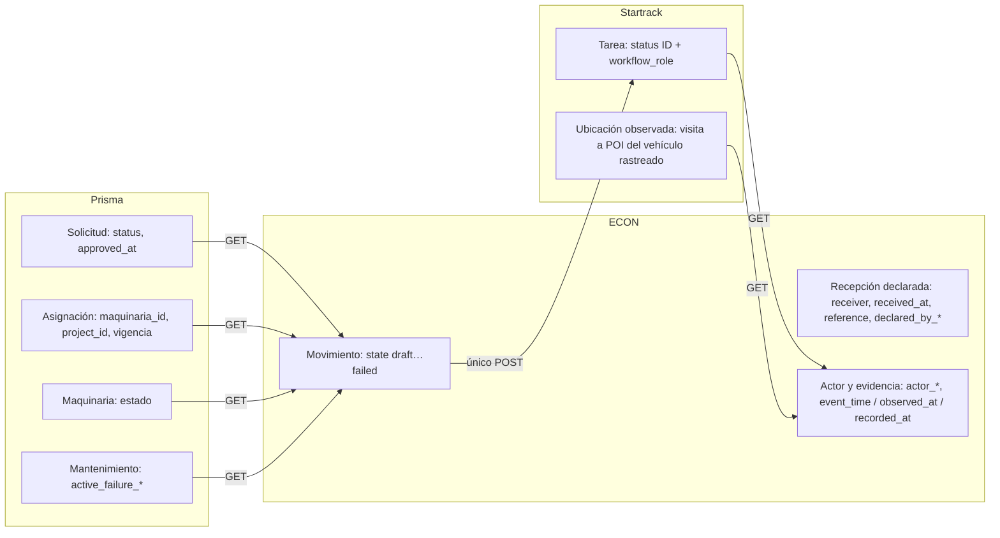

## RF-06: indicador definido, sin valor inventado

Esta sección es la **definición única** del indicador RF-06; la
[matriz de requisitos](matriz-requisitos-entregables.md), la
[analítica](analitica-decisiones.md) y los
[indicadores y referencias ISO](kpis-y-referencias-iso.md) enlazan aquí en lugar
de repetir la fórmula. Los indicadores que sí se calculan hoy con las lecturas
existentes están en [indicadores calculables](indicadores-calculables.md).

**Tiempo fuera de geocerca sin justificación**, por equipo y período acordado.
Unidad: horas. Cálculo: duración de la unión de intervalos válidos fuera de la
geocerca asignada, dentro del horario en que se exige presencia, excluyendo los
intervalos de salida autorizada o justificada. Unir intervalos evita doble conteo.

Se requieren identidad y vigencia del dispositivo, geocerca y asignación;
eventos fechados y válidos; horario exigible; justificaciones con vigencia y
criterio acordado para interpolar y cortar intervalos. Los huecos de señal
permanecen sin clasificar. Reportar horas evaluables y desconocidas junto al
indicador. Si faltan esos datos, el resultado es **no evaluable**, no cero.

Decisión: Logística y Técnica de Proyectos revisan el destino y la autorización;
Mantenimiento participa cuando hay una restricción. Estar fuera de geocerca no
equivale automáticamente a tiempo muerto, pérdida económica o uso indebido.

Fuente del requisito: [RF-06 del brief](onedrive/02-brief-del-reto.md#7-requerimientos).
Para otros indicadores consultar [analítica de decisiones](analitica-decisiones.md).

## Reproducción y revisión

Desde la raíz, sin cambiar el lockfile de la aplicación:

```powershell
uv run --no-project --with matplotlib python scripts/docs/generar_graficos.py
uv run --no-project --with matplotlib --with reportlab --with pypdf --with markdown-it-py python scripts/docs/generar_dossier.py
uv run --no-project --with openpyxl==3.1.5 python scripts/docs/exportar_matrices.py
uv run --no-project --with openpyxl==3.1.5 python scripts/docs/exportar_matrices.py --check
```

Los PNG/SVG y PDFs se generan localmente. `generar_dossier.py` dibuja los seis
diagramas, construye los dos PDF, extrae su texto en `tmp/pdfs/entregables/` para
revisión y falla si el dossier no tiene 16 páginas o las decisiones más de 2.
Si el sistema tiene una instalación de `cryptography` rota, añadir
`--with cryptography` para que `pypdf` use una copia sana. Tras regenerar,
actualizar fecha, páginas y SHA-256 en [`output/pdf/MANIFEST.md`](../output/pdf/MANIFEST.md).
Antes de entregar una nueva edición, renderizar los PDFs, revisar páginas y
verificar la matriz contra las fuentes. La generación no consulta ni modifica
Prisma o Startrack.
