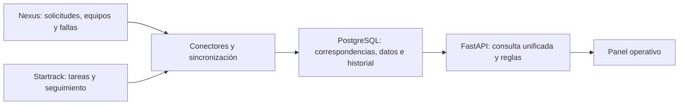

# Integración real: exploración de Nexus y Startrack

> Registro fechado de la exploración de conectividad. Es evidencia de acceso y contratos observados; el estado implementado está en [contexto vigente](contexto-vigente.md). Las afirmaciones de trabajo pendiente conservan su alcance histórico.

Verificado el **12 de septiembre de 2026**, mediante Chrome, código JavaScript servido a ese navegador, documentación oficial y consultas HTTP pequeñas. Se utilizó únicamente la cuenta asignada a Rodrigo Trujillo / Los Filósofos. Los resultados corresponden a los entornos entregados, no a una validación de producción.

El usuario pidió trabajar hacia una integración real. La agenda y las restricciones del evento se conservan como fuente en `docs/onedrive`; no limitan esta evaluación técnica a una demostración de 24 horas.

## Sandbox, conexión real y datos simulados

**Ya se entregaron dos sandboxes:** el documento de accesos identifica expresamente `https://staging.gps.gt/` como Startrack y `https://econ-key.maic.ai` como Prisma. Ambos permitieron iniciar sesión. La identificación como sandbox procede del documento, no solamente del nombre del dominio. [Accesos entregados](onedrive/05-accesos-y-manuales.md).

Una **conexión real a una API** puede consultar **datos sintéticos de un sandbox**. Son dimensiones diferentes: la conexión prueba autenticación, permisos, respuestas y mapeos reales del software; los datos representan escenarios de prueba. El kit describe sus registros como sintéticos y los separa de producción. No necesitamos acceso productivo para construir y probar un conector real. [Introducción](onedrive/00-introduccion-equipo.md), [especificación de entornos](onedrive/02-brief-del-reto.md#7-requerimientos).

El manual de MAIC/Nexus entregado explica funciones y procesos mediante pantallas; el PDF disponible es un extracto de nueve páginas de un documento numerado sobre 44. Sirve para interpretar solicitudes, asignaciones, fallas y roles, pero no proporciona un contrato de API ni un endpoint de renovación. La evidencia HTTP de esta revisión complementa el manual. [Manual convertido](onedrive/05-manual-nexus.md).

| Modalidad | Para qué usarla | Estado y limitación |
| --- | --- | --- |
| Consulta en vivo al sandbox | Probar integración con los sistemas entregados | Nexus ya respondió a lecturas autenticadas; Startrack necesita su clave API |
| Copia fechada del dataset del sandbox | Desarrollar y repetir pruebas sin depender de conectividad | Preparar una exportación o captura autorizada de los datos necesarios; no presentarla como estado actual |
| Casos sintéticos locales adicionales | Probar atrasos, mantenimiento, IDs sin correspondencia, duplicados y señales antiguas | Construirlos de forma explícita y separada; sus resultados no prueban conectividad ni exactitud del contrato externo |

La recomendación es **conectar Nexus primero, obtener la clave de Startrack en paralelo y mantener casos locales reproducibles para las reglas**. Para Los Filósofos, antes de demostrar un traslado de extremo a extremo hace falta localizar o solicitar un conjunto coherente de solicitud, asignación y tarea relacionadas; en esta revisión no quedó validado. Si falta ese caso en el sandbox, se puede ensayar localmente con registros claramente simulados.

Los conectores deberían permitir seleccionar explícitamente `live` o `fixture`, sin sustituir una fuente caída por datos inventados de manera silenciosa. Cada registro debe conservar fuente, entorno, ID y fecha de lectura; las pruebas locales deben tener IDs separados y el panel debe indicar el modo de datos. Esta separación está propuesta, todavía no implementada. No hace falta montar copias de Prisma y Startrack ni reconstruir sus interfaces para hacerlo.

Para cerrar dependencias con los responsables: solicitar la clave API de Startrack y sus permisos de lectura; confirmar con MAIC qué rutas y autenticación soportan para integraciones continuas; confirmar la disponibilidad de un caso completo del equipo o una exportación de referencia. La introducción de la API de Startrack describe cómo consumirla; no ofrece en esa página un alta automática a otro sandbox. Ya contamos con los entornos asignados.

## El problema que debemos resolver

Prisma, accesible en el entorno **Nexus ECON de MAIC**, registra solicitudes, maquinaria, asignaciones, fallas y proyectos. Startrack registra vehículos, motoristas, tareas, geocercas y seguimiento. Cada plataforma tiene IDs, permisos y estados propios. Una persona debe unir esos datos para responder: **¿la maquinaria solicitada está asignada, dónde se observó y qué falta para cumplir el traslado?**

El hub debe conservar ambas fuentes y relacionar solicitud → asignación → maquinaria → tarea de traslado → destino. Un estado administrativo, una señal del vehículo y el estado de una tarea representan hechos distintos. `DISPONIBLE`, motor apagado y traslado completado no son valores intercambiables.

Un ejemplo concreto del manual: aprobar una solicitud con una unidad asignada actualiza el inventario a **Ocupada**. Esa regla administrativa no certifica llegada física ni recepción en el destino. El hub debe mostrar la asignación junto con el traslado y sus evidencias, conservando ambos significados. [Manual, módulo de solicitudes](onedrive/05-manual-nexus.md#pagina-2-del-pdf-pagina-38-del-manual).

## Lo observado en las pantallas

| Observación | Alcance de la evidencia |
| --- | --- |
| Login correcto en `https://econ-key.maic.ai` | La pantalla identifica a Rodrigo Trujillo con rol visible Control De Costos |
| Login correcto en `https://staging.gps.gt` | Cuenta asignada al equipo; acceso a rastreo y tareas |
| Nexus: `RE-03`, Retroexcavadora 03, Los Filósofos | Estado `DISPONIBLE`, sin proyecto asignado; confirmado también por HTTP |
| Startrack: `RE-03`, motorista `MOT-006 — Rodrigo Trujillo` | El mapa mostró Apagado y un último evento de fuente de poder desconectada; son observaciones fechadas, no una certificación de disponibilidad |
| Solicitudes Nexus | La lista mostró dos solicitudes; la consulta con búsqueda `PROY-006` devolvió cero coincidencias |
| Tareas Startrack | La vista del 28 de agosto al 27 de septiembre mostró dos tareas y ninguna de MOT-006; no demuestra ausencia histórica de tareas |

No existe todavía una cadena solicitud–traslado de Los Filósofos validada en esta exploración. La asignación del kit no garantiza que todos esos registros ya estén creados en las plataformas. Un panel correcto debe mostrar **sin vínculo confirmado** cuando falten datos.

En la lista de Startrack apareció una tarea llamada `TAR-005 (prueba integracion)` cuyo **IDR coincidía exactamente con el ID de una solicitud Nexus**. Sin embargo, la solicitud pertenecía a PROY-014 y la tarea mostraba destino PROY-005; además, estaba cancelada. Esto demuestra una referencia externa candidata y una diferencia que requiere revisión, no una relación operativa aprobada. No se creó ni modificó esa tarea. La API documenta `remote_id` en el objeto de tarea; la correspondencia concreta entre IDR y ese campo debe comprobarse en una respuesta autenticada. [Contrato de tareas](https://support.gps-platform.com/api/jobs/).

## Nexus / MAIC: API interna comprobada

Base observada: `https://econ-key.maic.ai`. Las rutas siguientes pertenecen al backend que utiliza la aplicación web. Su funcionamiento se comprobó, pero no se encontró un contrato público de integración, garantía de estabilidad ni política de versiones del proveedor.

| Operación | Prueba realizada | Resultado |
| --- | --- | --- |
| `GET /api/auth/me` | Sin sesión | `401` |
| `POST /api/auth/login` | JSON con `email` y `password` de la cuenta asignada | `200`, respuesta con `success` y `user` |
| `GET /api/auth/me` | Con cookie del login | `200` |
| `GET /api/maquinaria/equipos` | `page=1&limit=1&search=RE-03` | `200`, una coincidencia |
| `GET /api/maquinaria/equipos/counts` | Sesión autenticada | `200`, total 15 en ese momento |
| `GET /api/maquinaria/requests` | `page=1&limit=1` | `200`, total 2 |
| `GET /api/maquinaria/requests` | `page=1&limit=1&search=PROY-006` | `200`, total 0 |
| `GET /api/maquinaria/operadores` | `page=1&limit=1&search=Rodrigo` | `200`, una coincidencia |

Las listas probadas devuelven `{items, total, page, limit}`. La búsqueda es una función del servidor cuyo contrato semántico completo no se conoce; cero coincidencias no demuestra inexistencia global del proyecto o sus solicitudes.

Campos observados en la lista de equipos: `id`, `org_id`, `empresa`, `clave`, `no_activo`, `nombre`, `estado`, `project_id`, `project_name`, `created_at`, `updated_at`, `active_failure_id`, `active_failure_status`, `active_failure_is_paro`, `assigned_personnel`, `fallas_count`, entre otros. La lista de solicitudes incluye `id`, `project_id`, `status`, fechas y `maquinaria_id`. Los operadores incluyen `id`, `cod_trabajador`, `nombre` y `is_active`.

No sustituir los IDs por nombres. Los esquemas deben verificarse por endpoint: una lista y un detalle pueden representar las relaciones con campos diferentes.

### Sesión y renovación

El login estableció la cookie `auth-token`, con `HttpOnly`, `Secure`, `SameSite=Strict`, ruta `/` y `Max-Age=604800` (siete días). Esto describe la duración declarada de la **cookie**, no una prueba de la vigencia efectiva del token en el servidor. La cookie tenía formato JWT; no se verificó su firma localmente ni se esperó a su vencimiento. No se publican sus valores.

En los once scripts observados revisados se encontraron llamadas de login y consulta de sesión. No se encontró en ellos un endpoint de refresh ni un intercambio `refresh_token`. Tampoco se probó que el servidor carezca de otros mecanismos.

Para un primer conector autorizado, la opción comprobable es iniciar sesión, conservar la cookie en el cliente HTTP del backend y reutilizarla. Ante `401`, realizar como máximo un nuevo login coordinado y repetir una lectura segura. Eso es **reautenticación**, no un refresh de token confirmado. Un `403` debe tratarse como problema de acceso, sin bucles de login. Este comportamiento de recuperación aún debe implementarse y probarse.

Se observó además una referencia a `localhost:8000` en otro módulo JavaScript. No corresponde al login real utilizado; no debe presentarse como dirección del backend desplegado.

### Rutas observadas solo en código

También se identificaron `GET /api/maquinaria/equipos/filters`, `GET /api/maquinaria/equipos/{id}` y `GET /api/projects`. No se hicieron consultas HTTP directas a estas rutas en esta revisión. Los filtros de listas incluyen estado, empresa, clase de equipo y estado de falla según la pantalla.

La UI puede derivar `OCUPADA_SIN_PROYECTO` a partir de maquinaria ocupada sin proyecto, o mostrar la falla activa en la columna de estado. Deben conservarse separados el estado de asignación, el de mantenimiento y la etiqueta visual derivada. No se encontraron filtros de sincronización incremental en los scripts revisados.

## Startrack: API oficial y sesión web

La documentación oficial define `https://<dominio-de-login>/api`, por lo que la base del entorno entregado es `https://staging.gps.gt/api`. Usa **HTTP Basic con API key del usuario y su contraseña del sistema**. La clave se consulta en Administrar → Usuarios → Integraciones (API). No es un contrato OAuth con access/refresh token. [Introducción oficial](https://support.gps-platform.com/api/intro/).

La consulta sin credenciales a `GET /api/vehicles?page_size=1&page_num=0` respondió `401` y `WWW-Authenticate: Basic realm="API"`. Esto confirma que la ruta responde y requiere autenticación; por sí solo no demuestra acceso autenticado.

En la navegación de esta cuenta no apareció el administrador de usuarios ni una opción para consultar la clave. Los scripts de la web usan cookies de sesión mediante `credentials: "same-origin"`. El estado propio inspeccionado no contenía una API key de Startrack identificable. Una clave de telemetría presente en JavaScript no es una credencial de integración.

El cliente JavaScript contiene una lectura del detalle de usuario y una función diferente que regenera la clave. Regenerar puede afectar integraciones existentes y no equivale a refrescar sesión; no se ejecutó esa operación.

Se hizo una comprobación adicional con el contrato de login observado: `POST /login.php`, con `width`, `client`, `username` y `password`, respondió `302` y luego `200` en la página autenticada. Se obtuvo del HTML únicamente el ID de la cuenta iniciada y se consultó `GET /ajax/users.php?cmd=detail&id=<id-propio>`. Respondió **`403`**, por lo que se detuvo esa vía. No se obtuvo una API key ni se probaron claves de otros usuarios.

**Dependencia concreta:** el administrador del cliente o Startrack debe proporcionar la API key habilitada de la cuenta autorizada, o una cuenta de integración con permisos de lectura. El acceso web entregado no bastó para obtener esa credencial. Una vez disponible, falta probar una lectura pequeña por Basic; no se puede afirmar todavía que la integración externa autenticada esté funcionando.

Rutas documentadas útiles para la siguiente prueba: `/api/job`, `/api/job/status`, `/api/job/type`, `/api/vehicles`, `/api/vehicle/{id}`, `/api/fleet/status` y `/api/drivers`. Su disponibilidad para esta cuenta debe confirmarse por separado. [Tareas](https://support.gps-platform.com/api/jobs/), [vehículos](https://support.gps-platform.com/api/vehicles/vehicles/), [conductores](https://support.gps-platform.com/api/drivers/).

El límite general publicado es 240 peticiones por IP cada dos minutos, con respuesta `529` al excederlo; algunas rutas tienen límites inferiores. Los webhooks existen como función del producto, pero ciertos envíos de ubicaciones requieren configuración por un administrador del sistema. No se verificó habilitación para este cliente. [Límites](https://support.gps-platform.com/api/intro/), [webhooks](https://support.gps-platform.com/admin/webhooks/).

## Arquitectura recomendada a partir de esta evidencia

**FastAPI y PostgreSQL siguen siendo una base razonable para el hub.** El mayor trabajo es definir correspondencias y reglas, comprobar permisos y hacer fiable la sincronización. Las pruebas de esta revisión no miden rendimiento ni demuestran capacidad para el volumen de producción.

1. **Conectores:** separar Nexus (sesión web comprobada) y Startrack (contrato Basic documentado). Conservar credenciales del lado del servidor. Para uso continuo, acordar con los proveedores una cuenta de servicio, permisos y contrato soportado.
2. **Sincronización:** ejecutar trabajos recuperables fuera de las peticiones del panel. Paginación, límites, tiempos de espera, reintentos acotados y registro de última consulta correcta. Frecuencia e incrementalidad se definen con contratos y volumen medido; no cargar de nuevo todas las plataformas en cada visita al panel.
3. **Persistencia:** identificar registros por sistema, organización/tipo e ID externo; mantener correspondencias explícitas, procedencia, fecha del origen cuando exista y fecha de lectura. Guardar los datos necesarios y los cambios relevantes, no credenciales en payloads. Un campo desconocido o vínculo ambiguo debe quedar registrado para revisión.
4. **Reglas:** validar solicitud, maquinaria, motorista, destino y período; permitir varios traslados por solicitud. Una geocerca por sí sola no cierra un traslado. Una señal antigua o desconectada debe mostrarse con su fecha. Las alertas requieren una relación y condiciones demostrables.
5. **Interfaz:** construir un panel pequeño de consulta, con estados originales, fecha de sincronización, relaciones faltantes y enlaces a las plataformas. Reutilizar en ellas los formularios operativos existentes. La app de motoristas puede evaluarse después si se detecta una necesidad que Startrack no cubra.

Antes de dimensionar producción faltan: cantidad de activos y eventos por día, cambios por segundo, retención, concurrencia, latencia objetivo, permisos por organización, eliminaciones, límites efectivos y garantías de las APIs. Un entorno con 15 equipos no representa la carga anunciada por el usuario.

## Estado del trabajo y evidencia

Esta revisión confirma acceso web a ambas plataformas y lecturas HTTP autenticadas de Nexus. Startrack tiene una API oficial, pero la obtención de la clave con esta cuenta quedó bloqueada por `403`; su API externa no se verificó con credenciales válidas. Todavía no implementa los conectores dentro del backend, una base unificada, sincronización continua ni un panel. No se realizaron escrituras de negocio.

Los scripts de inspección, inventarios de recursos y resultados detallados permanecen en `.context-work/site-inspection/`, excluida de Git. El informe HTTP sanitizado es `live-read-check.json`; la prueba de acceso propio de Startrack está en `.context-work/private/startrack-own-api-result.json`. Las capturas de estado y originales de acceso permanecen locales. No se comparten contraseñas, valores de cookies, tokens ni coordenadas precisas.

Las fuentes convertidas siguen en [onedrive/README.md](onedrive/README.md). Los contratos propuestos en [la propuesta original](onedrive/07-propuesta-original.md) no adquieren validez por parecerse a las rutas observadas aquí.
