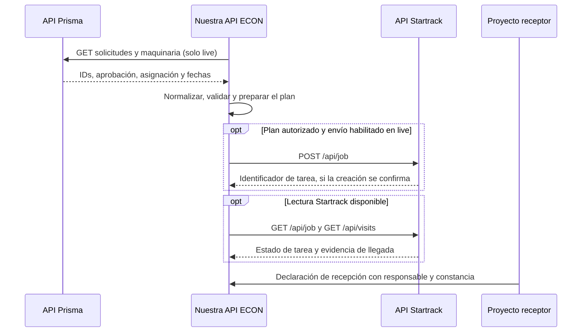

# Demostración de interacción entre APIs

Abrir `/integracion?mode=fixture` y elegir una solicitud. El recorrido muestra
quién participa, qué campos conocemos y qué falta para pasar a la siguiente
etapa. Seleccionar una conexión revela su contrato y evidencia. La selección
solo cambia la vista; no crea tareas ni ejecuta sincronizaciones.

## Recorrido

Este diagrama describe el contrato de integración, no una captura de tráfico.
En `fixture` se leen archivos y planes locales; no se contactan proveedores.
Prisma y Startrack no se llaman directamente: ECON coordina los intercambios
desde el servidor y conserva sus evidencias separadas.

| Paso del visor | Contrato | Evidencia visible |
| --- | --- | --- |
| Consultar solicitud y unidad | Prisma: `GET /api/maquinaria/requests`, `GET /api/maquinaria/equipos` | IDs de origen, estado, asignación y fechas suministradas |
| Normalizar y validar | Servicios compartidos de ECON | Campos del modelo y reglas explícitas, sin completar datos ausentes |
| Preparar tarea | Startrack: `POST /api/job` | Cuerpo preparado o lista de faltantes; preparación no equivale a envío |
| Consultar retorno | Startrack: `GET /api/job`, `GET /api/visits` | Tarea y observaciones vinculadas por ID; sin recepción inferida |
| Respuesta de nuestra API | ECON: `GET /api/v1/integration/{request_id}?mode=fixture` | La misma proyección que alimenta el visor, en JSON |

## Guion breve

1. Elegir la solicitud con CF-03 y abrir la primera conexión: explicar los
   datos proporcionados por Prisma y la procedencia de la muestra.
2. Seleccionar ECON: mostrar cómo se preserva el ID y cambian los nombres de
   los campos. Aprobación, unidad y correspondencias tienen reglas propias.
3. Seleccionar la preparación para Startrack: si no hay plan, mostrar los
   campos faltantes y que todavía no existe cuerpo para enviar.
4. Seleccionar el retorno: hacer visible que no existe tarea ni recepción
   suministrada. No simular una respuesta exitosa para completar el dibujo.
5. Abrir «Respuesta de nuestra API»: comparar el JSON con el recorrido y
   abrir su endpoint. Un HTTP 200 de ECON puede describir evidencia faltante;
   no certifica conexión ni envío a Startrack.

Para demostrar un cuerpo preparado sin enviar a proveedores, un rol autorizado
puede guardar un plan local desde el detalle de la solicitud con correspondencias
explícitas. Las pruebas de `tests/test_integration_trace.py` hacen ese recorrido
con IDs de prueba y SQLite aislado. No se precargan movimientos inventados en
el registro de la aplicación.

La recepción se registra en ECON mediante
`POST /api/v1/operations/{movement_id}/receipt`, por un rol autorizado y con
responsable, instante y constancia. No es otra API de proveedor ni un efecto
automático de entrar en una geocerca. Tampoco se implementa una escritura de
retorno a Prisma que su contrato no documente.
