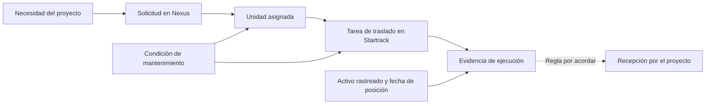

# Manuales, problema operativo y decisiones de interfaz

> Registro anterior a la migración solicitada a Dash. La arquitectura vigente
> está en [ADR 0003](adr/0003-python-dash-hub.md). Las observaciones de negocio
> y los límites de integración se conservan con su fecha original.

La [revisión analítica posterior](analitica-decisiones.md) concreta la portada para responsables de decisión, elimina elementos decorativos y define los gráficos que los datos actuales permiten sostener.

Revisión del **12 de septiembre de 2026**, ampliada por pedido del usuario después de la primera versión del frontend. Complementa la [revisión del kit](revision-contexto.md) y el [modelo operativo](modelo-operativo.md). Las instrucciones de los manuales se leyeron como referencia: no se ejecutaron altas, aprobaciones, cambios de estado, regeneraciones de claves ni modificaciones de permisos.

## Qué se consultó

Se recorrieron las **13 secciones** del [manual HTML de Nexus ECON v1.0](https://econ-key.maic.ai/docs/user-manual-ECON.html): introducción, navegación, glosario, nueve módulos y errores. Se leyó su contenido y los textos descriptivos de las figuras; no se auditó cada captura píxel por píxel. El navegador abrió el manual; una petición HTTP independiente devolvió el login, por lo que esa descarga no se usó como evidencia del manual. El PDF de OneDrive sigue siendo un extracto diferente de nueve páginas.

Hallazgos relevantes: la clave logística y el número de activo contable son campos distintos; la asignación usa una unidad disponible de la clase solicitada; aprobar con unidad cambia el inventario a ocupada. El manual también muestra aprobadas sin unidad. Distingue aprobación de bitácoras y validación posterior de costos. Sus indicadores requieren partidas, fechas y registros validados. Describe errores por mantenimiento y asignación pendiente. Hay discrepancias internas por confirmar: presenta duplicidad de clave como error aunque sus figuras repiten claves, y generaliza PV como denominador mientras su glosario usa AC para CPI. No convertimos esos ejemplos en restricciones nuevas del hub.

La sección [Administrador de usuarios de Startrack](https://support.gps-platform.com/learn/users/) explica usuarios, grupos y permisos del proveedor. También se revisaron los artículos vinculados que afectan al reto; la tabla siguiente registra su alcance, sin afirmar una auditoría de todo el sitio de soporte.

## Startrack: qué cambia nuestra interpretación

| Fuente oficial revisada | Hallazgo | Decisión para ECON |
| --- | --- | --- |
| [Usuarios](https://support.gps-platform.com/learn/users/) | Los grupos controlan pertenencia y permisos dentro de Startrack | El acceso del conector depende de la cuenta del proveedor. No implica añadir login ni una pantalla de usuarios al hub |
| [Tareas](https://support.gps-platform.com/learn/jobs/) | Una tarea puede tener asignados, programación, geocerca, formularios y contacto | Conservar esos objetos por separado; el nombre de un responsable no basta para vincular una solicitud |
| [Estados de tareas](https://support.gps-platform.com/learn/jobs/job-status/) | Etiquetas personalizadas se agrupan en pendiente, completado o cancelado; los dos últimos son terminales según la guía | Conservar etiqueta y categoría cuando el contrato las confirme. Una etiqueta desconocida no se clasifica por semejanza textual |
| [Cambiar estado](https://support.gps-platform.com/learn/jobs/job-change-status/) | Completar puede exigir todos los formularios y presencia en la geocerca configurada | Una posición aislada no prueba cierre. La aceptación de la maquinaria por el proyecto requiere evidencia acordada por ECON |
| [Crear tareas](https://support.gps-platform.com/learn/jobs/job-creation/) | La guía permite crear con solo título; desde las apps móviles asigna al creador | Tratar responsable, programación y destino ausentes como faltantes posibles, sin fabricar valores |
| [Tipos de tareas](https://support.gps-platform.com/learn/jobs/job-types/) | El tipo clasifica el propósito del trabajo y puede personalizarse | Diferenciar tipo de tarea de categoría de estado. No asumir que cualquier tarea es un traslado |
| [Administrador de tareas](https://support.gps-platform.com/learn/jobs/job-admin/) | Lista, tablero, calendario, mapa y exportaciones dependen de filtros | Registrar período, asignado y tipo al validar un caso; un resultado vacío no prueba inexistencia histórica |
| [Estados de usuario](https://support.gps-platform.com/learn/cellphones/cellphone-user-statuses/) | Describen la actividad del personal; pueden influir en su rastreo | Separarlos de tarea, motor y disponibilidad mecánica. Esta revisión no modifica el seguimiento de personas |
| [Celulares](https://support.gps-platform.com/learn/cellphones/) | El dispositivo de campo tiene usuario asignado y propiedades propias | Una observación del teléfono pertenece a ese activo; no equivale automáticamente a posición de la maquinaria |
| [Vehículos](https://support.gps-platform.com/learn/vehicle/) | Distingue vehículo rastreado, conductor, ID interno e ID remoto | Preparar correspondencias con ámbito y vigencia. El ID remoto es una pista verificable, no una garantía de igualdad |
| [Geocercas](https://support.gps-platform.com/learn/pois/) | Tienen geometría, ID remoto y propiedades configurables | Separar proyecto administrativo, destino y perímetro geográfico |
| [Crear geocercas](https://support.gps-platform.com/learn/pois/poi-creation/) | Hay distintos canales de creación y varios campos opcionales | No asumir que todas tienen contacto o referencia externa |
| [Gestión de geocercas](https://support.gps-platform.com/learn/pois/poi-admin/) | Visitas, activos cercanos y filtros son vistas diferentes | Mostrar la observación exacta y su fecha, sin presentar cercanía como entrada |
| [Buenas prácticas de geocercas](https://support.gps-platform.com/learn/pois/poi-good-practices/) | Una geometría demasiado amplia o incompleta altera las visitas registradas | Validar el perímetro y sus cambios antes de construir una regla de llegada |

La [API de usuarios](https://support.gps-platform.com/api/users/) documenta `id`, grupos, estado de rastreo y su fecha, además de configuración móvil. Ese estado técnico no sustituye los estados de tarea ni una decisión de mantenimiento. No se necesita traer teléfonos o correos al panel para mostrar el vínculo operativo; el contrato inicial debe limitarse a los campos útiles.

Al contrastar la [API de tareas](https://support.gps-platform.com/api/jobs/), `status` es un ID: el catálogo entrega su nombre y `workflow_role` (`0` pendiente, `1` completada, `2` cancelada). También distingue tipo de tarea, varios usuarios asignados, formularios requeridos, referencia externa y geocerca. `closed_date` cubre completar **o cancelar**, no recepción. La guía de creación habla de solo título obligatorio, pero el contrato API exige también `start_date`; no trasladar reglas de una pantalla directamente al conector. La muestra cURL de listar estados apunta a tipos, aunque el encabezado define `/api/job/status`: queda como discrepancia documental, sin haber probado esa ruta con nuestra cuenta. El frontend actual conserva estados del contrato del hub; incorporar este catálogo externo requiere primero validar una respuesta autorizada.

La [introducción de la API](https://support.gps-platform.com/api/intro/) confirma Basic con API key de usuario y contraseña, la ubicación de la clave en Usuarios → Integraciones (API), y el límite general de 240 peticiones por IP cada dos minutos con respuesta `529`; algunas rutas tienen límites propios. Es documentación del producto, no una prueba de permiso de nuestra cuenta. Sigue pendiente una clave habilitada: la nueva lectura documental no resuelve el `403` registrado en [la exploración](integraciones-reales.md).

## El problema que resuelve este frontend

El [brief](onedrive/02-brief-del-reto.md), los [casos](onedrive/04-casos-de-uso.md), los diagramas [AS-IS](onedrive/03-as-is.md) y [TO-BE](onedrive/03-to-be.md), y los [organigramas](onedrive/03-organigramas.md) describen coordinación entre Proyectos, Logística y Mantenimiento. Se contrastaron nuevamente con los manuales. La siguiente es nuestra interpretación para el diseño, no una automatización aprobada del proceso:

Las flechas representan relaciones por comprobar, no equivalencias ni escrituras automáticas. Una solicitud puede involucrar varios viajes; el GPS puede pertenecer al transporte. La asignación del equipo Los Filósofos sigue siendo RE-03 / MOT-006 / PROY-006. Los ejemplos locales tienen sus propios IDs y no acreditan que exista esa cadena completa en el sandbox.

| Usuario funcional | Pregunta que debe resolver | Presentación y acción útil |
| --- | --- | --- |
| Técnica de Proyectos | ¿Qué se asignó a mi necesidad y qué falta? | Solicitud, proyecto, fechas y vínculo al equipo; abrir el sistema de origen para gestionar |
| Logística y Equipos | ¿Qué tarea atiende el traslado y hacia dónde? | Unidad, tarea, destino, responsable y relación confirmada o pendiente |
| Mantenimiento | ¿Qué condición pone en riesgo el movimiento? | Falla y decisión de paro separadas; alerta con evidencia de la tarea afectada |

Son responsabilidades funcionales propuestas. No son roles autenticados del hub ni una reproducción de los permisos de las plataformas.

## Criterios del rediseño

La referencia visual es [ECON El Salvador](https://econ.com.sv/), cuya actividad incluye construcción, asfaltos y alquiler de maquinaria. Su identidad se toma del sitio corporativo, no del tema morado de MAIC ni de empresas con nombres parecidos. El origen de los recursos gráficos y las decisiones de componentes se registran en [arquitectura del frontend](frontend-architecture.md).

- Superficies cuadradas, bordes claros y uso contenido del azul corporativo. Reducir contenedores decorativos, mensajes repetidos y grandes tarjetas que apartan los registros de la vista.
- Tablas y detalles organizados por la pregunta operativa. Mostrar primero equipo, estado de asignación, traslado y faltantes; ampliar procedencia y evidencia cuando se necesiten.
- Números vinculados a los registros que los forman, con ámbito y corte visibles. No introducir tendencias, porcentajes de cumplimiento, costos ni recepción sin datos suficientes.
- Acceso etiquetado a los dos sandboxes y a su documentación. Los enlaces generales no prometen abrir un registro específico, especialmente en los ejemplos inventados.
- Mantener búsqueda, navegación por teclado, foco visible, estados de carga/error/vacío, modo explícito y funcionamiento móvil. Cambiar la estética no debe reducir esas capacidades.
- Separar primitivas shadcn, composición de pantallas, validación del contrato y consultas de TanStack Query. La arquitectura concreta y su política de caché se documentan junto al código.

## Próximas validaciones operativas

Confirmar con las áreas responsables el catálogo de estados, la relación de IDs, los viajes de cada solicitud, la evidencia de recepción, el activo que porta el GPS y la antigüedad aceptable de la señal. Esas decisiones siguen abiertas; no se enviaron consultas a terceros. La implementación actual puede enseñar datos y faltantes comprobables mientras se obtienen esos acuerdos.
