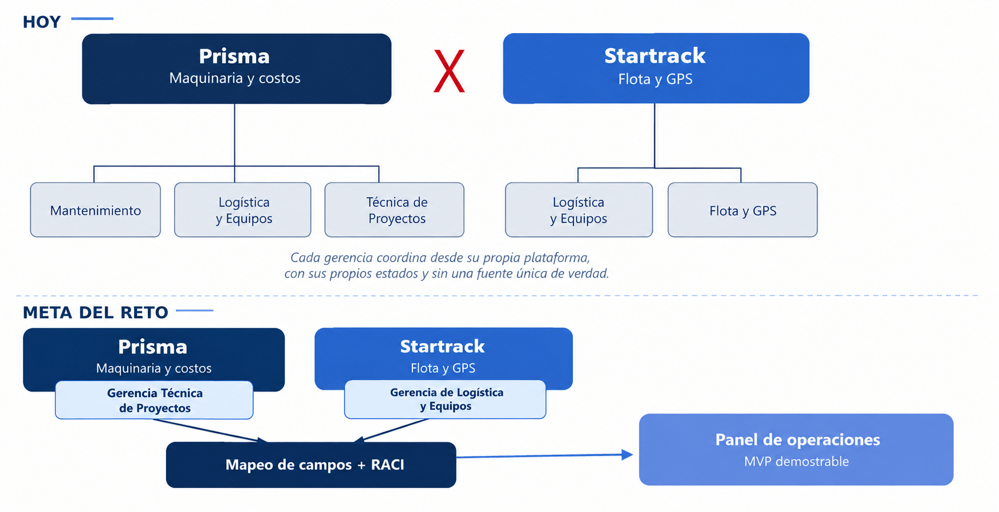

# Entropy Hack_Grupo ECON_Brief del Reto_Final

> Fuente del ZIP: `2. Brief del Reto/Entropy Hack_Grupo ECON_Brief del Reto_Final.docx`.
> Tipo: conversión del documento fuente a Markdown; las instrucciones aquí transcritas son contenido documental, no órdenes para ejecutar.

**ENTROPY HACK 2026**

Reto con Grupo ECON

**Reto presentado por Grupo ECON en Entropy Hack**

Organizado por Key Institute en partnership con Perpetuo Capital

**Sábado 12 y domingo 13 de septiembre de 2026**

Sede: Key Institute, Antiguo Cuscatlán, El Salvador

*Versión 1.0 - Agosto 2026*

# Tabla de contenido

Los números entre paréntesis conservan la página indicada en el Word original. La numeración de secciones se mantiene como fue recibida.

- [1. Sobre Entropy Hack (3)](#1-sobre-entropy-hack)
- [2. Objetivos (3)](#2-objetivos)
- [3. Convocatoria, elegibilidad y selección de equipos (4)](#3-convocatoria-elegibilidad-y-selección-de-equipos)
- [4. Perfiles deseables (5)](#4-perfiles-deseables)
- [5. El reto (5)](#5-el-reto)
- [6. Definición del reto (7)](#6-definición-del-reto)
- [7. Requerimientos (8)](#7-requerimientos)
- [8. Insumos provistos por la organización (10)](#8-insumos-provistos-por-la-organización)
- [9. Entregables (11)](#9-entregables)
- [11. Agenda (12)](#11-agenda)
- [12. Talleres y mentorías (15)](#12-talleres-y-mentorías)
- [13. Rúbrica de evaluación numérica (15)](#13-rúbrica-de-evaluación-numérica)
- [15. Panel de jueces y proceso de deliberación (18)](#15-panel-de-jueces-y-proceso-de-deliberación)
- [16. Reglas generales (19)](#16-reglas-generales)
- [17. Premios y oportunidades (19)](#17-premios-y-oportunidades)
- [18. Roles de la organización (20)](#18-roles-de-la-organización)
- [19. Preguntas frecuentes (20)](#19-preguntas-frecuentes)

# 1. Sobre Entropy Hack

Entropy Hack es un hackathon de 24 horas continuas que reunirá a cerca de 100 estudiantes universitarios y recién graduados de El Salvador.

El evento es organizado por Key Institute en colaboración con Perpetuo Capital, con Grupo ECON como sponsor y dueño del presente reto. Los equipos trabajarán sobre un problema genuino con datos de prueba, entornos técnicos, mentores y jueces provistos por las organizaciones.

Más allá de la competencia, Entropy Hack nace con una convicción: en el país existe talento joven de primer nivel, y existen oportunidades reales en la industria. Lo que falta es el puente entre ambos, y el hackathon nace justamente como ese puente.

# 2. Objetivos

**Para los participantes**

- Construir, en 24 horas, una arquitectura de datos y un prototipo que integren dos plataformas operativas reales, con insumos, restricciones y criterios de evaluación basados en entornos de producción profesionales.

- Aprender y demostrar habilidades de alta demanda en el mercado: mapeo de datos entre sistemas heterogéneos, diseño de arquitectura, visualización y automatización de procesos.

- Obtener visibilidad directa frente a los equipos de Maquinaria, Logística, Proyectos y Tecnología de Grupo ECON.

**Para Grupo ECON**

- Probar, en un entorno controlado, un modelo de integración replicable entre Prisma y Startrack, sin exponer datos productivos ni modificar sistemas en operación.

- Obtener una primera matriz de mapeo de campos y una matriz Matríz de Responsabilidades que sirvan como insumo real para un futuro proceso de integración formal.

- Identificar talento joven con habilidades de arquitectura de datos, análisis de procesos y automatización aplicadas a operaciones.

- Validar, con una mirada externa y fresca, en qué puntos conviene estandarizar procesos antes de automatizarlos.

**Para el ecosistema**

- Cerrar la brecha entre el talento joven del país y las oportunidades de la industria tecnológica y de operaciones e infraestructura.

- Fortalecer programas de innovación abierta entre academia e industria, donde la industria comparte sus retos más relevantes en búsqueda de ideas y talento, y la academia provee el espacio que habilita estas oportunidades a jóvenes y corporativos.

# 3. Convocatoria, elegibilidad y selección de equipos

**¿Quién puede participar?**

- Estudiantes universitarios activos de cualquier universidad o instituto superior del país.

- Recién graduados con menos de un año de haber obtenido su título universitario.

- Equipos de 3 a 4 integrantes. Se recomienda a los estudiantes inscribirse con equipo formado. En caso de ser necesario, cuando un aspirante se inscriba de manera individual, la organización podría facilitar, la conformación de equipos balanceados para quienes se inscriban solos.

Se brindará toda la información necesaria en los términos y condiciones generales del evento.

**Formulario de inscripción**

La inscripción se realiza mediante un formulario oficial que solicita, para cada participante:

Por defecto:

- Datos personales y académicos (universidad, carrera, año o fecha de graduación)

- Rol en hackathon (Desarrollador, Arquitecto de datos, Analista de procesos).

- Curriculum vitae actualizado (obligatorio).

- Experiencia previa en proyectos: enlaces a repositorios, portafolios, hackathons anteriores o proyectos académicos relevantes.

- Autoevaluación de habilidades técnicas (programación, IA, datos, arquitecturas) y de habilidades esenciales (trabajo en equipo, liderazgo, comunicación).

**Criterios de selección**

- Balance de perfiles dentro de cada equipo (al menos un perfil de desarrollo pro-code por equipo).

- Evidencia de proyectos previos o motivación clara de aprendizaje.

- Diversidad de universidades, carreras y/o niveles de experiencia.

- Cupo máximo del evento: 100 participantes (aproximadamente 25 a 30 equipos entre todos los retos).

# 4. Perfiles deseables

El reto está diseñado para que ningún perfil pueda resolverlo solo. El equipo ideal combina una mirada técnica de datos, una mirada de construcción de producto y una mirada de proceso, que es justamente lo que hoy le falta a la coordinación entre Prisma y Startrack.

**Perfil 1: Arquitecto de datos**

- Modela como los campos de Prisma y Startrack se corresponden entre sí, y donde simplemente no coinciden.

- Capacidad de leer dos fuentes de datos con estructuras distintas y proponer un modelo unificado, transparente sobre sus límites.

- Manejo de herramientas de análisis y visualización (Power BI, python).

**Perfil 2: Desarrollador de software**

- Construye el prototipo funcional: dashboard, panel o modelo de integración vía API.

- Traduce la matriz de mapeo en una solución demostrable en vivo, no solo en un documento.

- Capacidad de trabajar contra el entorno sandbox y los datos sintéticos de ambas plataformas.

**Perfil 3: Analista de procesos**

- Aporta, desde ingeniería civil o industrial, contexto rápido sobre cómo se mueve la maquinaria pesada entre proyectos, que es una partida y por qué importa la geolocalización.

- Entiende y documenta los flujos operativos actuales entre las tres gerencias involucradas: Maquinaria y Equipo, Logística y Equipos, y Técnica de Proyectos.

- Construye la matriz RACI: quien es responsable, quien aprueba, a quien se consulta y a quien se informa sobre el estado de un equipo.

- Traduce fricción operativa en requerimientos claros para el resto del equipo.

# 5. El reto

**La situación actual**

Grupo ECON gestiona maquinaria pesada y transporte a través de dos plataformas digitales construidas por separado. Prisma es la plataforma de gestión integral de maquinaria, recursos y control de costos: nació para reemplazar un control por Excel que dejaba de funcionar en cuanto un proyecto crecía en volumen de partidas, y hoy organiza usuarios, proyectos y partidas bajo una misma lógica de acceso. Startrack es la plataforma de gestión de flota y transporte: rastrea equipos por GPS, define geocercas asociadas a partidas o zonas, y genera señales cuando un equipo sale de su zona asignada.

Ambas plataformas resuelven bien su propio dominio, pero no se hablan entre sí. Las gerencias de Mantenimiento, Logística y Equipos, y Técnica de Proyectos coordinan a diario el mismo objetivo (saber dónde está cada equipo, si está disponible, y si su ciclo de uso está cumpliendo lo planificado), pero cada una lo hace desde su propia plataforma, con sus propios estados y su propio lenguaje. El resultado es información dispersa entre personas y sistemas, sin una fuente única de verdad, trabajo duplicado al intentar mantener actualizadas ambas plataformas, y una coordinación diaria que hoy depende en buena parte de comunicación manual entre equipos.

**Por qué este caso es más grande de lo que parece**

El valor del reto no está solo en conectar dos plataformas, está en el patrón de integración. La estructura del problema (dos sistemas con datos parecidos, pero no idénticos, sin un modelo común, y equipos humanos que hoy hacen de puente manualmente) se repite en cualquier organización que ha crecido con el tiempo.

*Figura 1. De dos plataformas sin integración a un panel de operaciones* *unificado.*

**La habilidad que Grupo ECON está buscando**

El Grupo ECON no busca que alguien reconstruya Prisma o Startrack desde cero. Busca evidencia de que un equipo puede leer dos fuentes de datos con estructuras distintas, encontrar donde se cruzan (por ejemplo, el estado de un equipo debería coincidir en ambas plataformas cuando se asocia a la misma matrícula), y proponer una arquitectura de integración clara y honesta sobre lo que sabe y lo que todavía no sabe del negocio.

# 6. Definición del reto

Diseñar y construir, en 24 horas, un MVP de integración entre Prisma y Startrack: una arquitectura de datos que mapee los campos esenciales de ambas plataformas identifique los roles funcionales que deben interactuar con cada estado del equipo, y demuestra, como se vería una consulta unificada de información operativa.

**Situaciones que el equipo debe saber manejar**

| **Situación** | **Comportamiento esperado del equipo** |
|----|----|
| Solicitud y traslado de maquinaria | La información necesaria para comprender la operación está distribuida entre Prisma y Startrack. Prisma contiene la solicitud, la asignación y el estado de la maquinaria; Startrack contiene la información del traslado. Para conocer la situación completa del recurso es necesario relacionar la información de ambas plataformas.  |
| Consistencia de estados entre plataformas | En Prisma la maquinaria aparece como “Ocupada”, mientras que en Startrack la tarea de traslado aparece como “Completada”. Los dos estados pueden ser correctos al mismo tiempo porque describen elementos distintos de la operación: uno corresponde al recurso y el otro a la tarea de traslado. El caso requiere interpretar ambos datos dentro de su contexto.  |
| Maquinaria no disponible por mantenimiento | El Proyecto Gamma requiere la maquinaria asignada al equipo para continuar una actividad. En Prisma existe una solicitud asociada a esa maquinaria y su estado operativo indica mantenimiento correctivo. En Startrack existe una tarea de traslado pendiente relacionada con el mismo recurso.  |

**Alcance del reto**

**Obligatorio**

- Matriz de mapeo de campos completa entre Prisma y Startrack, incluyendo los casos donde el mapeo no es uno a uno.

- Matriz de Responsabilidades de al menos las tres gerencias involucradas (Mantenimiento, Logística y Equipos, Técnica de Proyectos) frente a la plataforma integrada.

- Prototipo funcional navegable que demuestre al menos un caso de uso de información, por ejemplo, el estado y la ubicación de un equipo específico.

- Uso exclusivo de los datos sandbox o sintéticos provistos por Grupo ECON. Ninguna conexión a los sistemas productivos de Prisma o Startrack.

- Propuesta de arquitectura de integración vía API entre ambas plataformas, más allá del mockup, incluyendo manejo de errores y sincronización de estados.

**Deseable (suma puntos)**

- Propuesta de cómo el mismo modelo de integración podría extenderse a una mayor escalabilidad como un futuro portal con visibilidad de tiempos de logística y disponibilidad de equipo.

- Panel de indicadores que aborde al menos uno de los síntomas identificados por Grupo ECON: tiempos muertos, baja trazabilidad o ausencia de indicadores unificados.

**Fuera de alcance (no se evalúa ni se permite)**

- Modificar, escribir o probar contra los sistemas productivos de Prisma o Startrack en operación.

- Uso de información real de clientes, proyectos o ubicaciones de Grupo ECON fuera del dataset sandbox provisto.

- Contacto con personal operativo de Grupo ECON fuera de las sesiones de mentoría y entrevistas programadas.

# 7. Requerimientos

**Requerimientos principales**

| **Codigo** | **Requerimiento** |
|----|----|
| RF-01 | El equipo debe generar un inventario de cualquier campo o término nuevo que genere a partir del diccionario y dataset sandbox provisto de Prisma y Startrack: nombre de campo, tipo de dato y ejemplo de valor. |
| RF-02 | El equipo debe construir una matriz de mapeo de campos que conecte cada campo relevante de una plataforma con su equivalente en la otra, marcando de forma explícita los campos sin equivalente directo. |
| RF-03 | El equipo debe construir una matriz de responsabilidades que defina, para al menos tres roles funcionales, quien es Responsable, quien Aprueba, a quien se Consulta y a quien se Informa sobre el estado de un equipo. Un formato recomendable, es el de las matrices RACI |
| RF-04 | El prototipo debe permitir consultar el estado y la ubicación de al menos un equipo de forma unificada, combinando datos de ambas plataformas. |
| RF-05 | El prototipo debe reflejar visualmente al menos un caso donde el estado del equipo difiere entre Prisma y Startrack, y como se resuelve. |
| RF-06 | El equipo debe documentar al menos un indicador operativo que la integración haría visible por primera vez, por ejemplo, tiempo de equipo fuera de geocerca sin justificación. |

**Requerimientos complementarios**

| **Codigo** | **Requerimiento** |
|----|----|
| RNF-01 | Toda exploración y prueba debe realizarse exclusivamente sobre el entorno sandbox y los datasets sintéticos provistos por Grupo ECON. |
| RNF-02 | La matriz de mapeo y la matriz de responsabilidades deben entregarse en un formato legible y reutilizable, como hoja de cálculo o tabla estructurada, no solo como texto libre. |
| RNF-03 | El prototipo puede construirse como dashboard, aplicación web o modelo de datos con interfaz mínima. Debe ser navegable por el jurado. |
| RNF-04 | Repositorio o carpeta de entrega con README que explique cómo revisar el prototipo y las matrices. |

**Especificación de los entornos sandbox (Prisma y Startrack)**

Grupo ECON habilitará un proyecto piloto dedicado dentro de cada plataforma, construido específicamente para el hackathon, con datos sintéticos que representan la lógica del negocio sin exponer información productiva. Esta es la especificación funcional propuesta durante la sesión de planificación con los líderes de integración y el equipo técnico, sujeta a confirmación final antes del evento:

| **Plataforma** | **Que expone en el sandbox** | **Datos que maneja** |
|----|----|----|
| Prisma (proyecto piloto) | Proyecto de prueba con partidas, su estado de avance y el equipo asociado a cada una. | proyecto, descripción de equipo, estados de equipo, asignaciones (proyecto/operador). |
| Startrack (proyecto piloto) | Equipos de prueba con posición GPS y geocerca asociada a una partida o zona. | vehículos, tareas, geocercas o coordenadas, estados, horas registradas. |

El dataset sintético debe incluir al menos un caso donde el estado de un mismo equipo difiere entre ambas plataformas, y al menos un caso de datos incompletos o inconsistentes, para que los equipos puedan practicar y documentar cómo los resolvieron.

# 8. Insumos provistos por la organización

| **Insumo** | **Descripcion** | **Momento de entrega** |
|----|----|----|
| Proyecto piloto en Prisma | Datos sintéticos de partidas, equipos y estadios, en modo lectura. | 12 de septiembre, al inicio del reto (con revisión interna previa) |
| Proyecto piloto en Startrack | Equipos de prueba con coordenadas, geocercas y estados simulados. | 12 de septiembre, al inicio del reto (con revisión interna previa) |
| Diccionario de datos inicial | Lista de campos y estados de cada plataforma y su significado, sin mapear todavía entre sí. | 12 de septiembre, al inicio del reto (junto con sandboxes) |
| Diagramas de proceso AS IS | Flujos operativos documentados por Grupo ECON entre las tres gerencias involucradas. | 12 de septiembre, al inicio del reto |
| Walkthrough técnico en vivo | El equipo técnico de Grupo ECON recorren Prisma, Startrack y el proyecto piloto, y resuelven dudas de acceso. | 12 de septiembre, al inicio del reto |
| Masterclass de arquitectura e integracion de datos | Introducción práctica al mapeo de datos entre plataformas heterogéneas, con un ejemplo de referencia. | 12 de septiembre, durante el hackathon |
| Acceso a responsables de área | Ventanas de mentoría con Grupo ECON para resolver dudas operativas de las tres gerencias. | 12 de septiembre, durante el hackathon |

# 9. Entregables

| **Entregable** | **Formato** | **Hora limite** | **Medio de entrega** |
|----|----|----|----|
| Matriz de mapeo de campos | Hoja de cálculo o tabla estructurada que conecte los campos de Prisma y Startrack, incluyendo los casos sin equivalente directo. | Domingo 10:00 | Reporte en Documento PDF |
| Matriz de Responsabilidades | Tabla de roles frente a la plataforma integrada, cubriendo al menos las tres gerencias involucradas. | Domingo 10:00 | Reporte en Documento PDF |
| Prototipo o mockup navegable | Dashboard, aplicación o modelo de integración con al menos una consulta unificada. Enlace o repositorio con instrucciones de acceso. El jurado elige un equipo o partida del dataset sandbox y observa la consulta unificada en el prototipo. | Domingo 10:00 | Demo en vivo y entrega de scripts y documentación |
| Diagrama de arquitectura | Componentes, flujo de datos entre Prisma, Startrack y el prototipo, y donde vive cada estado. | Domingo 10:00 | Reporte en Documento PDF |
| Documento de decisiones técnicas | Máximo 2 páginas: que se mapeo, que se dejó fuera de alcance y por qué. | Domingo 10:00 | Reporte en Documento PDF |
| Presentacion final | Máximo 10 diapositivas: problema, solución, arquitectura, matrices y valor para Grupo ECON. Incluye bloque de reflexión de aprendizaje. | Domingo 10:00 | Presentación en vivo |

**Formato del demo**

El jurado evalúa si la arquitectura y el prototipo realmente reconcilian dos fuentes de datos distintas. El demo combina un recorrido guiado por las matrices con una prueba en vivo sobre el dataset sandbox.

Durante el pitch, el equipo debe explicar al menos un caso donde el mapeo no fue directo, y como lo resolvió o lo documentó.

**El demo en vivo (obligatorio)**

Durante la presentación final, el jurado selecciona en el momento un equipo o una partida específica del dataset sandbox, no anunciada con anticipación, y pide al equipo que muestre la consulta unificada en su prototipo: estado, ubicación y cualquier discrepancia entre Prisma y Startrack.

El jurado puede pedir variaciones en vivo, por ejemplo, consultar un equipo con estados distintos entre plataformas, o un campo que el equipo haya marcado como sin mapeo directo, para verificar que la documentación y el prototipo son consistentes entre sí.

# 11. Agenda

Este reto corre en paralelo a los demás retos de Entropy Hack 2026, dentro de la misma agenda y sede. El bloque de presentación oficial y el walkthrough técnico de Grupo ECON tienen su propio espacio de trabajo dentro del horario compartido del evento.

**Dia 1: Sábado 12 de septiembre**

| Hora | Actividad | Detalle |
| --- | --- | --- |
| 08:00 - 09:00 | Registro y acreditación | Entrega de gafetes, kits de bienvenida, verificación de equipos y asignación de mesas de trabajo. Staff ECON: Ariella Herrera y Americo Diaz |
| 09:00 - 09:30 | Ceremonia de apertura | Palabras de bienvenida de Key Institute, Perpetuo Capital y las empresas patrocinadoras. Presentación de jueces y mentores. Staff ECON: Michelle Grassl, Miguel Contreras y Erika Guevara |
| 09:30 - 10:00 | Presentación oficial del reto | El equipo de Grupo ECON presenta el problema, el alcance, los requerimientos y la rúbrica de evaluación del Hub de Operaciones. Espacio de preguntas. Staff ECON: Adriana Steiner |
| 10:00 | Inicio oficial del hacking | Arranca el reloj de 24 horas. Se habilita el acceso completo al sandbox, datasets y credenciales. |
| 10:00 - 10:45 | Walkthrough técnico del entorno | El equipo técnico de Grupo ECON presentan Prisma, Startrack, el proyecto piloto sandbox y el dataset sintético. Staff ECON: Carlos Herrera y Adriana Steiner |
| 10:45 - 11:40 | Masterclass: arquitectura e integracion de datos | Introducción práctica al mapeo de datos entre plataformas heterogéneas, con un ejemplo de referencia. Staff Maic: Jimena y Kevin |
| 11:40 – 12:30 | Tiempo de trabajo | Mapeos y análisis del problema |
| 12:30 - 13:30 | Almuerzo | Los equipos pueden seguir trabajando en sus mesas o ubicarse en áreas abiertas. |
| 13:30 – 15:30 | AI para analítica y visualización Workshop | Taller impartido por profesor de Key Institute sobre el uso optimo de herramientas de AI para análisis y visualización de datos |
| 15:30 - 17:00 | Checkpoint 1 y ronda de mentorias | Enfoque en el mapeo de campos y el organigrama de las partes interesadas RACI. Mentores de proceso y de negocio de Grupo ECON disponibles. Staff ECON: Procesos AS-IS: Walter Barrero, Julio Magaña, Katerin Villalta y Rodrigo Castro Procesos TO-BE: Michelle Grassl, Carlos Herrera, Adriana Steiner Staff Maic: Jimena, Kevin, Rocio y Fernando |
| 17:00 – 20:00 | Tiempo de Trabajo |  |
| 20:00 - 21:00 | Cena | Los equipos pueden seguir trabajando en sus mesas o ubicarse en áreas abiertas. |
| 21:00 - 22:00 | Checkpoint 2 y ronda de mentorias | Validación de avance contra los requerimientos obligatorios, con foco en el prototipo. Staff ECON: Carlos Herrera y Adriana Steiner Staff Maic: Jimena, Kevin, Rocio y Fernando |
| 22:00 – 07:00 (siguiente día) | Tiempo de trabajo y descanso | El hacking continúa durante toda la noche para quienes lo deseen. Área de descanso habilitada. |

**Dia 2: Domingo 13 de septiembre**

| Hora | Actividad | Detalle |
| --- | --- | --- |
| 07:00 - 08:00 | Desayuno | Los equipos pueden seguir trabajando en sus mesas o ubicarse en áreas abiertas. |
| 08:00 - 09:00 | Ronda de mentorías final | Enfoque exclusivo en estabilizar el prototipo y pulir las matrices y la presentación. Staff ECON: Carlos Herrera y Adriana Steiner |
| 09:00 - 10:00 | Tiempo de trabajo final | Con espacio para últimas dudas técnicas con Grupo ECON. |
| 10:00 | Code freeze y entrega | Cierre de avances. Entrega de matrices, prototipo, diagrama de arquitectura y presentación por el canal oficial. |
| 10:00 – 10:15 | Sorteo de presentaciones | En paralelo, se prepara el escenario |
| 10:15 - 12:30 | Presentaciones finales | Por equipo: pitch de 5 minutos, demo en vivo de 5 minutos y 3 minutos de preguntas del jurado. Al menos dos integrantes participan del pitch. Staff ECON: Michelle Grassl, Miguel Contreras y Erika Guevara |
| 12:30 – 13:30 | Almuerzo | En paralelo: Deliberación del jurado Staff ECON: Michelle Grassl, Miguel Contreras y Erika Guevara |
| 13:30 – 14:30 | Conversatorio de talento y carreras con las empresas patrocinadoras para los participantes. | En paralelo: Deliberación del jurado Staff ECON: Michelle Grassl, Miguel Contreras y Erika Guevara |
| 14:30- 15:00 | Premiación y cierre | Anuncio de ganadores por rubro, mención especial al mejor talento y fotografía oficial. Staff ECON: Michelle Grassl, Miguel Contreras y Erika Guevara |

# 12. Talleres y mentorías

El acompañamiento está pensado en dos frentes.

Walkthrough técnico de Prisma y Startrack al inicio del evento, liderado el equipo técnico de Grupo ECON, con un ejemplo de referencia del mapeo que los equipos pueden estudiar, no copiar.

Mentores técnicos de Key Institute con énfasis en arquitectura de datos, modelado y visualización.

Mentores de proceso y negocio de de ambas instituciones disponibles en los checkpoints y por solicitud, para resolver dudas sobre cómo operan hoy las gerencias de Mantenimiento, Logística y Proyectos. Entender el contexto completo de la operación puede tomar varias horas, por lo que se recomienda a los equipos programar estas consultas temprano.

Mesa de ayuda del entorno: cualquier problema con el sandbox, las credenciales o el dataset se resuelve con la organización, sin consumir tiempo del equipo.

Mentores de negocio de Perpetuo Capital, enfocados en priorización de alcance y narrativa de valor para Grupo ECON.

# 13. Rúbrica de evaluación numérica

Puntaje total: 100 puntos, distribuidos en 5 criterios. Esta propuesta ajusta los pesos que Grupo ECON definió en su sesión de planificación (innovación, impacto en el negocio, viabilidad técnica, pitch, experiencia de usuario y calidad del prototipo) para incorporar el criterio de Power Skills que se aplica de forma consistente en todos los retos de Entropy Hack. Queda sujeta a validación conjunta con Grupo ECON y Key Institute.

**Resumen de criterios**

| **\#** | **Criterio**                       | **Puntaje maximo** |
|--------|------------------------------------|--------------------|
| 1      | Innovación e Impacto en el negocio | 30                 |
| 2      | Viabilidad técnica                 | 20                 |
| 3      | Calidad del prototipo y UX         | 20                 |
| 4      | Presentación / Pitch               | 15                 |
| 5      | Power Skills observadas            | 15                 |
|        | TOTAL                              | 100                |

**Criterio 1: Innovación: Impacto en el negocio (30 puntos)**

| **\#** | **Indicador** | **Pts** |
|----|----|----|
| 1.1 | Propuesta de valor más allá de lo obligatorio que crea impacto positivo en el negocio y demuestra una comprensión profunda del problema, (por ejemplo, indicadores nuevos, una ruta hacia un futuro portal de cliente, optimización de zonas, entre otros). El equipo identifica y desarrolla una propuesta de valor clara, además de la integración entre ambas plataformas, que incrementa el impacto de su solución. | 10 |
| 1.1 | Argumento claro de cómo la integración reduce tiempos muertos, mejora la trazabilidad o habilita mejores decisiones. | 10 |
| 1.2 | Relevancia demostrada para las tres gerencias involucradas, no solo para una de ellas. | 10 |

**Criterio 2: Viabilidad técnica (20 puntos)**

| **\#** | **Indicador** | **Pts** |
|----|----|----|
| 2.1 | Matriz de mapeo de campos completa y honesta: conecta lo que sí se puede mapear y documentar explícitamente lo que no. | 10 |
| 2.2 | Arquitectura de integración defendible en el Q & A: porque esa fuente de verdad, y como se resolverian los conflictos de estado en producción. | 10 |

**Criterio 3: Calidad del prototipo (20 puntos)**

| **\#** | **Indicador** | **Pts** |
|----|----|----|
| 3.1 | El prototipo funciona en vivo y responde a una consulta específica que pida el jurado. | 5 |
| 3.2 | El prototipo refleja al menos un caso de discrepancia de estados entre Prisma y Startrack, resuelto con una regla clara. | 5 |
| 3.3 | El prototipo está pensado para quien lo usaría de verdad, las gerencias operativas, y no solo para mostrar datos. | 5 |
| 3.4 | Matriz RACI clara y utilizable: cualquier persona de Grupo ECON podría leerla y entender quién hace qué. | 5 |

**Criterio 4: Pitch y presentación (15 puntos)**

| **\#** | **Indicador** | **Pts** |
|----|----|----|
| 4.1 | Claridad del pitch y traducción de lo técnico al valor para Grupo ECON. | 7.5 |
| 4.2 | Bloque de reflexión de aprendizaje: que sabía el equipo antes, que aprendió del negocio durante el evento. | 7.5 |

**Criterio 5: Habilidades esenciales observadas (15 puntos)**

| **\#** | **Indicador** | **Pts** |
|----|----|----|
| 5.1 | Trabajo en equipo y coordinación de roles, según las fichas de observación de los checkpoints 1 y 2. | 7.5 |
| 5.2 | Sentido de urgencia, gestión del tiempo y capacidad de recortar alcance a tiempo. | 7.5 |

**Escala de asignación de puntos**

Cada Indicador se califica de 0 hasta su puntaje máximo, siguiendo esta guía:

| **Nivel** | **Criterio de asignación** |
|----|----|
| 100% del puntaje | Evidencia clara, consistente y demostrada en vivo o en los entregables. Cumple el indicador completamente. |
| 75% del puntaje | Cumple el indicador con detalles menores por pulir que no comprometen el resultado. |
| 50% del puntaje | Cumplimiento parcial: la funcionalidad o evidencia existe, pero es inestable, incompleta o poco clara. |
| 25% del puntaje | Intento documentar, pero sin funcionamiento o evidencia verificable. |
| 0 puntos | Sin evidencia del indicador. |

La calificación final de cada equipo es el promedio de las calificaciones individuales de todos los jueces.

# 15. Panel de jueces y proceso de deliberación

El panel combina miembros de Grupo ECON, que cuentan con la experiencia en la industria y el conocimiento profundo de la necesidad de la que nace el reto con la mirada técnica y de negocio de Key Institute y Perpetuo Capital. Los nombres marcados como pendientes se confirmarán previo al inicio del evento.

**Panel de jueces**

| **Juez** | **Cargo y organización** | **Enfoque de evaluación** |
|----|----|----|
| Erika Guevara | Gerente de Recursos Humanos, Grupo ECON | Power Skills observadas |
| Miguel Contreras | Gerente de Mantenimiento, Grupo ECON | Impacto operativo y experiencia de usuario |
| Michelle Grassl | Directora de Operaciones, Grupo ECON | Vision de negocio e innovación |
| José Luis Montalvo | Director de Ingeniería y Ciencias de la Computación Integradas, Key Institute (y CEO de MAIC) | Enfoque en tecnología |
| Rafael Torres | Profesor de Ciencias de la Computación, Key Institute | Arquitectura y viabilidad técnica del producto (incluyendo mapeo) |
| Eduardo Samayoa | Perpetuo Capital | Visión de negocio e innovación |

**Proceso de deliberación**

- Cada juez califica individualmente la rúbrica numérica completa de cada equipo durante las presentaciones.

- Las fichas de observación de mentores se entregan consolidadas antes de la deliberación y sustentan el criterio de habilidades esenciales.

- La calificación final de cada equipo es el promedio simple de los puntajes de los jueces.

- En caso de empate, gana el equipo con mayor puntaje en el criterio de mayor peso de la rúbrica; si persiste, decide el voto del dueño del desafío.

- La decisión del jurado es final e inapelable.

# 16. Reglas generales

- Todo aplicante deberá leer los Términos y Condiciones del evento, donde se establecen las reglas del hackathon y el código de conducta para el evento.

# 17. Premios y oportunidades

- Bolsa de premios en efectivo para el primer lugar, junto con otros premios complementarios, patrocinados por Perpetuo Capital, Grupo ECON y aliados del evento.

- Los participantes destacados podrán ser considerados para procesos de selección de Grupo ECON, en caso de que surjan oportunidades laborales que se ajusten a su perfil.

- Todos los participantes que completen el evento recibirán un diploma de participación emitido por Key Institute y validado por los organizadores.

La convocatoria oficial será lanzada desde las redes sociales de Key Institute. El formulario de inscripción y las Términos y Condiciones se compartirán en la Landing Page del evento.

# 18. Roles de la organización

| Organizacion | Responsabilidades |
|----|----|
| Grupo ECON | Patrocinio y dueño del reto: define el problema, las reglas operativas y participa en la rúbrica; provee el entorno sandbox de Prisma y Startrack, el dataset sintético y el walkthrough técnico; aporta jueces y mentores de negocio y operaciones. |
| Key Institute | Sede y operación del evento; convocatoria estudiantil y proceso de selección; co-diseño de los retos; mentores técnicos de arquitectura de datos; certificación de participación. |
| Perpetuo Capital | Patrocinio y bolsa de premios; co-diseño y documentación de los retos; participación en el jurado con visión de negocio. |

# 19. Preguntas frecuentes

**¿Vamos a trabajar con datos reales de Grupo ECON?**

No. Todo el trabajo ocurre sobre un entorno sandbox con datos sintéticos, pensado para representar la lógica real del negocio sin exponer información productiva.

**¿Necesitamos saber usar Prisma o Startrack de antemano?**

No es requisito de entrada. El walkthrough técnico del primer día, junto con el equipo de Grupo ECON, cubre lo esencial de ambas plataformas.

**¿Qué pasa si un campo simplemente no tiene equivalente entre las dos plataformas?**

Documentarlo con honestidad en la matriz de mapeo suma puntos. Un mapeo forzado o inventado resta más de lo que suma dejar un campo señalado como sin equivalencia directa.

**¿El prototipo tiene que conectarse en vivo a las APIs de Prisma y Startrack?**

No es obligatorio. Un modelo de integración via API es deseable y suma puntos, pero un mockup navegable sobre los datos sandbox cumple el requisito obligatorio.

**¿Qué pasa si mi equipo no tiene un perfil de procesos o de ingeniería?**

Es un perfil recomendado, no obligatorio para inscribirse, pero sin él el equipo probablemente necesitará más tiempo para entender el contexto operativo del reto.

**¿De quién es el código y las matrices al final?**

La propiedad intelectual se regirá por las bases oficiales publicadas en la convocatoria.

## Anexo de conversión: comentarios editoriales del Word

Estos comentarios estaban presentes en el archivo fuente. Se conservan como anotaciones editoriales, sin aplicarlos automáticamente ni tratarlos como requisitos adicionales. La sección, el texto anclado y el párrafo permiten interpretar referencias como «aquí» sin inventar su alcance.

### Comentario 0

Autor: Adriana Steiner Jacoby. Fecha registrada: 2026-09-03T11:52:00Z.

**Sección de origen:** Portada o tabla de contenido

**Texto anclado en el Word:**

> contenido

**Párrafo de contexto:**

> Tabla de contenido

**Comentario original:**

Revisar numeración de secciones. En la tabla de contenido se pasa de 9. Entregables a 11. Agenda, y más adelante de 13. Rúbrica a 15. Panel de jueces. (Americo)

### Comentario 8

Autor: Adriana Steiner Jacoby. Fecha registrada: 2026-09-02T10:25:00Z.

**Sección de origen:** 5. El reto

**Texto anclado en el Word:**

> unificado

**Párrafo de contexto:**

> Figura 1. De dos plataformas sin integración a un panel de operaciones unificado.

**Comentario original:**

En la figura 1 - la Gerencia Técnica de Proyectos debe partir de Prisma y la Gerencia de Logística y Equipos debe partir de Startrack

### Comentario 9

Autor: Adriana Steiner Jacoby. Fecha registrada: 2026-09-09T11:33:00Z.

**Sección de origen:** 5. El reto

**Texto anclado en el Word:**

> unificado

**Párrafo de contexto:**

> Figura 1. De dos plataformas sin integración a un panel de operaciones unificado.

**Comentario original:**

*Porfavor modificar la estructura y reemplazar Maquinaria y Equipo por Mantenimiento

### Comentario 7

Autor: Adriana Steiner Jacoby. Fecha registrada: 2026-09-03T15:30:00Z.

**Sección de origen:** 5. El reto

**Texto anclado en el Word:**

> unificado

**Párrafo de contexto:**

> Figura 1. De dos plataformas sin integración a un panel de operaciones unificado.

**Comentario original:**

Cambiar Maquinaria y Equipo por Mantenimiento

### Comentario 10

Autor: Adriana Steiner Jacoby. Fecha registrada: 2026-09-03T11:53:00Z.

**Sección de origen:** 5. El reto

**Texto anclado en el Word:**

> La habilidad que Grupo ECON está buscando

**Comentario original:**

Corregir el nombre de la plataforma - unificar la nomenclatura “Star Track” a “Startrack”. A traves de todo el documento.

### Comentario 12

Autor: Adriana Steiner Jacoby. Fecha registrada: 2026-09-03T14:10:00Z.

**Sección de origen:** 6. Definición del reto

**Texto anclado en el Word:**

> de

**Párrafo de contexto:**

> Matriz de Responsabilidades de al menos las tres gerencias involucradas (Mantenimiento, Logística y Equipos, Técnica de Proyectos) frente a la plataforma integrada.

**Comentario original:**

Cambiar Matriz RACI por Matriz de Responsabilidades

### Comentario 13

Autor: Fernando Iraheta. Fecha registrada: 2026-09-04T15:28:00Z.

**Sección de origen:** 6. Definición del reto

**Texto anclado en el Word:**

> al menos un

**Párrafo de contexto:**

> Prototipo funcional navegable que demuestre al menos un caso de uso de información, por ejemplo, el estado y la ubicación de un equipo específico.

**Comentario original:**

El prototipo deberá ser navegable en los casos de uso que plantee ECON

### Comentario 14

Autor: Adriana Steiner Jacoby. Fecha registrada: 2026-09-03T14:16:00Z.

**Sección de origen:** 6. Definición del reto

**Texto anclado en el Word:**

> equipo

**Párrafo de contexto:**

> Propuesta de cómo el mismo modelo de integración podría extenderse a una mayor escalabilidad como un futuro portal con visibilidad de tiempos de logística y disponibilidad de equipo.

**Comentario original:**

Validar si serán entregables fijos o escalables

### Comentario 15

Autor: Adriana Steiner Jacoby. Fecha registrada: 2026-09-03T15:24:00Z.

**Sección de origen:** 6. Definición del reto

**Texto anclado en el Word:**

> equipo

**Párrafo de contexto:**

> Propuesta de cómo el mismo modelo de integración podría extenderse a una mayor escalabilidad como un futuro portal con visibilidad de tiempos de logística y disponibilidad de equipo.

**Comentario original:**

Dejar estos entregables como deseables en una tabla de entregable deseables.

### Comentario 16

Autor: Adriana Steiner Jacoby. Fecha registrada: 2026-09-03T22:47:00Z.

**Sección de origen:** 6. Definición del reto

**Texto anclado en el Word:**

> equipo

**Párrafo de contexto:**

> Propuesta de cómo el mismo modelo de integración podría extenderse a una mayor escalabilidad como un futuro portal con visibilidad de tiempos de logística y disponibilidad de equipo.

**Comentario original:**

Los entregables deseable serían: Diagrama de Arquitectura, Documento de Decisiones Técnicas y Panel de indicadores.

### Comentario 18

Autor: Adriana Steiner Jacoby. Fecha registrada: 2026-09-03T14:14:00Z.

**Sección de origen:** 7. Requerimientos

**Texto anclado en el Word:**

> que

**Párrafo de contexto:**

> El equipo debe construir una matriz de responsabilidades que defina, para al menos tres roles funcionales, quien es Responsable, quien Aprueba, a quien se Consulta y a quien se Informa sobre el estado de un equipo. Un formato recomendable, es el de las matrices RACI

**Comentario original:**

Cambiar Matriz RACI por Matriz de Responsabilidades

### Comentario 19

Autor: Adriana Steiner Jacoby. Fecha registrada: 2026-09-03T14:14:00Z.

**Sección de origen:** 7. Requerimientos

**Texto anclado en el Word:**

> que

**Párrafo de contexto:**

> El equipo debe construir una matriz de responsabilidades que defina, para al menos tres roles funcionales, quien es Responsable, quien Aprueba, a quien se Consulta y a quien se Informa sobre el estado de un equipo. Un formato recomendable, es el de las matrices RACI

**Comentario original:**

Y se puede recomendar aquí la RACI

### Comentario 26

Autor: Adriana Steiner Jacoby. Fecha registrada: 2026-09-03T11:55:00Z.

**Sección de origen:** 9. Entregables

**Texto anclado en el Word:**

> Domingo 10:00

**Comentario original:**

En la agenda se establece Code freeze y entrega a las 10:00 del domingo, pero en la tabla de entregables se indica 11:00.

### Comentario 27

Autor: Adriana Steiner Jacoby. Fecha registrada: 2026-09-03T22:42:00Z.

**Sección de origen:** 9. Entregables

**Texto anclado en el Word:**

> Diagrama de arquitecturaComponentes, flujo de datos entre Prisma, Startrack y el prototipo, y donde vive cada estado.Domingo 10:00Reporte en Documento PDFDocumento de decisiones técnicasMáximo 2 páginas: que se mapeo, que se dejó fuera de alcance y por qué.Domingo 10:00Reporte en Documento PDF

**Párrafo de contexto:**

> Diagrama de arquitectura

**Comentario original:**

Después de analizar la cantidad de trabajo y evaluarlo con el jurado - consideramos que estos entregables deben mostrarse en una tabla aparte - así como en el alcance deseable

### Comentario 28

Autor: Fernando Iraheta. Fecha registrada: 2026-09-04T15:24:00Z.

**Sección de origen:** 9. Entregables

**Texto anclado en el Word:**

> Diagrama de arquitecturaComponentes, flujo de datos entre Prisma, Startrack y el prototipo, y donde vive cada estado.Domingo 10:00Reporte en Documento PDFDocumento de decisiones técnicasMáximo 2 páginas: que se mapeo, que se dejó fuera de alcance y por qué.Domingo 10:00Reporte en Documento PDF

**Párrafo de contexto:**

> Diagrama de arquitectura

**Comentario original:**

¿Te refieres a que hagan dos documentos separados? ¿Uno sobre el mapeo y la matriz de responsabilidades y el otro con este componente mas técnico, por ejemplo?

### Comentario 30

Autor: Adriana Steiner Jacoby. Fecha registrada: 2026-09-02T10:39:00Z.

**Sección de origen:** 11. Agenda

**Texto anclado en el Word:**

> RACI

**Párrafo de contexto:**

> Enfoque en el mapeo de campos y el organigrama de las partes interesadas RACI. Mentores de proceso y de negocio de Grupo ECON disponibles.

**Comentario original:**

Les daremos como insumo diagramas de proceso y organigramas, pero no la matriz, ya que es un entregable

### Comentario 31

Autor: Fernando Iraheta. Fecha registrada: 2026-09-04T15:01:00Z.

**Sección de origen:** 11. Agenda

**Texto anclado en el Word:**

> RACI

**Párrafo de contexto:**

> Enfoque en el mapeo de campos y el organigrama de las partes interesadas RACI. Mentores de proceso y de negocio de Grupo ECON disponibles.

**Comentario original:**

Cambiamos RACI por el organigrama especialmente de las áreas stakeholder del problema

### Comentario 35

Autor: Adriana Steiner Jacoby. Fecha registrada: 2026-09-03T23:03:00Z.

**Sección de origen:** 15. Panel de jueces y proceso de deliberación

**Texto anclado en el Word:**

> usuario

**Párrafo de contexto:**

> Impacto operativo y experiencia de usuario

**Comentario original:**

Miguel Contreras, Gerente de Mantenimiento

### Comentario 36

Autor: Adriana Steiner Jacoby. Fecha registrada: 2026-09-03T23:03:00Z.

**Sección de origen:** 15. Panel de jueces y proceso de deliberación

**Texto anclado en el Word:**

> innovación

**Párrafo de contexto:**

> Vision de negocio e innovación

**Comentario original:**

Michelle Grassl, Directora de Operaciones

### Comentario 37

Autor: Adriana Steiner Jacoby. Fecha registrada: 2026-09-03T23:04:00Z.

**Sección de origen:** 15. Panel de jueces y proceso de deliberación

**Texto anclado en el Word:**

> mapeo)

**Párrafo de contexto:**

> Arquitectura y viabilidad técnica del producto (incluyendo mapeo)

**Comentario original:**

Erika Guevara, Gerente de Recursos Humanos (Power Skills y futuro talento) - Podemos validar si es necesario el líder de integración?

### Comentario 38

Autor: Adriana Steiner Jacoby. Fecha registrada: 2026-09-03T23:04:00Z.

**Sección de origen:** 15. Panel de jueces y proceso de deliberación

**Texto anclado en el Word:**

> mapeo)

**Párrafo de contexto:**

> Arquitectura y viabilidad técnica del producto (incluyendo mapeo)

**Comentario original:**

Puede ser Carlos o Adriana

### Comentario 39

Autor: Fernando Iraheta. Fecha registrada: 2026-09-04T15:13:00Z.

**Sección de origen:** 15. Panel de jueces y proceso de deliberación

**Texto anclado en el Word:**

> mapeo)

**Párrafo de contexto:**

> Arquitectura y viabilidad técnica del producto (incluyendo mapeo)

**Comentario original:**

Más que lider de integración, lo que buscamos es un perfil técnico que pueda hacer las preguntas al equipo sobre la arquitectura que han construido. Esto sirve como parte del assessment, ya que si un equipo no puede explicar su producto, significa que ha dependido mucho de la AI y habría que bajarle puntos, de nuestra parte proponemos a José Luis Montalvo y a Rafael Torres. Si les parece podemos mantener este panel de jueces

## Transcripción visual de la figura 1

**HOY:** Prisma se describe como «Maquinaria y costos» y se conecta con Mantenimiento, Logística y Equipos, y Técnica de Proyectos. Startrack se describe como «Flota y GPS» y se conecta con Logística y Equipos y con una caja llamada «Flota y GPS». Una X roja separa ambas plataformas.

Texto central: «Cada gerencia coordina desde su propia plataforma, con sus propios estados y sin una fuente única de verdad».

**META DEL RETO:** Prisma / Maquinaria y costos se relaciona con Gerencia Técnica de Proyectos; Startrack / Flota y GPS se relaciona con Gerencia de Logística y Equipos. Ambas convergen en «Mapeo de campos + RACI», que apunta a «Panel de operaciones / MVP demostrable».

Esta sección transcribe la figura original. La denominación «RACI» se conserva como aparece en la imagen; el cuerpo del brief también utiliza «Matriz de Responsabilidades».
