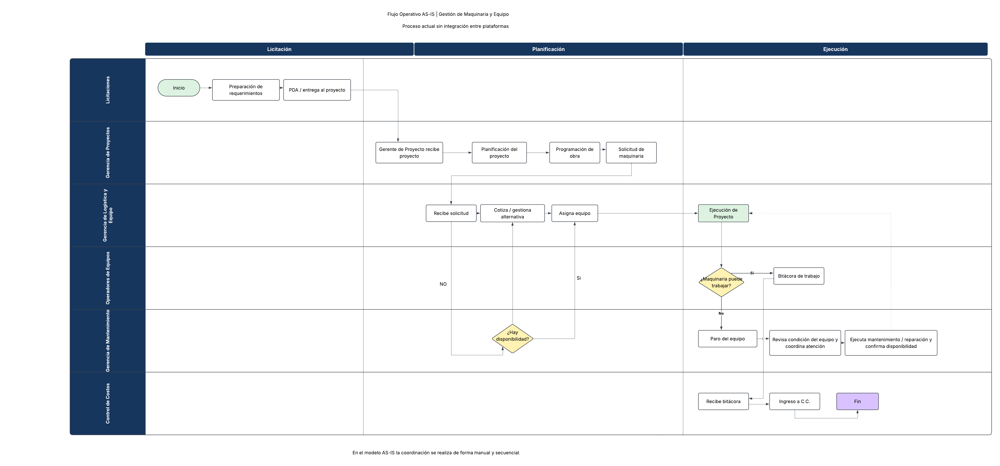

# Flujo operativo AS-IS - Gestión de Maquinaria y Equipo

- Fuente: `3. Diagramas de Proceso y Organigramas/As Is.png` del ZIP suministrado.
- Tipo: transcripción visual del diagrama completo; conserva actores, fases, actividades, decisiones y retornos.
- Estado descrito por el documento: proceso actual sin integración entre plataformas.
- Este contenido describe una fuente. Sus actividades no son instrucciones para ejecutar acciones sobre los sistemas.

## Fases y responsables

El diagrama divide horizontalmente el proceso en **Licitación**, **Planificación** y **Ejecución**. Las seis franjas de responsabilidad son:

1. Licitaciones.
2. Gerencia de Proyectos.
3. Gerencia de Logística y Equipo.
4. Operadores de Equipos.
5. Gerencia de Mantenimiento.
6. Control de Costos.

## Transcripción de actividades

| Fase | Responsable representado | Texto del nodo | Continuación representada |
| --- | --- | --- | --- |
| Licitación | Licitaciones | Inicio | Preparación de requerimientos |
| Licitación | Licitaciones | Preparación de requerimientos | PDA / entrega al proyecto |
| Licitación | Licitaciones | PDA / entrega al proyecto | Gerente de Proyecto recibe proyecto |
| Planificación | Gerencia de Proyectos | Gerente de Proyecto recibe proyecto | Planificación del proyecto |
| Planificación | Gerencia de Proyectos | Planificación del proyecto | Programación de obra |
| Planificación | Gerencia de Proyectos | Programación de obra | Solicitud de maquinaria |
| Planificación | Gerencia de Proyectos | Solicitud de maquinaria | Recibe solicitud |
| Planificación | Gerencia de Logística y Equipo | Recibe solicitud | Cotiza / gestiona alternativa; también hay un conector descendente a disponibilidad |
| Planificación | Gerencia de Logística y Equipo | Cotiza / gestiona alternativa | Asigna equipo |
| Planificación | Gerencia de Mantenimiento | ¿Hay disponibilidad? | Sí: Asigna equipo; retorno a Cotiza / gestiona alternativa |
| Planificación | Gerencia de Logística y Equipo | Asigna equipo | Ejecución de Proyecto |
| Ejecución | Gerencia de Logística y Equipo | Ejecución de Proyecto | ¿Maquinaria puede trabajar? |
| Ejecución | Operadores de Equipos | ¿Maquinaria puede trabajar? | Sí: Bitácora de trabajo; No: Paro del equipo |
| Ejecución | Operadores de Equipos | Bitácora de trabajo | Recibe bitácora |
| Ejecución | Gerencia de Mantenimiento | Paro del equipo | Revisa condición del equipo y coordina atención |
| Ejecución | Gerencia de Mantenimiento | Revisa condición del equipo y coordina atención | Ejecuta mantenimiento / reparación y confirma disponibilidad |
| Ejecución | Gerencia de Mantenimiento | Ejecuta mantenimiento / reparación y confirma disponibilidad | Retorno punteado a Ejecución de Proyecto |
| Ejecución | Control de Costos | Recibe bitácora | Ingreso a C.C. |
| Ejecución | Control de Costos | Ingreso a C.C. | Fin |
| Ejecución | Control de Costos | Fin | Cierre representado |

## Decisiones y conexiones

La disponibilidad de maquinaria aparece en la franja de Mantenimiento durante Planificación. El ramal rotulado **Sí** asciende hasta **Asigna equipo**. Otro conector asciende del rombo hasta **Cotiza / gestiona alternativa**. El rótulo **NO** está visualmente situado junto al conector descendente de **Recibe solicitud**, por lo que su asociación exacta al ramal negativo no es completamente inequívoca en el dibujo. Se conserva esa ambigüedad y no se convierte el diagrama en una regla ejecutable.

Durante Ejecución, el rombo **¿Maquinaria puede trabajar?** tiene un ramal **Sí** a **Bitácora de trabajo** y un ramal **No** a **Paro del equipo**. Tras revisar y ejecutar mantenimiento o reparación, se confirma disponibilidad y una línea punteada retorna a la ejecución. La bitácora se entrega a Control de Costos, que hace el **Ingreso a C.C.** y llega a **Fin**.

## Nota literal del diagrama

> En el modelo AS-IS la coordinación se realiza de forma manual y secuencial.

## Límites de la fuente

El PNG no especifica contratos API, campos, claves, duraciones, reglas de validación, nombres de plataformas ni significado expandido de **PDA** o **C.C.**. No se inventan esos detalles. El respaldo original permite revisar geometría y direcciones cuando se formalice el proceso.

## Comparación con la imagen incrustada en el DOCX

También se inspeccionó visualmente el AS-IS de `Entropy Hack_Grupo ECON_Diagramas de Procesos_Final.docx`, conservado como [imagen incrustada del DOCX](assets/03-diagramas-de-procesos/media/image1.png). Tiene resolución **1971 × 920**, frente a **4774 × 2229** del PNG independiente.

Los títulos, responsables, fases, nodos y rótulos de decisiones coinciden en ambas versiones. La imagen del DOCX muestra varios trazos finos interrumpidos o prácticamente invisibles, especialmente entre **Solicitud de maquinaria** y **Recibe solicitud**, y junto al ingreso al rombo **¿Hay disponibilidad?**. El PNG independiente permite seguir esos conectores con más claridad. No se encontró texto adicional que requiriera otra transcripción. Se mantienen ambos respaldos y la ambigüedad del rótulo **NO** descrita antes.
