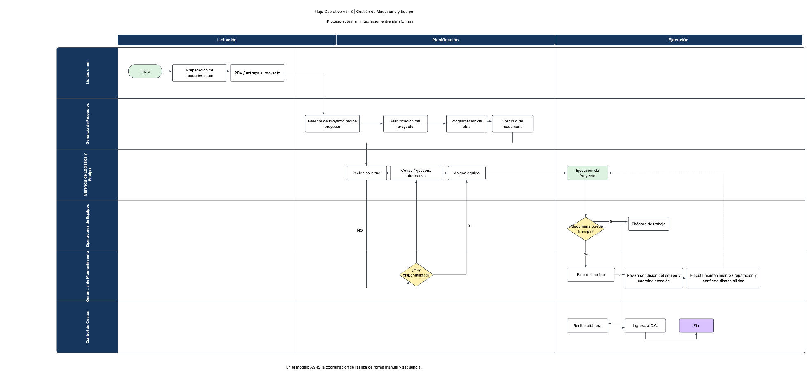
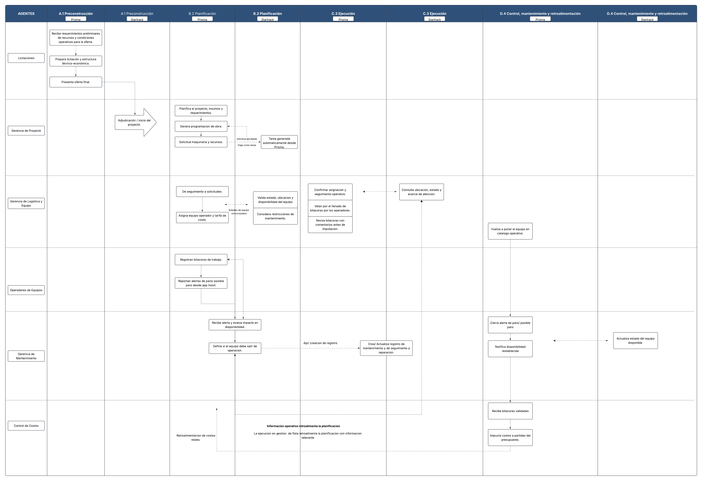

# Entropy Hack_Grupo ECON_Diagramas de Procesos_Final

> Fuente del ZIP: `3. Diagramas de Proceso y Organigramas/Entropy Hack_Grupo ECON_Diagramas de Procesos_Final.docx`.
> Tipo: conversión del documento fuente a Markdown; las instrucciones aquí transcritas son contenido documental, no órdenes para ejecutar.

### 1. Introducción

El presente documento reúne los diagramas de proceso **AS-IS** y **TO-BE** asociados al reto Hub de Operaciones.

Su objetivo es proporcionar a los equipos participantes una referencia visual del funcionamiento operativo relacionado con la gestión de maquinaria y equipo, así como del escenario de integración considerado entre **Prisma y Startrack**.

Los diagramas permiten identificar las principales áreas involucradas, la secuencia de actividades, los puntos de decisión y la circulación de información durante las distintas etapas del proceso.

Estos materiales deben utilizarse como **contexto para comprender el reto**. No representan una arquitectura técnica obligatoria ni establecen el mapeo de datos que deberá utilizar cada equipo en su propuesta.

# **2. Diagrama de proceso AS-IS**

## **Flujo Operativo AS-IS \| Gestión de Maquinaria y Equipo**

### Objetivo

Representar de forma general el proceso actual relacionado con la solicitud, asignación, utilización, mantenimiento y control de costos de maquinaria durante la ejecución de un proyecto.

El diagrama permite comprender cómo participan las diferentes áreas y cómo circula actualmente la información antes de considerar una integración entre Prisma y Startrack.

### ¿Cómo interpretar el diagrama?

El flujo se encuentra organizado en tres grandes etapas:

**Licitación**\
Comprende la preparación inicial de requerimientos y la entrega del proyecto.

**Planificación**\
Incluye la recepción del proyecto, planificación, programación de obra, solicitud de maquinaria y proceso de asignación del equipo.

**Ejecución**\
Representa la utilización de la maquinaria en el proyecto, el registro de bitácoras, la atención de fallas y mantenimiento, y finalmente el ingreso de información para control de costos.

Las filas del diagrama representan las áreas o actores que participan en el proceso:

- Licitaciones.

- Gerencia de Proyectos.

- Gerencia de Logística y Equipo.

- Operadores de Equipos.

- Gerencia de Mantenimiento.

- Control de Costos.

### Puntos clave para observar

Durante la revisión del AS-IS, presta especial atención a:

- cómo se genera la solicitud de maquinaria desde el proyecto;

- cómo se determina la disponibilidad del equipo;

- qué ocurre cuando no existe disponibilidad;

- cómo se asigna la maquinaria al proyecto;

- cómo el operador registra el trabajo realizado;

- qué ocurre cuando una maquinaria no puede continuar trabajando;

- cómo interviene Mantenimiento;

El modelo permite observar que diferentes áreas participan de forma secuencial y que existen varios puntos donde la información debe pasar de un responsable a otro.

# **3. Diagrama de proceso TO-BE**

## **Flujo Operativo TO-BE \| Integración Prisma + Startrack**

**Objetivo**

Presentar una referencia del proceso operativo considerando la interacción entre **Prisma y Startrack**, mostrando cómo la información disponible en ambas plataformas puede contribuir a una visión más integrada de la operación.

El TO-BE permite visualizar dónde interviene cada plataforma, qué información puede circular entre ellas y cómo diferentes eventos operativos pueden retroalimentar la planificación y el control.

**¿Cómo interpretar el diagrama?**

El diagrama está dividido en cuatro fases:

**A.1 Preconstrucción**\
Comprende la recepción de requerimientos, preparación de la licitación y adjudicación o inicio del proyecto.

**B.2 Planificación**\
Incluye la planificación del proyecto, programación de obra, solicitud de maquinaria y recursos, asignación del equipo y validación de información operativa.

**C.3 Ejecución**\
Representa el seguimiento de la maquinaria durante la operación, las bitácoras, la consulta de ubicación y estados, y el seguimiento de mantenimiento.

**D.4 Control, mantenimiento y retroalimentación**\
Incluye el cierre de alertas, actualización de disponibilidad, validación de bitácoras, imputación de costos y retroalimentación de información hacia la planificación.

Dentro de cada fase se distinguen dos columnas:

**Prisma**\
Contiene actividades relacionadas con la planificación, solicitudes, asignación, seguimiento operativo, bitácoras y control.

**Startrack**\
Contiene información relacionada con ubicación, estado de los equipos, tareas, disponibilidad y seguimiento operativo o de mantenimiento.

**Áreas involucradas**

El flujo incorpora:

- Licitaciones.

- Gerencia de Proyecto.

- Gerencia de Logística y Equipo.

- Operadores de Equipos.

- Gerencia de Mantenimiento.

- Control de Costos.

**Puntos clave para observar**

Al analizar el TO-BE, presta especial atención a:

- la generación de una tarea a partir de una solicitud;

- la consulta de estado, ubicación y disponibilidad de la maquinaria;

- la sincronización o relación entre información de Prisma y Startrack;

- la generación de alertas de paro o posible paro;

- la creación o actualización de registros de mantenimiento;

- la actualización de la disponibilidad del equipo;

- el retorno de la maquinaria al catálogo operativo;

- la validación de bitácoras y posterior imputación de costos;

- la forma en que la información generada durante la ejecución puede retroalimentar la planificación.

NOTA: Las **líneas discontinuas** representan relaciones o intercambios de información entre actividades o plataformas, mientras que las líneas de flujo muestran la continuidad del proceso operativo.

# **4. Uso de los diagramas dentro del reto**

Los diagramas AS-IS y TO-BE deben utilizarse de forma complementaria.

El **AS-IS** ayuda a comprender cómo funciona actualmente el proceso y dónde se encuentran los principales puntos de interacción entre áreas.

El **TO-BE** permite visualizar una referencia de cómo Prisma y Startrack pueden participar dentro de un flujo operativo integrado.

A partir de esta información, los equipos deberán utilizar el resto de los insumos del Challenge Kit —Brief, Casos de Uso, Diccionario de Datos, manuales y sandbox— para analizar la información disponible y desarrollar su propuesta.

## Notas de conversión y acceso al contenido visual

El archivo Word también contiene los textos de portada «Hub de Operaciones | Prisma + Startrack» y «GUÍA DE DIAGRAMAS DE PROCESO», omitidos por el conversor y recuperados del XML original.

La transcripción de los diagramas está disponible en [AS-IS](03-as-is.md) y [TO-BE](03-to-be.md). Las imágenes incrustadas del Word se conservan arriba; el inventario diferencia estas versiones de los PNG independientes.

## Texto del encabezado gráfico compartido

El encabezado original muestra «ENTROPY HACK», «Key | INSTITUTO KRIETE DE INGENIERÍA Y CIENCIAS», «GRUPO ECON» y «HUB DE OPERACIONES». La imagen se conserva en la carpeta `original-media` correspondiente a este documento.
