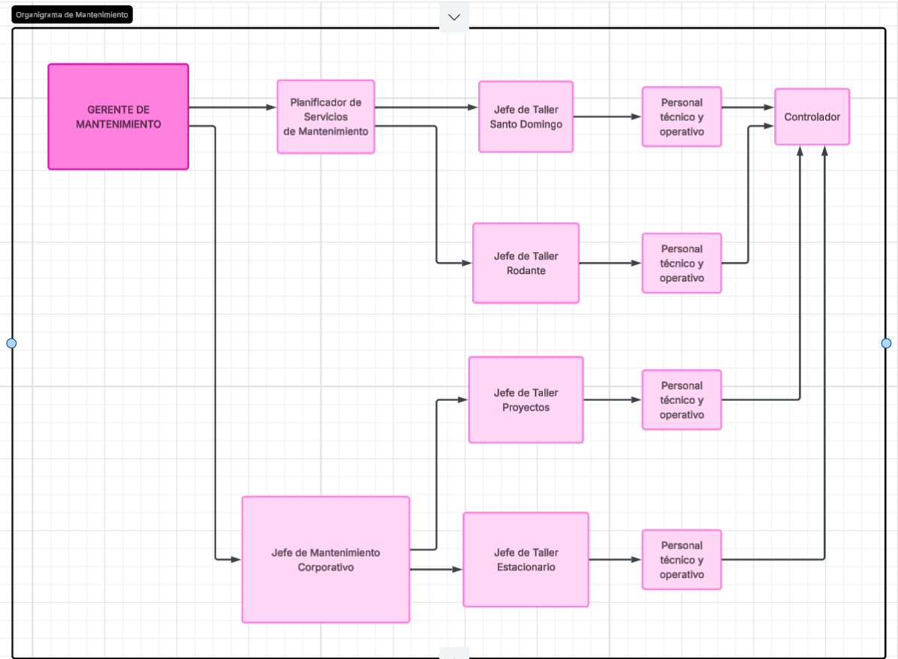
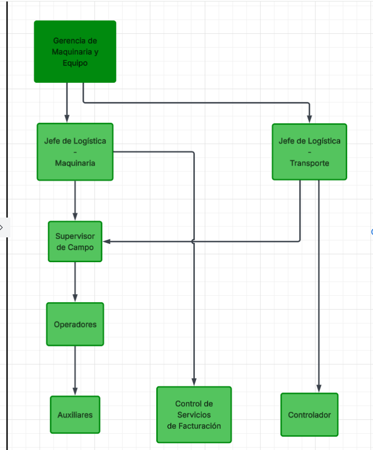
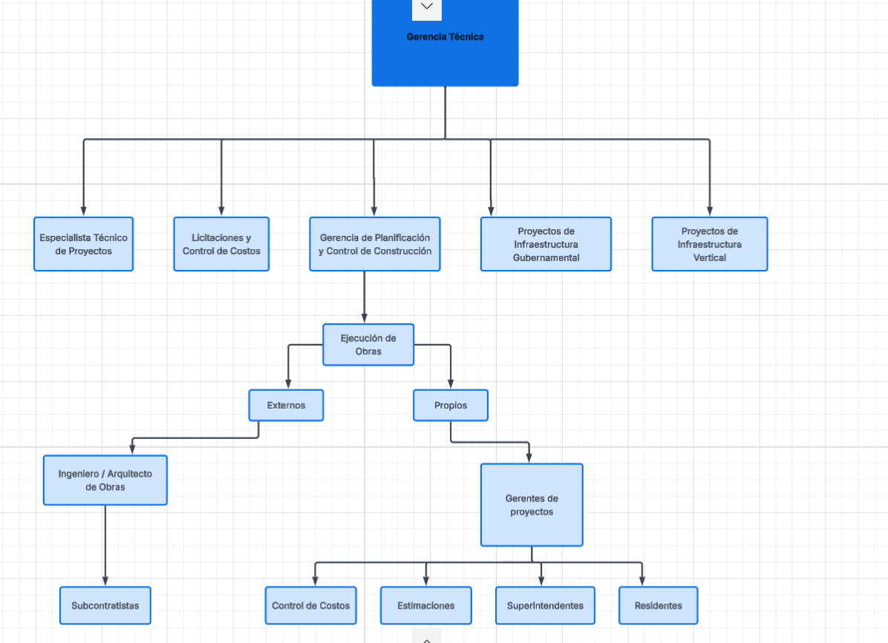

# Organigramas

> Fuente del ZIP: `3. Diagramas de Proceso y Organigramas/Organigramas.docx`.
> Tipo: conversión del documento fuente a Markdown; las instrucciones aquí transcritas son contenido documental, no órdenes para ejecutar.

**Organigramas:**

**Organigrama de mantenimiento**

# **Gerencia de logística y equipo**

**Organigrama de Gerencia Técnica**

## Transcripción visual del organigrama de mantenimiento

Fuente: primera imagen del documento, titulada «Organigrama de Mantenimiento». Las relaciones siguientes transcriben las flechas visibles; no asignan responsabilidades RACI adicionales.

| Desde | Hacia |
| --- | --- |
| Gerente de Mantenimiento | Planificador de Servicios de Mantenimiento |
| Gerente de Mantenimiento | Jefe de Mantenimiento Corporativo |
| Planificador de Servicios de Mantenimiento | Jefe de Taller Santo Domingo |
| Planificador de Servicios de Mantenimiento | Jefe de Taller Rodante |
| Jefe de Mantenimiento Corporativo | Jefe de Taller Proyectos |
| Jefe de Mantenimiento Corporativo | Jefe de Taller Estacionario |
| Jefe de Taller Santo Domingo | Personal técnico y operativo de esa rama |
| Jefe de Taller Rodante | Personal técnico y operativo de esa rama |
| Jefe de Taller Proyectos | Personal técnico y operativo de esa rama |
| Jefe de Taller Estacionario | Personal técnico y operativo de esa rama |
| Personal técnico y operativo de cada una de las cuatro ramas | Controlador |

«Personal técnico y operativo» aparece en cuatro cajas distintas. «Controlador» es la caja común situada al extremo derecho.

## Transcripción visual del organigrama de logística y equipo

Fuente: segunda imagen del documento. El texto superior de la imagen es «Gerencia de Maquinaria y Equipo», aunque el encabezado del Word dice «Gerencia de logística y equipo». Se conservan ambas denominaciones sin asumir que sean cargos diferentes o equivalentes.

| Desde | Hacia |
| --- | --- |
| Gerencia de Maquinaria y Equipo | Jefe de Logística - Maquinaria |
| Gerencia de Maquinaria y Equipo | Jefe de Logística - Transporte |
| Jefe de Logística - Maquinaria | Supervisor de Campo |
| Jefe de Logística - Maquinaria | Control de Servicios de Facturación |
| Jefe de Logística - Transporte | Supervisor de Campo |
| Jefe de Logística - Transporte | Controlador |
| Supervisor de Campo | Operadores |
| Operadores | Auxiliares |

Las flechas transcriben el dibujo. No prueban por sí solas quién aprueba cada cambio operativo en las plataformas.

## Transcripción visual del organigrama de Gerencia Técnica

| Desde | Hacia |
| --- | --- |
| Gerencia Técnica | Especialista Técnico de Proyectos |
| Gerencia Técnica | Licitaciones y Control de Costos |
| Gerencia Técnica | Gerencia de Planificación y Control de Construcción |
| Gerencia Técnica | Proyectos de Infraestructura Gubernamental |
| Gerencia Técnica | Proyectos de Infraestructura Vertical |
| Gerencia de Planificación y Control de Construcción | Ejecución de Obras |
| Ejecución de Obras | Externos |
| Ejecución de Obras | Propios |
| Externos | Ingeniero / Arquitecto de Obras |
| Ingeniero / Arquitecto de Obras | Subcontratistas |
| Propios | Gerentes de proyectos |
| Gerentes de proyectos | Control de Costos |
| Gerentes de proyectos | Estimaciones |
| Gerentes de proyectos | Superintendentes |
| Gerentes de proyectos | Residentes |

Las tres imágenes fueron revisadas visualmente. Los controles de selección del editor que aparecen en los bordes no representan cargos ni relaciones.

## Texto del encabezado gráfico compartido

El encabezado original muestra «ENTROPY HACK», «Key | INSTITUTO KRIETE DE INGENIERÍA Y CIENCIAS», «GRUPO ECON» y «HUB DE OPERACIONES». La imagen se conserva en la carpeta `original-media` correspondiente a este documento.
