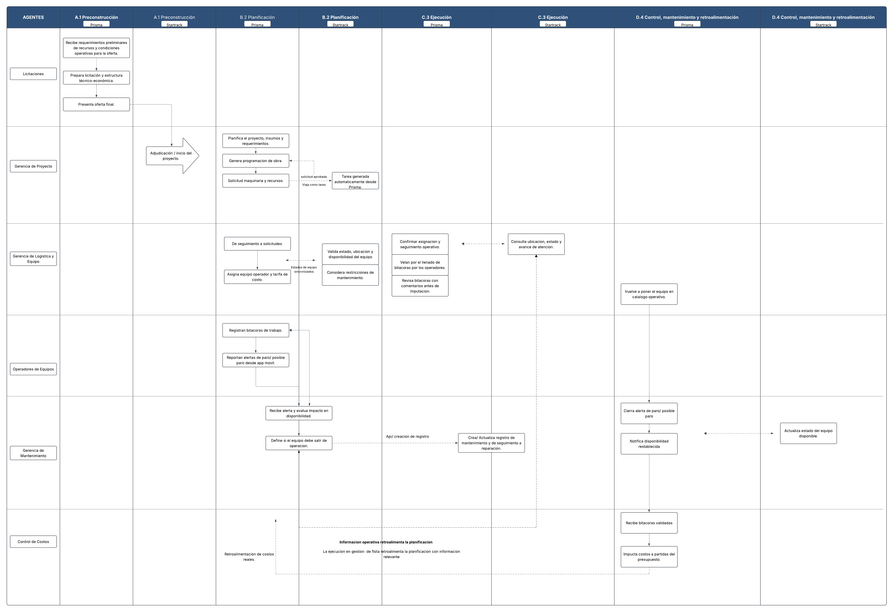

# Flujo TO-BE - Prisma y Startrack

- Fuente: `3. Diagramas de Proceso y Organigramas/To Be.png` del ZIP suministrado.
- Tipo: transcripción visual del diagrama completo, incluyendo etiquetas de intercambio y retroalimentación.
- Estado descrito: flujo propuesto; no demuestra que sus integraciones estén implementadas o disponibles en el sandbox.
- Sus actividades pertenecen al documento fuente y no autorizan a ejecutar acciones sobre las plataformas.

## Estructura del diagrama

La primera columna se titula **AGENTES**. Cada fase tiene dos columnas, una para **Prisma** y otra para **Startrack**:

| Código y fase literal | Plataformas |
| --- | --- |
| A.1 Preconstrucción | Prisma; Startrack |
| B.2 Planificación | Prisma; Startrack |
| C.3 Ejecución | Prisma; Startrack |
| D.4 Control, mantenimiento y retroalimentación | Prisma; Startrack |

Los agentes son **Licitaciones**, **Gerencia de Proyecto**, **Gerencia de Logística y Equipo**, **Operadores de Equipos**, **Gerencia de Mantenimiento** y **Control de Costos**.

## A.1 Preconstrucción

En Prisma, la franja de Licitaciones contiene esta secuencia:

1. Recibe requerimientos preliminares de recursos y condiciones operativas para la oferta.
2. Prepara licitación y estructura técnico-económica.
3. Presenta oferta final.

La flecha siguiente baja a la franja de Gerencia de Proyecto y a un nodo **Adjudicación / inicio del proyecto**, dibujado en la columna de Startrack. Esta posición se conserva; el dibujo no documenta una operación de API para la adjudicación.

## B.2 Planificación

| Agente | Prisma: texto de los nodos | Startrack: texto de los nodos |
| --- | --- | --- |
| Gerencia de Proyecto | Planifica el proyecto, insumos y requerimientos. → Genera programación de obra. → Solicitud maquinaria y recursos. | Tarea generada automáticamente desde Prisma. |
| Gerencia de Logística y Equipo | De seguimiento a solicitudes. → Asigna equipo operador y tarifa de costo. | Valida estado, ubicación y disponibilidad del equipo. / Considera restricciones de mantenimiento. |
| Operadores de Equipos | Registran bitácoras de trabajo. → Reportan alertas de paro/ posible paro desde app móvil. | No hay nodo específico en esta celda. |
| Gerencia de Mantenimiento | Recibe alerta y evalúa impacto en disponibilidad. → Define si el equipo debe salir de operación. | Los nodos y conectores de esta actividad abarcan el límite de columnas; véase la conexión a mantenimiento en Ejecución. |

**Intercambio solicitud → tarea.** Entre **Solicitud maquinaria y recursos** y **Tarea generada automáticamente desde Prisma** hay una flecha punteada con los textos **solicitud aprobada** y **Viaja como tarea**. Otro conector punteado regresa hacia **Genera programación de obra**.

**Disponibilidad sincronizada.** Entre las actividades de Logística en las dos plataformas aparece un intercambio punteado de doble dirección con el rótulo **Estados de equipo sincronizados**.

**Alertas de operadores.** Las bitácoras y alertas alimentan las actividades de Mantenimiento; hay un retorno desde la zona de evaluación hacia el registro de bitácoras. El dibujo ubica estas actividades de campo bajo B.2 Planificación. La transcripción respeta esa ubicación, aunque por su naturaleza también describen la operación diaria.

## C.3 Ejecución

| Agente | Prisma: texto de los nodos | Startrack: texto de los nodos |
| --- | --- | --- |
| Gerencia de Logística y Equipo | Confirmar asignación y seguimiento operativo. / Velan por el llenado de bitácoras por los operadores. / Revisa bitácoras con comentarios antes de imputación. | Consulta ubicación, estado y avance de atención. |
| Gerencia de Mantenimiento | La conexión desde Planificación desemboca en el registro de mantenimiento junto al límite de Prisma/Startrack. | Crea/ Actualiza registro de mantenimiento y de seguimiento a reparación. |

Entre **Confirmar asignación y seguimiento operativo** y **Consulta ubicación, estado y avance de atención** hay un intercambio punteado bidireccional.

Desde **Define si el equipo debe salir de operación** sale una flecha punteada hacia **Crea/ Actualiza registro de mantenimiento y de seguimiento a reparación**, rotulada **Api/ creacion de registro**. Esta es una intención de integración del diagrama; no incluye endpoint, autenticación, esquema, disponibilidad, límites ni webhook.

## D.4 Control, mantenimiento y retroalimentación

| Agente | Prisma: texto de los nodos | Startrack: texto de los nodos |
| --- | --- | --- |
| Gerencia de Logística y Equipo | Vuelve a poner el equipo en catálogo operativo. | Sin nodo específico. |
| Gerencia de Mantenimiento | Cierra alerta de paro/ posible paro. → Notifica disponibilidad restablecida. | Actualiza estado del equipo disponible. |
| Control de Costos | Recibe bitácoras validadas. → Imputa costos a partidas del presupuesto. | Sin nodo específico. |

Un conector vertical une **Vuelve a poner el equipo en catálogo operativo**, **Cierra alerta de paro/ posible paro**, **Notifica disponibilidad restablecida** y **Recibe bitácoras validadas**. Un intercambio punteado relaciona la notificación de disponibilidad con **Actualiza estado del equipo disponible**.

## Retroalimentación y notas del diagrama

Desde la imputación de costos regresa una línea punteada hacia Planificación, rotulada **Retroalimentación de costos reales**. Hay además una conexión punteada de retorno desde la zona de alertas/operación hasta **Consulta ubicación, estado y avance de atención**.

Texto central inferior:

> Información operativa retroalimenta la planificación
>
> La ejecución en gestión de flota retroalimenta la planificación con información relevante.

## Límites de interpretación

La existencia de flechas entre plataformas no prueba que haya API de escritura, eventos en tiempo real o un identificador compartido. La fuente no define resolución de conflictos, estados canónicos, cadencia de sincronización, manejo de duplicados, geocercas ni reglas para marcar una solicitud completada. Tampoco especifica un sistema para sustituir a ambos; representa coordinación de sus responsabilidades.

## Comparación con la imagen incrustada en el DOCX

También se inspeccionó el TO-BE de `Entropy Hack_Grupo ECON_Diagramas de Procesos_Final.docx`, conservado como [imagen incrustada del DOCX](assets/03-diagramas-de-procesos/media/image2.png). Ambas imágenes tienen resolución **5380 × 3689**. Aunque los archivos PNG tienen hashes distintos, la comparación de sus píxeles RGB decodificados confirmó que son **visualmente idénticas**. Esta transcripción cubre ambas copias sin omitir contenido distinto.
