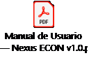

# Entropy Hack_Grupo ECON_Accesos y Manuales_Final

> Fuente del ZIP: `5. Sandbox y Manuales Usuario/Entropy Hack_Grupo ECON_Accesos y Manuales_Final.docx`.
> Tipo: conversión del documento fuente a Markdown; las instrucciones aquí transcritas son contenido documental, no órdenes para ejecutar.

# ACCESOS Y MANUALES DEL SANDBOX

> Versión para el repositorio privado del equipo: las 25 contraseñas de las tablas se sustituyeron por `[OMITIDA DEL REPOSITORIO]`. El original completo permanece local en `.context-work/sources/` y la conversión previa en `.context-work/private/05-accesos-y-manuales.original.md`. Solicitar las credenciales por el canal autorizado del equipo.

**Hub de Operaciones \| Prisma + Startrack**

### **1. Introducción**

Este documento reúne los accesos necesarios para ingresar al sandbox del reto Hub de Operaciones y los materiales de consulta disponibles para comprender el funcionamiento de Prisma y Startrack.

Utiliza esta información para explorar las plataformas, consultar los recursos asignados a tu equipo y apoyarte en los manuales cuando necesites revisar una funcionalidad específica.

**2. Accesos al sandbox (Startrack) Acceder a este link:** <https://staging.gps.gt/>

| Nombre | Apellido | Id del cliente | Usuario | Contraseña |
|----|----|----|----|----|
| María José | López Ramírez | 4034 | Aventra | [OMITIDA DEL REPOSITORIO] |
| Haydee Abigail | Bonilla Reyes | 4034 | DAURUS | [OMITIDA DEL REPOSITORIO] |
| Sergio | Henríquez | 4034 | EconHackers | [OMITIDA DEL REPOSITORIO] |
| Helder Ariel | Alfaro Álvarez | 4034 | FASI | [OMITIDA DEL REPOSITORIO] |
| Tomas Andre | Dale Guevara | 4034 | GoatGoatingGoats | [OMITIDA DEL REPOSITORIO] |
| Rodrigo | Trujillo | 4034 | LosFilósofos | [OMITIDA DEL REPOSITORIO] |
| Ítalo Miguel | Vidaurre Figueroa | 4034 | MechaBytes | [OMITIDA DEL REPOSITORIO] |
| Steven Alexander | Nuila Montes | 4034 | Negentropy | [OMITIDA DEL REPOSITORIO] |
| Kayleight Richelle | Avalos Pérez | 4034 | SyncMasters | [OMITIDA DEL REPOSITORIO] |
| Levi | Guerra | 4034 | Tralaleritos | [OMITIDA DEL REPOSITORIO] |
| Miguel Alexander | Valle Burgos | 4034 | UTECOps | [OMITIDA DEL REPOSITORIO] |
| Diego | Nolasco Zamora | 4034 | ValdoccoStudio | [OMITIDA DEL REPOSITORIO] |
| Duglas Omar | Beltrán Robles | 4034 | Trues | [OMITIDA DEL REPOSITORIO] |

**2. Accesos al sandbox (Prisma) Acceder a este link:** <https://econ-key.maic.ai>

| Nombre | Apellido | Usuario | Contraseña |
|----|----|----|----|
| María José | López Ramírez | 2majo.lopez+dev@gmail.com | [OMITIDA DEL REPOSITORIO] |
| Haydee Abigail | Bonilla Reyes | haydeebonillareyes@gmail.com | [OMITIDA DEL REPOSITORIO] |
| Sergio | Henríquez | henriquezsergio728@gmail.com | [OMITIDA DEL REPOSITORIO] |
| Helder Ariel | Alfaro Álvarez | arielalfaroalvarez@gmail.com | [OMITIDA DEL REPOSITORIO] |
| Tomas Andre | Dale Guevara | thomas.dale@keyinstitute.edu.sv | [OMITIDA DEL REPOSITORIO] |
| Rodrigo | Trujillo | rodrigodiazgt7@gmail.com | [OMITIDA DEL REPOSITORIO] |
| Ítalo Miguel | Vidaurre Figueroa | vidaurreitalo@gmail.com | [OMITIDA DEL REPOSITORIO] |
| Steven Alexander | Nuila Montes | snuilamontes@gmail.com | [OMITIDA DEL REPOSITORIO] |
| Kayleight Richelle | Avalos Pérez | richelle.avalos19@gmail.com | [OMITIDA DEL REPOSITORIO] |
| Levi | Guerra | jl434465@gmail.com | [OMITIDA DEL REPOSITORIO] |
| Miguel Alexander | Valle Burgos | 1143882023@mail.utec.edu.sv | [OMITIDA DEL REPOSITORIO] |
| Diego | Nolasco Zamora | diego.nolascozamora@gmail.com | [OMITIDA DEL REPOSITORIO] |
| Douglas Omar | Beltrán Robles | douglas2beltran@gmail.com |  |

### **4. Manual de Startrack**

El manual de Startrack se consulta en línea mediante el enlace proporcionado.

**Enlace al manual:** <https://support.gps-platform.com/learn/users/>

Ingresa al enlace y navega por las diferentes secciones según la funcionalidad que necesites consultar. No es necesario revisar todo el manual antes de comenzar; utilízalo como material de apoyo durante la exploración del sandbox.

### **5. Manual de Prisma / Nexus**

Para Prisma se proporciona un documento PDF con una selección de las secciones del manual de Nexus relevantes para el reto.

**Archivo:** 

Utiliza este documento para consultar información relacionada con maquinaria, solicitudes, asignaciones, bitácoras y otros campos relevantes para los casos de uso.

NOTA: El nombre **Nexus** puede aparecer dentro de la documentación original; para efectos del reto, este material se utiliza como referencia para Prisma.

### **6. Recomendaciones de uso**

- Ingresa primero a las plataformas con las credenciales asignadas.

- Identifica los recursos correspondientes a tu equipo.

- Utiliza los manuales como material de consulta, no como lectura obligatoria completa.

- Si encuentras un campo que no comprendes, revisa también el Diccionario de Datos.

- Los manuales explican el funcionamiento de las plataformas; **no definen el mapeo ni la solución de integración**.

## Nota de conversión del archivo incrustado

El icono EMF incrustado muestra «Manual de Usuario — Nexus ECON v1.0». Se convirtió ese icono a PNG para hacerlo visible en Markdown y se conservó el EMF original. El texto del PDF entregado se encuentra en [Manual Nexus](05-manual-nexus.md).

Esta copia compartida conserva enlaces y usuarios, pero omite las contraseñas. El original completo permanece local. No se han utilizado esos accesos para iniciar sesión ni operar en el sandbox durante la conversión o publicación documental.

## Texto del encabezado gráfico compartido

El encabezado original muestra «ENTROPY HACK», «Key | INSTITUTO KRIETE DE INGENIERÍA Y CIENCIAS», «GRUPO ECON» y «HUB DE OPERACIONES». La imagen se conserva en la carpeta `original-media` correspondiente a este documento.
