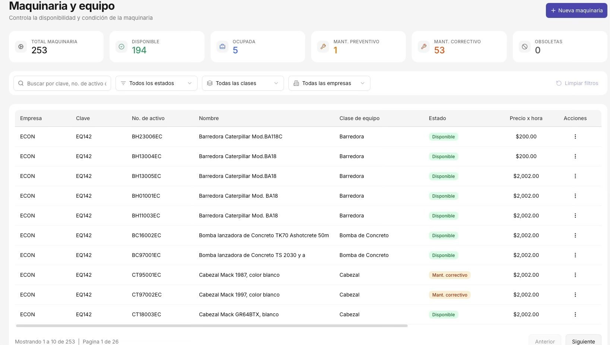
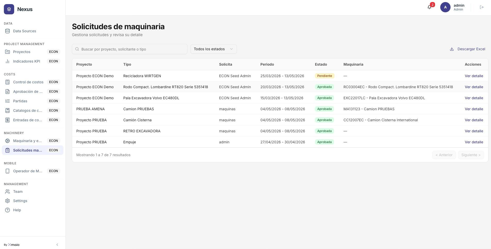
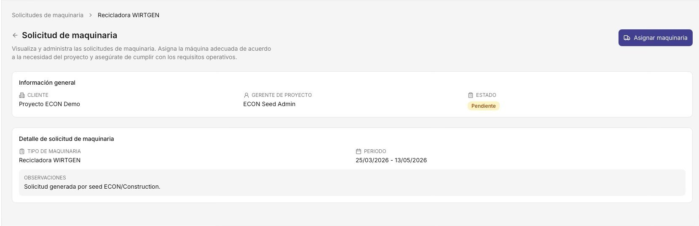
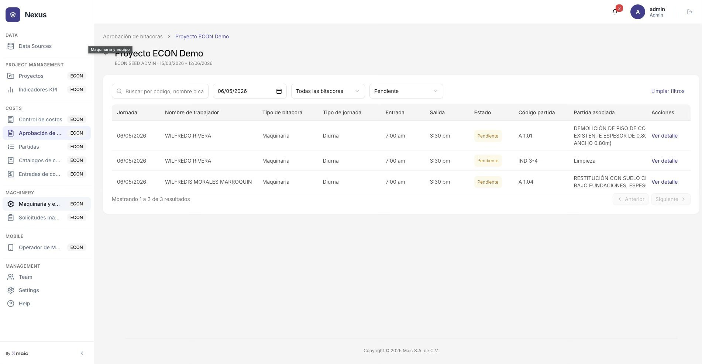
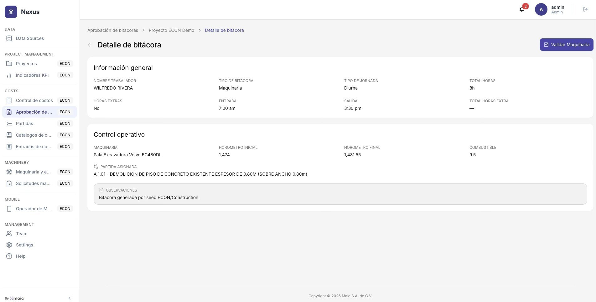
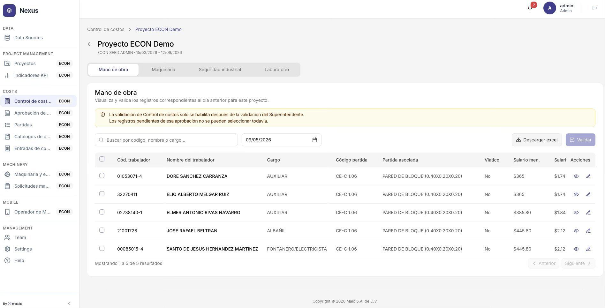
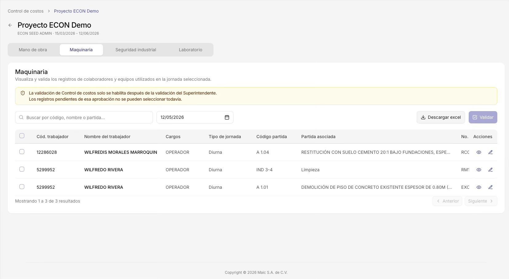
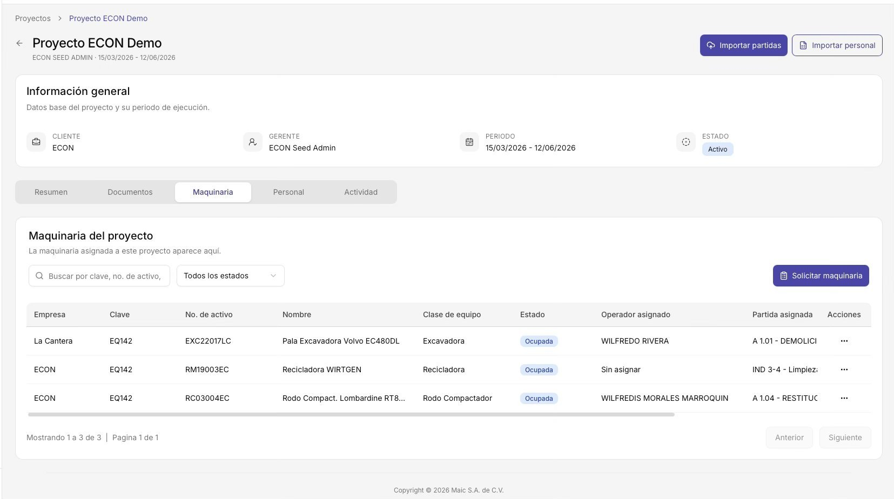

# Manual de Usuario - Nexus ECON v1.0

- Fuente: `5. Sandbox y Manuales Usuario/Manual de Usuario — Nexus ECON v1.0.pdf` del ZIP suministrado.
- Conversión: texto completo de las **9 páginas recibidas**, con tablas y campos de las **8 capturas** transcritos tras inspección visual.
- El PDF recibido es un **extracto de un manual de 44 páginas**, ordenado como 35, 38, 39, 22, 23, 24, 19, 20 y 11. Las otras 35 páginas no están en este archivo.
- Cabecera común de la fuente: `12/8/26, 17:08`, `Manual de Usuario — Nexus ECON v1.0`, `Nexus ECON`, `Manual de usuario v1.0`.
- Pie común de la fuente: `https://econ.maic.ai/docs/user-manual-ECON.html`. URL preservada como referencia documental; no se abrió durante la conversión.
- Los procedimientos aquí transcritos son contenido del manual; no son autorización para ejecutar cambios en Prisma, Nexus, Startrack o el sandbox.
- Se distinguen **texto del manual**, **transcripción de captura** y **notas de conversión**. Los ejemplos pertenecen a la fuente; no representan mediciones verificadas de producción.

## Cobertura y orden

| Página del PDF recibido | Página impresa del manual | Contenido | Figuras |
| --- | --- | --- | --- |
| 1 | 35/44 | Inventario de maquinaria | 24 |
| 2 | 38/44 | Módulo 9: solicitudes de maquinaria | Ninguna |
| 3 | 39/44 | Listado y detalle de solicitudes | 27, 28 |
| 4 | 22/44 | Módulo 4: aprobación de bitácoras | Ninguna |
| 5 | 23/44 | Bandeja y datos de bitácora | 16 |
| 6 | 24/44 | Control operativo y detalle de bitácora | 17 |
| 7 | 19/44 | Módulo 3: control de costos | Ninguna |
| 8 | 20/44 | Mano de obra y maquinaria en control de costos | 13, 14 |
| 9 | 11/44 | Maquinaria del proyecto y solicitud | 6 |

## Página 1 del PDF: página 35 del manual

[Respaldo visual de la página completa](assets/visual-manual/nexus-page-1.png).

### Texto del manual

Los filtros permiten buscar por clave o número de activo, y filtrar por estado (Disponible, Ocupada, Mantenimiento), clase de equipo (Barredora, Excavadora, etc.) y empresa propietaria. El botón **Limpiar filtros** restablece la vista completa.

**Fig. 24 - Inventario de maquinaria:** contadores superiores Total 253, Disponible 194, Ocupada 5, Mant. Preventivo 1, Mant. Correctivo 53, Obsoletas 0. Tabla con 10 equipos visibles: Barredoras Caterpillar (BA118C, BA18 x4) a $200/hr Disponibles, Bombas lanzadoras de Concreto a $2,002/hr Disponibles, Cabezales Mack 1987 y 1997 en Mant. correctivo. Filtros de buscador, estados, clases y empresas. Paginación: 1-10 de 253, página 1 de 26.

### Transcripción de la captura: figura 24

Título: **Maquinaria y equipo**. Subtítulo: **Controla la disponibilidad y condición de la maquinaria**. Botón **+ Nueva maquinaria**.

| Contador | Valor visible |
| --- | ---: |
| Total maquinaria | 253 |
| Disponible | 194 |
| Ocupada | 5 |
| Mant. preventivo | 1 |
| Mant. correctivo | 53 |
| Obsoletas | 0 |

Filtros: buscador por clave o número de activo (texto final recortado), **Todos los estados**, **Todas las clases**, **Todas las empresas**, **Limpiar filtros**.

| Empresa | Clave | No. de activo | Nombre | Clase de equipo | Estado | Precio x hora |
| --- | --- | --- | --- | --- | --- | ---: |
| ECON | EQ142 | BH23006EC | Barredora Caterpillar Mod.BA118C | Barredora | Disponible | $200.00 |
| ECON | EQ142 | BH13004EC | Barredora Caterpillar Mod.BA18 | Barredora | Disponible | $200.00 |
| ECON | EQ142 | BH13005EC | Barredora Caterpillar Mod.BA18 | Barredora | Disponible | $2,002.00 |
| ECON | EQ142 | BH01001EC | Barredora Caterpillar Mod. BA18 | Barredora | Disponible | $2,002.00 |
| ECON | EQ142 | BH11003EC | Barredora Caterpillar Mod. BA18 | Barredora | Disponible | $2,002.00 |
| ECON | EQ142 | BC16002EC | Bomba lanzadora de Concreto TK70 Ashotcrete 50m | Bomba de Concreto | Disponible | $2,002.00 |
| ECON | EQ142 | BC97001EC | Bomba lanzadora de Concreto TS 2030 y a | Bomba de Concreto | Disponible | $2,002.00 |
| ECON | EQ142 | CT95001EC | Cabezal Mack 1987, color blanco | Cabezal | Mant. correctivo | $2,002.00 |
| ECON | EQ142 | CT97002EC | Cabezal Mack 1997, color blanco | Cabezal | Mant. correctivo | $2,002.00 |
| ECON | EQ142 | CT18003EC | Cabezal Mack GR64BTX, blanco | Cabezal | Disponible | $2,002.00 |

Todas las filas tienen un menú de **Acciones** representado con tres puntos. Pie: **Mostrando 1 a 10 de 253 | Página 1 de 26**, botones **Anterior** y **Siguiente**.

**Nota de conversión:** el pie de figura agrupa las cinco barredoras a $200/hr, mientras que la captura muestra $200.00 solamente en las primeras dos y $2,002.00 en las otras tres. Se conservan ambas evidencias sin corregir la fuente. La repetición de `EQ142` muestra que no se debe suponer que el campo **Clave** es único sin comprobar el contrato de datos.

## Página 2 del PDF: página 38 del manual

[Respaldo visual de la página completa](assets/visual-manual/nexus-page-2.png).

### Texto del manual: MACHINERY - Módulo 9 - Solicitudes de maquinaria

Módulo logístico para coordinar y formalizar el traslado de equipos entre proyectos. Centraliza todas las solicitudes de maquinaria del portafolio, gestiona el flujo de aprobación cruzada entre el PM solicitante y el Coordinador de Maquinaria, y mantiene el historial completo de asignaciones con sus períodos de uso. Una solicitud aprobada con unidad asignada actualiza automáticamente el estado del equipo en el inventario del Módulo 8 a **Ocupada**.

#### Gestionar solicitudes de traslado

**Paso a paso - Asignar maquinaria a una solicitud pendiente**

1. Ir a **MACHINERY → Solicitudes ma...** en el menú lateral. La tabla muestra todas las solicitudes del portafolio con su estado actual.
2. Identificar la solicitud con estado **Pendiente** que se desea procesar. Los filtros de buscador (por proyecto, solicitante o tipo) y el dropdown de estado facilitan la búsqueda.
3. Clic en **Ver detalle** al final de la fila para abrir la vista completa de la solicitud.
4. Revisar la **Información general** (proyecto solicitante, gerente responsable y estado actual) y el **Detalle de solicitud** (tipo de maquinaria requerida, período de uso solicitado y observaciones del PM).
5. Clic en **Asignar maquinaria** (botón morado, esquina superior derecha). Seleccionar del inventario disponible la unidad específica a asignar (solo se muestran equipos con estado **Disponible** y de la clase correcta).
6. Confirmar la asignación. El estado de la solicitud cambia a **Aprobada**, el equipo en el inventario pasa a **Ocupada** y se envía una notificación al PM solicitante.

La página termina con el encabezado **Vista del listado de solicitudes**.

## Página 3 del PDF: página 39 del manual

[Respaldo visual de la página completa](assets/visual-manual/nexus-page-3.png).

### Texto del manual

**Fig. 27 - Solicitudes de maquinaria:** tabla con 7 solicitudes del portafolio. Columnas: Proyecto, Tipo (equipo solicitado), Solicita (usuario PM), Periodo (fechas), Estado (badge), Maquinaria (unidad asignada con código), Ver detalle. Recicladora WIRTGEN Pendiente sin unidad asignada. Rodo Compact Lombardine Aprobada con RC03004EC. Pala Excavadora Aprobada con EXC22017LC. Camión PRUEBAS AMENA Aprobada MA131123. Camión Cisterna Proyecto PRUEBA Aprobada CC12007EC. RETRO EXCAVADORA y Empuje Aprobadas sin unidad asignada. Buscador por proyecto/solicitante/tipo y filtro Todos los estados.

#### Transcripción de la captura: figura 27

Título: **Solicitudes de maquinaria**. Subtítulo: **Gestiona solicitudes y revisa su detalle**. Buscador: **Buscar por proyecto, solicitante o tipo**. Filtro: **Todos los estados**. Acción: **Descargar Excel**.

| Proyecto | Tipo | Solicita | Periodo | Estado | Maquinaria |
| --- | --- | --- | --- | --- | --- |
| Proyecto ECON Demo | Recicladora WIRTGEN | ECON Seed Admin | 25/03/2026 - 13/05/2026 | Pendiente | — |
| Proyecto ECON Demo | Rodo Compact. Lombardine RT820 Serie 5351418 | ECON Seed Admin | 20/03/2026 - 13/05/2026 | Aprobada | RC03004EC - Rodo Compact. Lombardine RT820 Serie 5351418 |
| Proyecto ECON Demo | Pala Excavadora Volvo EC480DL | ECON Seed Admin | 15/03/2026 - 13/05/2026 | Aprobada | EXC22017LC - Pala Excavadora Volvo EC480DL |
| PRUEBA AMENA | Camion PRUEBAS | maquinas | 04/05/2026 - 08/05/2026 | Aprobada | MA131123 - Camion PRUEBAS |
| Proyecto PRUEBA | Camión Cisterna | maquinas | 04/05/2026 - 08/05/2026 | Aprobada | CC12007EC - Camion Cisterna International |
| Proyecto PRUEBA | RETRO EXCAVADORA | maquinas | 04/05/2026 - 08/05/2026 | Aprobada | — |
| Proyecto PRUEBA | Empuje | admin | 27/04/2026 - 30/04/2026 | Aprobada | — |

Todas las filas tienen **Ver detalle** en **Acciones**. Pie: **Mostrando 1 a 7 de 7 resultados**, **Anterior**, **Siguiente**.

### Vista de detalle de una solicitud

**Fig. 28 - Detalle de solicitud Recicladora WIRTGEN:** breadcrumb Solicitudes de maquinaria > Recicladora WIRTGEN. Información general: Cliente Proyecto ECON Demo, Gerente de Proyecto ECON Seed Admin, Estado Pendiente (badge ámbar). Detalle de solicitud de maquinaria: Tipo RECICLADORA WIRTGEN, Periodo 25/03/2026 - 13/05/2026, Observaciones Solicitud generada por seed ECON/Construction. Botón Asignar maquinaria en morado en la esquina superior derecha.

#### Transcripción de la captura: figura 28

Ruta: **Solicitudes de maquinaria > Recicladora WIRTGEN**. Título: **Solicitud de maquinaria**.

Texto de ayuda: **Visualiza y administra las solicitudes de maquinaria. Asigna la máquina adecuada de acuerdo a la necesidad del proyecto y asegúrate de cumplir con los requisitos operativos.**

| Sección | Campo | Valor |
| --- | --- | --- |
| Información general | Cliente | Proyecto ECON Demo |
| Información general | Gerente de proyecto | ECON Seed Admin |
| Información general | Estado | Pendiente |
| Detalle de solicitud de maquinaria | Tipo de maquinaria | Recicladora WIRTGEN |
| Detalle de solicitud de maquinaria | Periodo | 25/03/2026 - 13/05/2026 |
| Detalle de solicitud de maquinaria | Observaciones | Solicitud generada por seed ECON/Construction. |

Acción: **Asignar maquinaria**.

### Solicitudes registradas - datos reales del portafolio

La página muestra solo el encabezado de una tabla con columnas **PROYECTO**, **TIPO DE EQUIPO SOLICITADO**, **SOLICITA**, **PERIODO**, **ESTADO**, **UNIDAD ASIGNADA**. Sus filas están fuera del extracto recibido. La tabla de siete registros anterior proviene de la captura y no se presenta como las filas ausentes de esta segunda tabla.

**Nota de conversión:** dos solicitudes figuran como **Aprobada** sin unidad. El manual no explica si son datos de prueba, una situación válida o un defecto. No se deduce que **Aprobada** garantice asignación, traslado, llegada ni operación física del equipo.

## Página 4 del PDF: página 22 del manual

[Respaldo visual de la página completa](assets/visual-manual/nexus-page-4.png).

### Texto del manual: MOBILE - COSTS - Módulo 4 - Aprobación de bitácoras

Mesa de control de calidad operativa. Es el enlace crítico entre el campo y los KPIs: cada RDO (Registro Diario Operativo) capturado por operadores y caporales en la app móvil pasa por aquí antes de impactar el Valor Ganado (EV) y el Costo Real (AC). El superintendente o encargado de la obra revisa los datos de cada jornada - avance físico, horas de mano de obra, horómetros de maquinaria y combustible - y decide si aprobar o devolver con observaciones.

#### Aprobar un RDO

**Paso a paso - Revisión y aprobación de bitácora**

1. Ir a **COSTS → Aprobación de bitácoras**. La bandeja muestra todos los RDOs del proyecto activo.
2. Usar los filtros para localizar el RDO: selector de fecha (calendario), dropdown de tipo de bitácora (**Todas las bitácoras / Maquinaria / Mano de obra**) y dropdown de estado (**Pendiente / Aprobada / Rechazada**).
3. Identificar en la tabla el registro a revisar. Las columnas muestran: **Jornada** (fecha), **Nombre de trabajador**, **Tipo de bitácora**, **Tipo de jornada** (Diurna/Nocturna), **Entrada**, **Salida**, **Estado** (Pendiente), **Código partida** y **Partida asociada**.
4. Clic en **Ver detalle** al final de la fila para abrir la vista completa de la bitácora.
5. Revisar la sección **Información general**: nombre del trabajador, tipo de bitácora, tipo de jornada, total de horas normales, si aplican horas extras, hora de entrada y hora de salida.
6. Revisar la sección **Control operativo**: nombre del equipo, horómetro inicial y final, cantidad de combustible reportada y la partida WBS a la que se asigna el uso.
7. Si los datos son correctos, clic en **Validar Maquinaria** (botón morado, esquina superior derecha).

## Página 5 del PDF: página 23 del manual

[Respaldo visual de la página completa](assets/visual-manual/nexus-page-5.png).

### Texto del manual

**Fig. 16 - Bandeja de aprobación de bitácoras (06/05/2026 filtrado por Pendiente):** 3 RDOs de WILFREDO RIVERA (A 1.01 DEMOLICION y IND 3-4 Limpieza) y WILFREDIS MORALES MARROQUIN (A 1.04 RESTITUCION). Todos tipo Maquinaria, jornada Diurna, entrada 7:00am, salida 3:30pm. Columnas visibles: Jornada, Nombre trabajador, Tipo bitácora, Tipo jornada, Entrada, Salida, Estado, Código partida, Partida asociada, Acciones (Ver detalle).

### Transcripción de la captura: figura 16

Ruta: **Aprobación de bitácoras > Proyecto ECON Demo**. Encabezado de proyecto: **Proyecto ECON Demo**, **ECON SEED ADMIN - 15/03/2026 - 12/06/2026**. Filtros: buscador por código/nombre/cargo (texto recortado), fecha **06/05/2026**, **Todas las bitácoras**, **Pendiente**, **Limpiar filtros**.

| Jornada | Nombre de trabajador | Tipo de bitácora | Tipo de jornada | Entrada | Salida | Estado | Código partida | Partida asociada |
| --- | --- | --- | --- | --- | --- | --- | --- | --- |
| 06/05/2026 | WILFREDO RIVERA | Maquinaria | Diurna | 7:00 am | 3:30 pm | Pendiente | A 1.01 | DEMOLICIÓN DE PISO DE CO… EXISTENTE ESPESOR DE 0.80… ANCHO 0.80m) [recortado en captura] |
| 06/05/2026 | WILFREDO RIVERA | Maquinaria | Diurna | 7:00 am | 3:30 pm | Pendiente | IND 3-4 | Limpieza |
| 06/05/2026 | WILFREDIS MORALES MARROQUIN | Maquinaria | Diurna | 7:00 am | 3:30 pm | Pendiente | A 1.04 | RESTITUCIÓN CON SUELO C… BAJO FUNDACIONES, ESPES… [recortado en captura] |

Cada fila tiene **Ver detalle**. Pie: **Mostrando 1 a 3 de 3 resultados**, **Anterior**, **Siguiente**.

### Vista de detalle de una bitácora

Al hacer clic en **Ver detalle** se abre la pantalla de auditoría completa con dos secciones diferenciadas: la información laboral del trabajador y los datos operativos del equipo utilizado.

**Datos reales de bitácora - WILFREDO RIVERA / Pala Excavadora Volvo EC480DL**

| Información general | Valor |
| --- | --- |
| Nombre trabajador | WILFREDO RIVERA |
| Tipo de bitácora | Maquinaria |
| Tipo de jornada | Diurna |
| Total horas | 8h |
| Horas extras | No |
| Entrada | 7:00 am |
| Salida | 3:30 pm |

| Control operativo | Valor |
| --- | --- |
| Maquinaria | Pala Excavadora Volvo EC480DL |

La tabla continúa en la página 24 del manual, que corresponde a la página siguiente de este PDF.

## Página 6 del PDF: página 24 del manual

[Respaldo visual de la página completa](assets/visual-manual/nexus-page-6.png).

### Texto del manual: continuación de control operativo

| Campo | Valor |
| --- | --- |
| Horómetro inicial | 1,474 |
| Horómetro final | 1,481.55 |
| Horas imputadas | 7.55 hrs |
| Combustible | 9.5 |
| Partida asignada | A 1.01 - DEMOLICION DE PISO DE CONCRETO EXISTENTE ESPESOR DE 0.80M |

**Fig. 17 - Vista Detalle de bitácora:** breadcrumb Aprobación de bitácoras > Proyecto ECON Demo > Detalle de bitácora. Sección Información general con datos del trabajador y jornada. Sección Control operativo con Pala Excavadora Volvo EC480DL, horómetros 1474/1481.55, combustible 9.5 y partida A 1.01. Botón Validar Maquinaria en morado en la esquina superior derecha.

### Transcripción de la captura: figura 17

Ruta: **Aprobación de bitácoras > Proyecto ECON Demo > Detalle de bitácora**. Título: **Detalle de bitácora**. Acción: **Validar Maquinaria**.

| Sección | Campo | Valor |
| --- | --- | --- |
| Información general | Nombre trabajador | WILFREDO RIVERA |
| Información general | Tipo de bitácora | Maquinaria |
| Información general | Tipo de jornada | Diurna |
| Información general | Total horas | 8h |
| Información general | Horas extras | No |
| Información general | Entrada | 7:00 am |
| Información general | Salida | 3:30 pm |
| Información general | Total horas extra | — |
| Control operativo | Maquinaria | Pala Excavadora Volvo EC480DL |
| Control operativo | Horómetro inicial | 1,474 |
| Control operativo | Horómetro final | 1,481.55 |
| Control operativo | Combustible | 9.5 |
| Control operativo | Partida asignada | A 1.01 - DEMOLICIÓN DE PISO DE CONCRETO EXISTENTE ESPESOR DE 0.80M (SOBRE ANCHO 0.80m) |
| Control operativo | Observaciones | Bitacora generada por seed ECON/Construction. |

**Nota de conversión:** la cabecera del PDF se superpone al texto de los horómetros en esta página. Los valores se recuperaron de la capa de texto y se confirmaron en la captura. La fuente no indica unidad del combustible. **Total horas** (8h) y **Horas imputadas** (7.55 hrs) son campos distintos; no se igualan ni se interpreta su diferencia como fallo sin una regla de negocio.

## Página 7 del PDF: página 19 del manual

[Respaldo visual de la página completa](assets/visual-manual/nexus-page-7.png).

### Texto del manual: COSTS - Módulo 3 - Control de costos

Panel de auditoría diaria de los recursos registrados en las bitácoras de campo. Permite a Control de Costos revisar, corregir y validar los costos de mano de obra, maquinaria, seguridad industrial y laboratorio reportados para cada jornada, vinculándolos a las partidas WBS correctas antes de que impacten el AC del proyecto. La validación en este módulo es el segundo nivel de aprobación, posterior a la del Superintendente en campo.

#### Validar registros de una jornada

**Paso a paso - Validar costos de mano de obra o maquinaria**

1. Ir a **COSTS → Control de costos** y seleccionar el proyecto activo.
2. Seleccionar la pestaña del tipo de recurso a auditar: **Mano de obra**, **Maquinaria**, **Seguridad industrial** o **Laboratorio**.
3. Usar el buscador por código, nombre o cargo, y el selector de fecha, para filtrar los registros de la jornada a validar.
4. Revisar la columna **Partida asociada** de cada registro. Si algún colaborador o equipo tiene asignada una partida incorrecta, clic en el ícono de edición (lápiz) de esa fila.
5. En el modal **Asociar partida**, buscar la partida correcta por código o nombre y seleccionarla. Clic en **Guardar asignación**.
6. Una vez verificados todos los registros, seleccionarlos con los checkboxes y clic en **Validar** (botón morado, esquina superior derecha). Si se requiere exportar, usar **Descargar excel** primero.

**Prerrequisito de validación:** La validación de Control de costos **solo se habilita después de que el Superintendente de campo haya validado previamente el RDO** desde la app móvil. Los registros que aún no tienen aprobación del Superintendente aparecen bloqueados (no seleccionables) con el aviso de alerta amarillo.

## Página 8 del PDF: página 20 del manual

[Respaldo visual de la página completa](assets/visual-manual/nexus-page-8.png).

### Texto del manual

**Fig. 13 - Pestaña Mano de obra (09/05/2026):** 5 trabajadores - DORE SANCHEZ CARRANZA, ELIO MELGAR, ELMER RIVAS, JOSE BELTRAN y SANTO HERNANDEZ - todos Auxiliares y Albañil asignados a partida CE-C 1.06 PARED DE BLOQUE (0.40X0.20X0.20). Columnas: Cod. trabajador, Nombre, Cargo, Código partida, Partida asociada, Viático, Salario men., Salario, Acciones.

**Fig. 14 - Pestaña Maquinaria (12/05/2026):** 3 registros - WILFREDIS MORALES MARROQUIN (A 1.04 RESTITUCION), WILFREDO RIVERA x2 (IND 3-4 Limpieza y A 1.01 DEMOLICION). Columnas adicionales vs Mano de obra: Tipo de jornada (Diurna) y No. de activo (RCC..., RM1..., EXC...).

### Transcripción de la captura: figura 13

Ruta: **Control de costos > Proyecto ECON Demo**. Título: **Proyecto ECON Demo**. Responsable y período: **ECON SEED ADMIN - 15/03/2026 - 12/06/2026**. Pestañas: **Mano de obra**, **Maquinaria**, **Seguridad industrial**, **Laboratorio**.

Título de panel: **Mano de obra**. Ayuda: **Visualiza y valida los registros correspondientes al día anterior para este proyecto.**

Alerta: **La validación de Control de costos solo se habilita después de la validación del Superintendente. Los registros pendientes de esa aprobación no se pueden seleccionar todavía.**

Buscador: **Buscar por código, nombre o cargo...**. Fecha **09/05/2026**. Botones **Descargar excel** y **Validar** (atenuado).

| Cód. trabajador | Nombre del trabajador | Cargo | Código partida | Partida asociada | Viático | Salario men. | Salario |
| --- | --- | --- | --- | --- | --- | ---: | ---: |
| 01053071-4 | DORE SANCHEZ CARRANZA | AUXILIAR | CE-C 1.06 | PARED DE BLOQUE (0.40X0.20X0.20) | No | $365 | $1.74 |
| 32270411 | ELIO ALBERTO MELGAR RUIZ | AUXILIAR | CE-C 1.06 | PARED DE BLOQUE (0.40X0.20X0.20) | No | $365 | $1.74 |
| 02738140-1 | ELMER ANTONIO RIVAS NAVARRO | AUXILIAR | CE-C 1.06 | PARED DE BLOQUE (0.40X0.20X0.20) | No | $385.80 | $1.84 |
| 21001728 | JOSE RAFAEL BELTRAN | ALBAÑIL | CE-C 1.06 | PARED DE BLOQUE (0.40X0.20X0.20) | No | $445.80 | $2.12 |
| 00085015-4 | SANTO DE JESUS HERNANDEZ MARTINEZ | FONTANERO/ELECTRICISTA | CE-C 1.06 | PARED DE BLOQUE (0.40X0.20X0.20) | No | $445.80 | $2.12 |

Columna inicial de selección por checkbox. **Acciones** con iconos de ver (ojo) y editar (lápiz) en cada fila. Pie: **Mostrando 1 a 5 de 5 resultados**, **Anterior**, **Siguiente**.

**Nota de conversión:** el pie de figura simplifica los cargos como Auxiliares y Albañil; la captura incluye también **FONTANERO/ELECTRICISTA**. No se interpreta el campo **Salario** como costo diario u horario porque la unidad no aparece en esta captura.

### Transcripción de la captura: figura 14

Ruta, proyecto, responsable, período y pestañas como en figura 13. Título de panel **Maquinaria**. Ayuda: **Visualiza y valida los registros de colaboradores y equipos utilizados en la jornada seleccionada.** Alerta de aprobación previa idéntica a figura 13.

Buscador: **Buscar por código, nombre o partida...**. Fecha: **12/05/2026**. Botones: **Descargar excel** y **Validar** (atenuado).

| Cód. trabajador | Nombre del trabajador | Cargos | Tipo de jornada | Código partida | Partida asociada visible | No. de activo visible |
| --- | --- | --- | --- | --- | --- | --- |
| 12286028 | WILFREDIS MORALES MARROQUIN | OPERADOR | Diurna | A 1.04 | RESTITUCIÓN CON SUELO CEMENTO 20:1 BAJO FUNDACIONES, ESPE... | RCC... |
| 5299952 | WILFREDO RIVERA | OPERADOR | Diurna | IND 3-4 | Limpieza | RM1... |
| 5299952 | WILFREDO RIVERA | OPERADOR | Diurna | A 1.01 | DEMOLICIÓN DE PISO DE CONCRETO EXISTENTE ESPESOR DE 0.80M (... | EXC... |

Los textos largos y números de activo están recortados por la interfaz; se conserva el recorte, sin completar por suposición. El encabezado visible del último dato aparece como **No.**; el pie de figura lo identifica como **No. de activo**. Selección por checkbox y acciones de ver/editar. Pie: **Mostrando 1 a 3 de 3 resultados**, **Anterior**, **Siguiente**.

La página termina con el encabezado **REASIGNAR PARTIDA WBS**. Su desarrollo posterior no está incluido en este extracto.

## Página 9 del PDF: página 11 del manual

[Respaldo visual de la página completa](assets/visual-manual/nexus-page-9.png).

### Texto del manual

Categoría: Excavadora, Recicladora, Rodo Compactador, etc.

**Estado**

**Ocupada** en los tres equipos del ejemplo. Indica que están en uso en este proyecto.

**Operador asignado**

Nombre del operador responsable (ej. WILFREDO RIVERA). Puede aparecer **Sin asignar** si el equipo no tiene operador activo.

**Partida asignada**

Código y descripción de la partida WBS donde se está imputando el uso del equipo (ej. A 1.01 - DEMOLICI..., IND 3-4 - Limpieza).

**Fig. 6 - Pestaña Maquinaria del proyecto:** 3 equipos asignados (Pala Excavadora, Recicladora WIRTGEN, Rodo Compact) todos en estado Ocupada, con operadores y partidas asignadas. Botón Solicitar maquinaria en la esquina superior derecha.

### Transcripción de la captura: figura 6

Ruta **Proyectos > Proyecto ECON Demo**. Título **Proyecto ECON Demo**, encabezado **ECON SEED ADMIN - 15/03/2026 - 12/06/2026**. Botones **Importar partidas**, **Importar personal**.

Sección **Información general**, ayuda **Datos base del proyecto y su periodo de ejecución**:

| Campo | Valor |
| --- | --- |
| Cliente | ECON |
| Gerente | ECON Seed Admin |
| Periodo | 15/03/2026 - 12/06/2026 |
| Estado | Activo |

Pestañas **Resumen**, **Documentos**, **Maquinaria**, **Personal**, **Actividad**. Panel **Maquinaria del proyecto**. Ayuda: **La maquinaria asignada a este proyecto aparece aquí.** Buscador por clave/número de activo (texto final recortado), filtro **Todos los estados**, botón **Solicitar maquinaria**.

| Empresa | Clave | No. de activo | Nombre | Clase de equipo | Estado | Operador asignado | Partida asignada visible |
| --- | --- | --- | --- | --- | --- | --- | --- |
| La Cantera | EQ142 | EXC22017LC | Pala Excavadora Volvo EC480DL | Excavadora | Ocupada | WILFREDO RIVERA | A 1.01 - DEMOLICI… |
| ECON | EQ142 | RM19003EC | Recicladora WIRTGEN | Recicladora | Ocupada | Sin asignar | IND 3-4 - Limpiez… |
| ECON | EQ142 | RC03004EC | Rodo Compact. Lombardine RT8... | Rodo Compactador | Ocupada | WILFREDIS MORALES MARROQUIN | A 1.04 - RESTITUC… |

Los puntos suspensivos señalan texto recortado por la interfaz. **Acciones**: menú de tres puntos por fila. Pie: **Mostrando 1 a 3 de 3 | Página 1 de 1**, **Anterior**, **Siguiente**.

### Solicitar maquinaria desde el proyecto

1. Desde la pestaña **Maquinaria** del proyecto, clic en **Solicitar maquinaria** (botón morado, esquina superior derecha).
2. En el modal, seleccionar el **Tipo de maquinaria** requerido usando el buscador desplegable.
3. Ingresar la **Fecha de inicio** y la **Fecha de fin** del período en que se necesita el equipo (formato **DD/MM/AAAA**).

El extracto recibido termina aquí. No se inventan pasos posteriores de envío, confirmación o validación.

## Elementos comunes de las capturas

Las figuras de pantallas completas muestran la marca **Nexus**, avatar **admin / Admin**, una campana con contador **2**, icono de salida y menú lateral. Es una descripción de la interfaz capturada, no credenciales.

| Grupo | Etiquetas del menú visibles |
| --- | --- |
| DATA | Data Sources |
| PROJECT MANAGEMENT | Proyectos; Indicadores KPI |
| COSTS | Control de costos; Aprobación de ...; Partidas; Catálogos de c...; Entradas de co... |
| MACHINERY | Maquinaria y e...; Solicitudes ma... |
| MOBILE | Operador de M... |
| MANAGEMENT | Team; Settings; Help |

Los módulos de negocio llevan distintivo **ECON**. Pie de aplicación **By maic** y, donde aparece, **Copyright © 2026 Maic S.A. de C.V.** Las etiquetas truncadas se mantienen; no equivalen a endpoints ni nombres de tablas.

## Límites y hallazgos para utilizar este documento como contexto

1. **Cobertura real:** están transcritas las nueve páginas proporcionadas, no el manual completo de 44 páginas. Faltan fragmentos anteriores y posteriores, incluida la continuación de la tabla de solicitudes y del procedimiento de solicitud.
2. **Estado administrativo y físico:** se documenta que aprobar con unidad asignada cambia el inventario a **Ocupada**. No aparece una condición de geocerca, recepción física o evidencia GPS para ese cambio.
3. **Aprobaciones separadas:** primero se valida el RDO por Superintendente; después, Control de Costos. No debe confundirse la aprobación de la solicitud de maquinaria con estos dos controles.
4. **Datos de ejemplo que requieren aclaración:** solicitudes aprobadas sin unidad, códigos de clase/clave repetidos, valores horarios distintos entre captura y pie, y operador **Sin asignar** en un equipo ocupado. Se preservan como evidencia, sin transformarlos en reglas definitivas.
5. **Disponibilidad técnica no probada:** el PDF describe interfaz y procedimientos. No proporciona API, webhooks, autenticación técnica, esquema de eventos, límites, latencia, permisos ni contrato de escritura.
6. **Respaldo visual:** se conservan nueve páginas renderizadas y las ocho capturas originales extraídas del PDF. Todo texto visible sustantivo se trasladó a Markdown; los recortes existentes en origen se indican.
