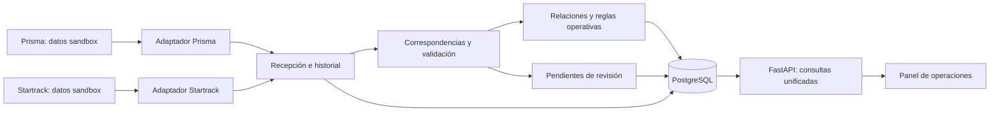

# Análisis de la propuesta de integración

**Tipo:** análisis propio, separado de las fuentes. **Fecha:** 12 de septiembre de 2026. **Objeto:** evaluar la [propuesta original](07-propuesta-original.md) frente al material entregado. El código de esa propuesta se leyó como documento; no se ejecutó ni se incorporó a la aplicación. Las recomendaciones siguientes son decisiones sugeridas, no contratos confirmados de Prisma o Startrack.

## Dictamen

**Mantendría FastAPI y PostgreSQL para construir el hub, pero corregiría el modelo operativo antes de implementar los webhooks.** La idea de consultar ambas plataformas desde un punto común sí encaja con el reto. La propuesta actual sirve como boceto de demostración; todavía no acredita una integración real, un mapeo completo ni la resolución correcta de los tres casos.

El objetivo principal es relacionar **maquinaria, solicitud, asignación, traslado, ubicación y mantenimiento**, conservando el significado de cada dato. Un evento de geocerca no demuestra por sí solo que un traslado terminó. Un equipo ocupado y una tarea completada pueden ser compatibles. El propio brief pide una arquitectura honesta sobre lo conocido y lo pendiente. [Brief, definición del reto](02-brief-del-reto.md#6-definición-del-reto); [caso 02](04-casos-de-uso.md#caso-de-uso-02--consistencia-de-estados-entre-plataformas).

FastAPI es adecuado para exponer consultas y recibir o importar datos normalizados. PostgreSQL es una elección razonable para persistir relaciones, reglas aplicadas e historial. **No hay cifras de registros, telemetría por segundo o concurrencia en los insumos que permitan demostrar capacidad para el volumen alto indicado por el usuario.** La selección inicial no sustituye medir esas cargas cuando se conozcan.

## Contexto que debe usar el equipo

La introducción asigna a **Equipo 6 — Los Filósofos** la retroexcavadora **RE-03**, el motorista de sandbox **MOT-006 — Rodrigo Trujillo**, el proyecto **PROY-006 — Proyecto Zeta** y la geocerca relacionada **Proyecto Zeta — San Salvador**. [Introducción, apartado «Tu equipo y recursos asignados»](00-introduccion-equipo.md#hub-de-operaciones). Rodrigo también figura por nombre en las tablas de accesos de ambas plataformas, asociado al usuario `LosFilósofos` en Startrack. Deben conservarse ambas referencias; el kit no proporciona una lista completa de integrantes ni confirma un cargo dentro del equipo. [Accesos y manuales](05-accesos-y-manuales.md).

**CF-03, MOT-014 y PROY-014** corresponden al ejemplo del walkthrough. Los proyectos Alfa, Beta y Gamma son escenarios de referencia y no necesariamente los recursos asignados a cada equipo. Conviene conservar esos ejemplos como casos sintéticos identificados y preparar la consulta real del equipo con sus recursos autorizados. [Casos, asignación de recursos y modo de uso](04-casos-de-uso.md#cómo-utilizar-estos-casos).

El ZIP contiene documentación, ejemplos y un diccionario; no incluye un contrato de API ni un volcado completo de todas las operaciones. El diccionario declara que sus campos son priorizados y que el mapeo aún debe construirse. Las flechas de automatización del TO-BE describen una intención, no acreditan endpoints ni webhooks disponibles. [Diccionario, instrucciones filas 7–10](06-diccionario-de-datos/01-instrucciones.md#fila-7); [TO-BE, límites de interpretación](03-to-be.md#límites-de-interpretación).

El manual refuerza la separación entre administración y presencia física: **aprobar una solicitud con una unidad asignada cambia el inventario a `Ocupada`**, sin exigir una llegada por GPS. Sus capturas muestran además solicitudes aprobadas sin unidad y una acción «Descargar Excel»; son pistas para explorar, no garantías sobre permisos o exportaciones habilitadas en este sandbox. [Manual, página 38](05-manual-nexus.md#pagina-2-del-pdf-pagina-38-del-manual), [página 39](05-manual-nexus.md#pagina-3-del-pdf-pagina-39-del-manual).

## Matriz de propuesta, evidencia y ajuste

Esta tabla evalúa la propuesta; **no reemplaza la matriz completa de mapeo exigida por el reto**.

| Propuesta | Evidencia disponible | Ajuste recomendado |
| --- | --- | --- |
| «La solución óptima» es que ambos sistemas disparen webhooks. | No se entregaron esquemas de eventos, firma, reintentos, orden, paginación o endpoints. La conexión en vivo no es obligatoria. [Brief, preguntas frecuentes](02-brief-del-reto.md#19-preguntas-frecuentes). | Presentar webhooks como alternativa condicionada a soporte real. Empezar con datos sandbox exportados o fixtures identificados; añadir consulta periódica o webhooks cuando se confirme el contrato. |
| `vehicle_id = CF-03` equivale directamente a `activo_id`. | Prisma ejemplifica «No. de activo» con `CF-03 - Cargador frontal 03`; Startrack tiene «Descripción» `CF-03` e «ID remoto» `78093`. No se declara que este último sea el ID de un endpoint. [Prisma fila 5](06-diccionario-de-datos/02-prisma.md#fila-5); [Startrack filas 4 y 14](06-diccionario-de-datos/03-startrack.md#fila-4). | Crear una tabla de correspondencias verificadas por sistema, objeto e identificador. Conservar código y descripción originales. No unir automáticamente por parecido textual ni ocultar dos IDs contradictorios usando `or`. |
| Basta almacenar un estado por activo. | El caso 01 necesita solicitud, proyecto, equipo, traslado, destino, motorista y fechas. El mismo equipo puede intervenir en varias operaciones. [Caso 01](04-casos-de-uso.md#caso-de-uso-01--solicitud-y-traslado-de-maquinaria). | Relacionar una operación concreta y su vigencia. Mantener entidades separadas y una relación solicitud–traslado justificada, sin forzar que sea uno a uno. |
| Un evento `INSIDE` marca la tarea `Completada`. | El diccionario separa geocercas y estado de tareas. No contiene `vehicle.geofence_update`, `INSIDE` ni una regla de cierre por entrada. [Startrack geocercas](06-diccionario-de-datos/03-startrack.md#fila-16); [estado de tarea](06-diccionario-de-datos/03-startrack.md#fila-27). | Mostrar observación de ubicación y estado reportado de la tarea por separado. Confirmar tarea, destino y regla de cierre antes de inferir finalización. |
| `Ocupada` y `Completada` siempre significan operación consistente. | El caso 02 explica que **pueden** ser correctos porque describen objetos distintos. No valida toda la operación. [Caso 02](04-casos-de-uso.md#caso-de-uso-02--consistencia-de-estados-entre-plataformas). | Mostrar «estados compatibles por su significado» cuando la relación esté confirmada. Revisar además destino, fechas, mantenimiento y frescura; permitir «información insuficiente». |
| `Obsoleta (mantenimiento correctivo)` es el estado canónico de mantenimiento. | Esa frase aparece en el caso 03, pero el catálogo distingue `Mant. correctivo` y `Obsoletas`; mantenimiento ejemplifica `CF-03 - Obsoleto`. [Caso 03](04-casos-de-uso.md#caso-de-uso-03--maquinaria-no-disponible-por-mantenimiento); [Prisma filas 8 y 17](06-diccionario-de-datos/02-prisma.md#fila-8). | Registrar la contradicción entre fuentes. Conservar el valor literal; validar con Mantenimiento cómo se interpreta cada estado antes de aprobar equivalencias. |
| Cualquier texto que contenga `correctivo` activa alerta de traslado pendiente. | El caso 03 requiere conjuntamente maquinaria afectada y traslado pendiente relacionado. [Caso 03, problema](04-casos-de-uso.md#caso-de-uso-03--maquinaria-no-disponible-por-mantenimiento). | Evaluar ambas condiciones y su período. El texto «sin mantenimiento correctivo» también contiene la palabra buscada y no debe activar la regla. Usar un catálogo validado. |
| `horometro` forma parte del evento de geocerca. | En el diccionario de Startrack, `Horometro` figura en **Mantenimiento**, tipo `numero/h`. El manual de Prisma también muestra horómetros inicial y final en bitácoras. Ninguna de esas referencias acredita que el dato viaje en un webhook GPS. [Startrack fila 40](06-diccionario-de-datos/03-startrack.md#fila-40); [manual, página 24](05-manual-nexus.md#pagina-6-del-pdf-pagina-24-del-manual). | Registrar su procedencia, unidad y momento de medición. No calcular utilización diaria a partir de una sola lectura ni confundirla con odómetro. |
| El nombre de geocerca representa la ubicación actual. | Nombre y destino son referencias descriptivas. El diccionario también contiene coordenadas cuya escala no está documentada. [Startrack filas 17–21](06-diccionario-de-datos/03-startrack.md#fila-17). | Mostrar la fuente y hora de observación de ubicación. No tratar un destino programado como GPS actual ni inventar la escala de las coordenadas. |
| Validar con Pydantic cumple RF-01; devolver JSON cumple RF-05. | RF-01 exige inventario de nuevos campos y términos; RF-05 exige reflejar visualmente la diferencia de estados. [Brief, requerimientos](02-brief-del-reto.md#7-requerimientos). | Entregar el inventario y una interfaz navegable. La validación técnica es útil, pero es otra evidencia. |
| El frontend es opcional y dos pruebas garantizan los 20 puntos técnicos. | Se exige prototipo navegable; la viabilidad técnica se divide entre mapeo y arquitectura. [Brief, entregables](02-brief-del-reto.md#9-entregables); [rúbrica](02-brief-del-reto.md#13-rúbrica-de-evaluación-numérica). | Priorizar una consulta operativa clara, matrices defendibles y una demo reproducible. Ninguna suite garantiza una calificación. |

## Defectos concretos del código propuesto

La revisión siguiente es estática; no se ejecutaron los fragmentos del documento.

| Hallazgo | Consecuencia | Corrección de diseño |
| --- | --- | --- |
| `nuevo_estado` es opcional y se llama `.lower()` sin comprobarlo. | Un evento de cambio de estado con valor ausente puede producir error del servidor; antes del fallo ya se asignó `None` al registro. | Modelo específico por evento con sus campos obligatorios; validar antes de modificar datos. |
| Todos los datos del evento son opcionales; `source` y `event_type` aceptan cualquier texto. | Se admiten combinaciones sin sentido y un tipo desconocido puede responder `processed` sin hacer nada. | Discriminar esquemas por tipo, validar fuente permitida y rechazar explícitamente eventos no soportados. |
| Los ejemplos incluyen `driver_id`, `geofence_id` y `solicitud_id`, ausentes del modelo. | Pydantic los ignora con su configuración predeterminada; se pierde información útil para relacionar los registros. | Declararlos cuando el contrato los soporte; detectar campos inesperados y conservar el documento recibido de forma controlada. |
| `horometro` y `motivo` se aceptan pero no se guardan ni explican el resultado. | La respuesta no permite reconstruir el dato o motivo original de la evaluación. | Preservar procedencia y evidencia empleada por la regla. |
| La rama de geocerca no comprueba que Prisma siga `Ocupada`. | Cualquier `INSIDE` etiqueta la operación como consistente, incluso si existe una falla. | Derivar la evaluación desde el conjunto de hechos pertinentes, separado de los estados originales. |
| La rama de mantenimiento no consulta la tarea pendiente. | Puede anunciar un traslado pendiente después de haberlo marcado `Completada`. Las alertas tampoco se resuelven cuando se restablece disponibilidad. | Calcular la condición contra la tarea relacionada y administrar apertura, vigencia y resolución de alertas. |
| `event_id` y `timestamp` no intervienen en el procesamiento. | Un duplicado se aplica otra vez; una actualización antigua puede reemplazar una reciente. | Deduplicación persistente, orden por objeto y versión cuando exista, e historial de decisiones. |
| El estado vive en un diccionario global. | Se pierde al reiniciar; los procesos pueden tener copias distintas. No hay registro durable ni transacción de cambios. | Persistir recepción, cambios y resultado en PostgreSQL. |
| No hay autenticación de emisor ni control de acceso a consultas. | El campo `source` lo decide quien envía el JSON; no acredita su origen. | Autenticar conectores y usuarios según el contrato y los roles acordados; limitar acceso por recurso. |
| Se devuelve `202` con un resultado supuestamente procesado sin recepción durable. | No queda claro si el evento solo fue recibido, ya se aplicó o se perdió después. | Documentar el contrato HTTP. Si se acepta para procesar luego, confirmar después de persistir y exponer su estado de procesamiento. |

Pydantic documenta que los campos extra se ignoran por defecto y permite cambiar ese comportamiento; también ofrece uniones discriminadas para validar un modelo distinto según el evento. Son mecanismos técnicos útiles, no una validación del significado de negocio. [Pydantic: campos extra](https://docs.pydantic.dev/latest/concepts/models/#extra-data), [uniones discriminadas](https://docs.pydantic.dev/latest/concepts/unions/#discriminated-unions).

La limitación de memoria entre procesos está documentada por FastAPI. Para la persistencia, SQLAlchemy permite enmarcar los cambios en una transacción con confirmación o reversión; una sesión no debe compartirse libremente entre tareas concurrentes. [FastAPI: memoria por proceso](https://fastapi.tiangolo.com/deployment/concepts/#memory-per-process), [SQLAlchemy: transacciones y sesiones](https://docs.sqlalchemy.org/en/20/orm/session_basics.html#framing-out-a-begin-commit-rollback-block).

### Pruebas que faltan

Las dos pruebas comparten la aplicación y el diccionario mutable. La segunda no prepara una tarea pendiente independiente: después de ejecutar la primera, el traslado puede seguir como completado y aun así la prueba de alerta pasa. Además, las aserciones ratifican las reglas escritas en el código, incluyendo la inferencia de cierre por geocerca, sin verificar que esas reglas sean correctas frente a la fuente.

Prepararía fixtures separados por caso y comprobaciones de comportamiento para:

1. Solicitud, asignación y traslado de una operación concreta; un activo distinto del ejemplo fijo.
2. Estados compatibles de objetos distintos, sin alterar ninguno.
3. Mantenimiento validado y traslado pendiente relacionado; ausencia de alerta para una tarea cancelada o completada, según regla acordada.
4. Entrada a otra geocerca, falta de destino, ubicación antigua y dato insuficiente: no cerrar la tarea.
5. Campo obligatorio ausente, estado desconocido, identidad ambigua y evento no autorizado.
6. Duplicado, evento fuera de orden, concurrencia y reinicio sin perder historial ni emitir alertas repetidas.
7. Restablecimiento de disponibilidad y resolución trazable de la alerta.

El caso 02 fuente programa el traslado para el **21/09/2026**, mientras la prueba propuesta usa un evento del **12/09/2026**. Si se mantiene esa fecha por ser un ejemplo alternativo, debe etiquetarse así; no presentarla como reproducción fiel del caso. [Caso 02](04-casos-de-uso.md#caso-de-uso-02--consistencia-de-estados-entre-plataformas).

## Arquitectura revisada sugerida

Para el MVP usaría un solo servicio de integración y PostgreSQL, con adaptadores separados por fuente. La disponibilidad de API determina cómo entra la información; el dominio unificado no debería depender de un proveedor de webhooks específico.

**Fuentes de autoridad propuestas, pendientes de validación:** Prisma aporta solicitud, asignación y estado de maquinaria; Startrack aporta estado de tarea y observaciones de ubicación. El hub conserva identidades relacionadas, procedencia, evaluación y dudas. Mantenimiento aparece en ambas fuentes: su autoridad por campo debe acordarse. No se consigue una verdad única sobrescribiendo todos los estados con una sola etiqueta.

El modelo lógico debe separar maquinaria, proyecto, solicitud, asignación, tarea de traslado, observación de ubicación, mantenimiento y alerta. Agregaría una tabla de correspondencias entre IDs de fuente y la identidad del hub, junto con registro de importaciones o eventos. Una relación puede quedar pendiente o ambigua; ese resultado debe ser visible, no completarse con una asociación inventada.

**Procesamiento persistente propuesto:** guardar el dato recibido y una clave de deduplicación; resolver correspondencias; evaluar reglas; confirmar los cambios y el estado de procesamiento en una transacción. Si hay un proceso posterior, separar explícitamente «recibido» de «aplicado» y permitir reintentos idempotentes. Una clave `(fuente, event_id)` sirve solo si el proveedor garantiza ese identificador. Para archivos, registrar lote y referencia de fila; un hash de contenido por sí solo no identifica todas las actualizaciones de negocio.

**Tiempo y orden:** distinguir fecha programada, hora en que ocurrió el hecho y hora de recepción del hub. Usar versión o secuencia del origen si existe; no asumir orden global de llegada. Si la fuente no entrega timestamp o versión, registrar la limitación y evitar proclamar sincronización en tiempo real. Conservar zona horaria o documentar su ausencia; Pydantic dispone de `AwareDatetime` para exigirla cuando el contrato la defina. [Pydantic: datetimes](https://docs.pydantic.dev/latest/api/standard_library_types/#datetimes).

**Consulta para las gerencias:** selector de equipo/proyecto, solicitud y período, tarea relacionada, estados originales por objeto, ubicación con procedencia y antigüedad, alerta explicada y responsable de revisión. Debe mostrar también «sin dato», «sin equivalencia» o «relación pendiente». Una interfaz sencilla puede demostrar esto; no hace falta reconstruir las plataformas.

**Escalabilidad posterior:** medir activos, eventos por activo, retención, tamaño de payloads, consultas concurrentes y latencia deseada. Usar esas mediciones para definir índices, lotes, límites y necesidad de una cola o particiones. Docker facilita reproducir el entorno local; no prueba alta disponibilidad ni capacidad productiva. No añadiría más infraestructura al MVP sin una necesidad demostrada.

### Campos nuevos y vocabulario de integración

Los nombres `event_id`, `event_type`, `vehicle_id`, `activo_id`, `nuevo_estado`, `timestamp`, `alerta_mantenimiento` e `indicador_riesgo` de la propuesta **no son un contrato literal documentado del proveedor**. Algunos representan conceptos reales con otros nombres; otros son metadatos o derivaciones nuevas. El inventario RF-01 debe clasificarlos, dar tipo y ejemplo, indicar procedencia y documentar transformación o ausencia de equivalencia. `geofence_id` tampoco es la grafía literal `geocerca_id` del diccionario. [RF-01 y RF-02](02-brief-del-reto.md#7-requerimientos); [geocerca_id](06-diccionario-de-datos/03-startrack.md#fila-16).

Este análisis propone además los conceptos de identidad del hub, correspondencia validada, hora de recepción, versión de regla, estado de procesamiento y calidad de relación. Si se implementan, también entran en ese inventario. No se presentan aquí como campos existentes de las plataformas.

## Cobertura real del reto y prioridades

| Requisito | Qué falta en la propuesta | Prioridad de MVP |
| --- | --- | --- |
| RF-01: inventario de nuevos campos/términos | Tabla de nombre, tipo, ejemplo, procedencia y significado de los nombres creados. | Alta |
| RF-02: matriz de mapeo | Mapeos por objeto, transformaciones, cardinalidad, evidencia, dudas y campos sin equivalente. | Alta |
| RF-03: responsabilidades | Matriz legible de las tres gerencias; definir quién revisa identidad, estado de mantenimiento y traslado. | Alta |
| RF-04: consulta unificada | Consulta navegable de datos relacionados y selección del recurso. La persistencia es una recomendación de arquitectura; RF-04 no la exige expresamente. | Alta |
| RF-05: diferencia visual de estados | Mostrar estados originales, interpretación y regla aplicada; mantener separados estado del recurso y estado del traslado. | Alta |
| RF-06: indicador documentado | Definición de al menos un indicador con población, fuente, fórmula y limitaciones. | Alta; cálculo solo con datos suficientes |

La interfaz **es obligatoria** según RNF-03, aunque sea mínima. La conexión en vivo a las APIs no lo es. El brief solicita además README, matrices, diagrama, decisiones técnicas de máximo dos páginas y presentación de máximo diez diapositivas. Su texto principal fija entrega y congelamiento el domingo a las **10:00**; los comentarios editoriales conservados no sustituyen ese texto. [Requerimientos](02-brief-del-reto.md#7-requerimientos); [entregables](02-brief-del-reto.md#9-entregables).

La rúbrica fuente reparte **30 puntos** en innovación e impacto, **20** en viabilidad técnica, **20** en prototipo y UX, **15** en presentación y **15** en Power Skills. Dentro de viabilidad, **10** corresponden al mapeo y **10** a la arquitectura defendible. El documento indica que la rúbrica está sujeta a validación; no corresponde prometer puntajes por usar FastAPI o aprobar pruebas. [Rúbrica completa](02-brief-del-reto.md#13-rúbrica-de-evaluación-numérica).

### Indicador viable para documentar primero

**Traslados pendientes con maquinaria no disponible:** contar tareas distintas pendientes, vigentes en el período consultado y relacionadas de forma confirmada con maquinaria cuyo estado validado impide la operación. Mostrar el detalle de cada tarea, recurso, motivo y responsable de revisión.

La definición necesita acordar qué estados implican indisponibilidad y qué significa vigencia. Los registros sin relación o con datos faltantes deben mostrarse aparte; no interpretarlos como cero riesgo. No se calcula un valor con los ejemplos del diccionario. Este indicador propuesto deriva del caso 03 y puede documentarse para RF-06 sin inventar ahorro económico. [Caso 03](04-casos-de-uso.md#caso-de-uso-03--maquinaria-no-disponible-por-mantenimiento).

El desempeño diario, tiempo muerto y tiempo fuera de geocerca requieren historial temporal y reglas de justificación. El manual sí documenta bitácoras con horómetro inicial/final, horas imputadas, jornada y aprobación; pueden ser una fuente futura para utilización diaria. Hay que confirmar su acceso, población y validación, sin confundir horas laborales con horas de maquinaria. Las capturas aisladas no permiten calcular un indicador de toda la operación; una sola lectura acumulada de Startrack tampoco. [Manual, aprobación de bitácoras](05-manual-nexus.md#pagina-4-del-pdf-pagina-22-del-manual), [control operativo](05-manual-nexus.md#pagina-6-del-pdf-pagina-24-del-manual).

### Orden sugerido para las 24 horas

1. **Aclarar datos y alcance:** revisar recursos de Los Filósofos, identificar acceso realmente disponible, catálogo de estados y relaciones; registrar incertidumbres con los mentores.
2. **Cerrar el modelo mínimo:** mapa de campos, correspondencias, responsabilidades y reglas de los casos. Priorizar una consulta completa antes de automatizar cambios entre sistemas.
3. **Construir ingestión y consulta:** importar datos sandbox permitidos, persistirlos en PostgreSQL y mostrar procedencia y faltantes. Si no hay API, demostrar el adaptador simulado como tal.
4. **Demostrar variaciones:** caso compatible, riesgo por mantenimiento y dato incompleto. Preparar consultas sobre los recursos que el jurado pueda seleccionar dentro del alcance autorizado; evitar una demo limitada a `CF-03`.
5. **Cerrar entregables:** matrices, indicador, diagrama, decisiones, instrucciones reproducibles y ensayo del pitch. La demo fuente permite que el jurado elija un equipo o partida no anunciado. [Formato del demo](02-brief-del-reto.md#9-entregables).

## Preguntas que deben resolverse antes de integrar

| Tema | Pregunta concreta | Decisión que desbloquea |
| --- | --- | --- |
| Acceso técnico | ¿Qué endpoints, exportaciones o mecanismos de consulta están habilitados para nuestro sandbox y con qué permisos/límites? | Elegir importación, consulta periódica o webhooks reales. |
| Eventos | Si existen webhooks, ¿qué firma, IDs, reintentos, orden, versiones y timestamps garantizan? | Contrato de recepción, autenticación e idempotencia. |
| Identidad | ¿Qué identifica establemente maquinaria, solicitud y tarea? ¿Qué representa `ID remoto`? | Correspondencias sin depender de nombres. |
| Operación | ¿Qué vincula una solicitud concreta con su traslado? ¿Puede haber varios traslados o asignaciones? | Cardinalidades y consulta por período. |
| Estados | ¿`Obsoletas`, `Obsoleto` y `Obsoleta (mantenimiento correctivo)` son etiquetas distintas, un artificio del ejercicio o una inconsistencia? | Catálogo y regla de disponibilidad confirmados. |
| Autoridad | ¿Quién modifica disponibilidad, confirma traslado y resuelve alertas cuando las fuentes difieren? | Responsabilidades y eventual escritura controlada. |
| Ubicación | ¿La evidencia es GPS actual, última observación, destino o geocerca? ¿Qué escala tienen las coordenadas y cuándo se actualizan? | Evitar presentar planificación como posición física. |
| Tiempo | ¿Qué zona horaria, versión y fecha de modificación entrega cada fuente? | Frescura, reconciliación temporal y KPIs. |
| Alcance de demo | ¿El jurado consultará solo recursos asignados o todo un dataset accesible al equipo? | Preparar búsqueda genérica respetando los permisos. |
| Producción futura | ¿Cuántos activos, cambios, usuarios, años de retención y qué demora máxima son aceptables? | Dimensionamiento posterior basado en mediciones. |

**Resultado de este análisis:** continuar con el hub FastAPI + PostgreSQL, con un modelo que preserve estados por objeto y datos trazables. La prioridad inmediata es confirmar relaciones y construir una consulta operativa defendible; los webhooks se incorporan cuando exista evidencia de su contrato y disponibilidad.
