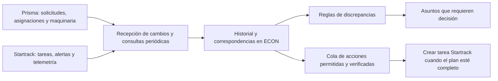
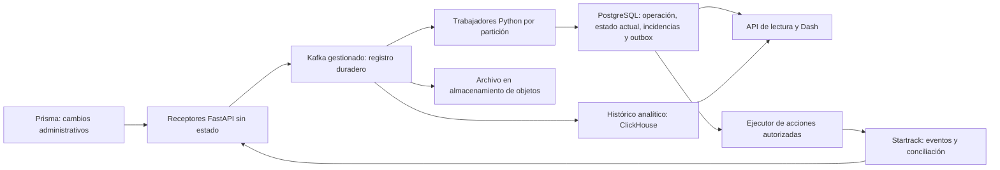

# Sincronización de Prisma y Startrack y detección de discrepancias

Fecha: 12 de septiembre de 2026. **Propuesta de ampliación**, basada en el código
actual y los contratos consultados. No describe funcionalidades nuevas ya
implementadas ni habilita conexiones. Todo el caso conserva datos sintéticos.

La sección final resume la [escala a miles de vehículos](#escala-a-miles-de-vehículos-propuesta)
con procesamiento distribuido y almacenamiento separado; también es propuesta.

## Resultado que buscamos

Cuando cambie una solicitud, asignación o condición de maquinaria en Prisma,
ECON debe detectar qué movimientos afecta. Cuando cambie una tarea o llegue
evidencia de Startrack, ECON debe actualizar su seguimiento y evaluar si los
hechos son compatibles con el plan. Una diferencia debe indicar qué ocurrió,
qué dato la sostiene y quién debe revisarla.

La sincronización hacia ECON puede recibir información de ambos sistemas. Una
corrección automática hacia un proveedor es una operación distinta: requiere
un campo autorizado, un contrato de escritura y una regla de negocio acordada.
No se aplicará la regla de que el último sistema en responder sobreescribe todo.

## Qué tenemos y qué falta

| Componente | Situación comprobada | Ampliación propuesta |
| --- | --- | --- |
| Adaptadores HTTP / SDK | Clientes Prisma y Startrack; acceso real a Startrack pendiente de validación | Contratos de cambios, telemetría e integración autenticada verificados con proveedores |
| Consultas periódicas | CLI `sync_operations --watch`; intervalo por defecto de 120 segundos, más tiempo de ejecución del ciclo | Proceso supervisado, presupuesto por proveedor y recorrido justo de todos los movimientos pendientes |
| Persistencia | Movimientos, eventos, fotografías de consulta y cola de envío | Bandeja duradera de eventos entrantes, progreso de sincronización e incidencias con historial |
| Cambios Prisma | Se revalidan planes `draft`/`blocked` y se comprueba el origen antes de enviar | Comparar también los cambios posteriores al envío; identificar nuevas solicitudes para revisión |
| Seguimiento Startrack | Tarea vinculada, conciliación de envíos inciertos y visitas acotadas | Cambios de contenido de tareas, telemetría histórica y reglas de coherencia operativa |
| Duplicados de envío | Identidad local, reclamación transaccional y estado `unknown` sin reenvío automático | Detección de duplicados de eventos entrantes y pruebas de recuperación integral |
| Interfaz | Asuntos por revisar, solicitudes y operaciones | Incidencias explicadas, línea de tiempo de hechos y cobertura por fuente |

El ciclo actual lee una lista acotada de movimientos, con límite por defecto de
100 y orden por creación. Para ampliar volumen hay que incorporar paginación o
selección por próxima revisión, de modo que los registros anteriores no queden
sin seguimiento. El candado de sincronización es local al proceso; el envío sí
dispone de reclamación transaccional. Una ejecución distribuida necesita
coordinación adicional. Véanse [workflow.py](../apps/api/app/services/workflow.py),
[ledger.py](../apps/api/app/services/ledger.py) y la
[guía operativa actual](solucion-integracion.md).

Las consultas de inventario Prisma también tienen cobertura acotada y no guardan
un cursor de recorrido. La ampliación debe descubrir registros fuera de las
primeras páginas, además de revisar por detalle las operaciones ya conocidas.

## Cómo detectar cambios

**Prisma.** El contrato entregado documenta consultas y aprobación mediante
`PATCH /api/maquinaria/requests/{id}/approve`. No documenta un webhook ni la
creación de proyectos/solicitudes por API. El conector actual realiza lecturas.
Primero se puede consultar periódicamente, comparar campos relevantes por ID y
conservar cada cambio observado. Si MAIC ofrece eventos, se añade el receptor
con su contrato real. Tener un SDK no hace que Prisma emita notificaciones.
[Contrato proporcionado](../econ-hackathon-openapi.json).

**Startrack.** La documentación publica webhooks de alertas y ubicaciones; el
envío de ubicaciones requiere configuración administrativa. No acredita un
webhook general de cambios de tareas. Para esas tareas se mantiene la consulta
API mientras se confirma otra vía. La cuenta debe validar qué eventos y campos
recibe efectivamente. [Webhooks oficiales](https://support.gps-platform.com/admin/webhooks/),
[API de tareas](https://support.gps-platform.com/api/jobs/).

**Ambas vías se complementan.** Un webhook permite reaccionar al aviso recibido;
una consulta periódica comprueba el estado y recupera omisiones. Si la fuente
solo entrega el estado actual, no podemos reconstruir cambios intermedios que
ocurrieron entre dos consultas. Esa limitación debe permanecer visible.

Si MAIC puede modificar Prisma, proponer eventos de solicitud creada, aprobada,
cancelada o reasignada, y cambios de condición de maquinaria. Son nombres y
capacidades por acordar. La emisión debería quedar registrada en la misma
transacción del cambio de Prisma y enviarse desde una cola, evitando perder el
aviso cuando falle la conexión.

## Responsabilidad de los datos

| Hecho | Fuente que se debe confirmar como responsable | Regla |
| --- | --- | --- |
| Solicitud, unidad y período de uso aprobado | Prisma | Conservar la versión empleada al preparar el traslado y las modificaciones posteriores |
| Condición técnica y restricciones de uso | Mantenimiento y su registro acordado | Validar significado de catálogos y vigencia; `OBSOLETA` no prueba una avería |
| Programación del traslado | Logística | No copiar el período solicitado como compromiso de llegada |
| Estado y contenido de la tarea | Startrack | Correlacionar con el movimiento; no sustituye el estado de la máquina |
| Encendido, ubicación y horómetro | Dispositivo identificado y Startrack | Conservar el instante del hecho, calidad y vínculo vigente con el activo |
| Recepción de maquinaria | Proyecto receptor y constancia | Una visita de geocerca o tarea completada no sustituye la recepción |
| Discrepancia y su resolución | ECON | Guardar hechos de origen, regla, revisión y decisión; no alterar la evidencia |

Una máquina **operativa** puede estar técnicamente apta y **ocupada** por una
asignación al mismo tiempo. Una tarea de traslado **completada** también puede
coexistir con una máquina **ocupada** en el proyecto. Ninguna de esas combinaciones
es una discrepancia por sí sola.

La relación máquina-dispositivo debe tener fechas de vigencia y distinguir GPS
propio de GPS del transportador. Una sustitución de dispositivo no debe atribuir
su historia anterior a otra máquina. El mapeo detallado de campos sigue en
[equivalencias-prisma-startrack.md](equivalencias-prisma-startrack.md).

## Reglas prioritarias

Son reglas propuestas, salvo la fila marcada como **señal implementada**. Se
aplican únicamente si hay identidad, cobertura y fechas suficientes; en caso
contrario se muestra **no evaluable** (en el hub, `overlap_not_verifiable`).

Los cuatro intervalos del dominio —período de uso de la solicitud, asignación
vigente de la unidad, programación del traslado e intervalo observado— se
definen en [intervals.py](../apps/api/app/services/intervals.py) y se comparan
de forma inclusiva por días, sin convertir uno en otro ni leer el reloj. Una
fecha ausente, una cobertura parcial o un instante sin zona horaria produce
«no verificable», nunca «sin conflicto».

| Regla | Evidencia mínima y condición | Decisión que permite |
| --- | --- | --- |
| Asignación modificada después del envío | Solicitud y tarea vinculadas; comparación de unidad, proyecto o período con la versión enviada | Revisar el traslado existente y acordar modificación o cancelación; no crear otra tarea automáticamente |
| Disponibilidad administrativa incompatible | Catálogo validado indica libre, pero existe asignación aprobada vigente incompatible con esa definición | Corregir la asignación o el estado en su fuente |
| Restricción de uso con encendido observado | Restricción técnica vigente, sensor perteneciente a la máquina, encendido reciente y contexto de prueba/mantenimiento | Mantenimiento verifica si es una prueba autorizada o uso que requiere intervención |
| Asignaciones solapadas — **señal implementada** en el hub, no bloqueo | Dos solicitudes `APROBADA` con la misma `maquinaria_id` y períodos de uso que se cruzan (inclusivo por días) → alerta `overlapping_approved_requests` (warning, Logística) con ambos IDs y períodos; fechas ausentes → `overlap_not_verifiable` (info). Una solicitud aprobada cuyo período difiere de la asignación vigente de su unidad en el mismo proyecto → `assignment_window_differs_from_request` (info, «revisar vigencia»). Solo comparan fechas de origen; no usan el corte de observación. Ver [hub.py](../apps/api/app/services/hub.py) | Logística resuelve el conflicto de capacidad en Prisma; ECON no impide la aprobación ni modifica la asignación |
| Presencia fuera del destino previsto | Vínculo GPS vigente, posición válida y reciente, geocerca acordada, etapa y traslado autorizado conocidos. **Sin implementar**: el hub no evalúa presencia GPS; el dispositivo puede ser del transportador y entrar en una geocerca no prueba ubicación | Verificar destino o movimiento; excluir trayectos autorizados |
| Tarea completada sin recepción registrada | Tarea correlacionada y consulta de recepciones disponible, más plazo de registro acordado | Pedir la constancia; no concluir que la máquina no llegó |
| Posible tiempo sin actividad | Jornada comprometida y secuencia de observaciones adecuadas al tipo de máquina, descontando períodos justificados | Revisar causa con el proyecto; no calcular improductividad a partir de velocidad cero |
| Datos que dejaron de actualizarse | Último evento válido, última consulta exitosa y frecuencia esperada por fuente | Corregir integración/dispositivo; no clasificar como máquina parada |

Cada incidencia necesita ID, regla y versión, maquinaria/proyecto/movimiento,
hechos y fuentes, fechas de inicio/detección/última evaluación, evidencia,
responsable funcional, siguiente acción y estado de revisión. Un evento
repetido no crea una incidencia nueva. La ausencia de datos posteriores no
resuelve una incidencia existente. Una nueva ocurrencia tras la resolución
conserva su relación con la anterior.

## Cómo medir utilización y tiempos muertos

Se necesita integrar la jornada planificada, bitácoras aprobadas, causas de
espera/paro, mantenimiento y señales de la máquina. El horómetro mide una
magnitud cuya definición debe validarse; no equivale automáticamente a horas
productivas. Se calcula sobre lecturas compatibles y se controlan reinicios,
cambios de sensor, unidades y discontinuidades.

Para una excavadora, estar quieta puede ser parte normal de su trabajo. No se
debe definir ralentí improductivo usando solamente velocidad cero y motor
encendido. Según el equipo, hacen falta señales de carga, hidráulica, PTO u otra
evidencia de actividad, o una bitácora validada.

La clasificación propuesta por intervalo es: trabajo confirmado, traslado,
espera confirmada con causa, mantenimiento, pausa planificada y tiempo sin
evidencia suficiente. Las categorías deben evitar solapamientos. Gerencia puede
comparar horas programadas con horas clasificadas y ver siempre cuánto tiempo
quedó sin clasificar. No usar las diferencias como tiempo muerto por defecto.

El costo de una espera requeriría horas confirmadas, tarifa aplicable, moneda y
componentes de costo validados. Por ahora no hay evidencia para mostrar pérdidas
monetarias ni utilización de toda la flota con las muestras proporcionadas.
Los criterios de presentación permanecen en
[analitica-decisiones.md](analitica-decisiones.md).

## Controles de robustez que desarrollar

1. **Guardar antes de confirmar recepción.** Validar el webhook según el mecanismo
   autenticado que acuerde el proveedor; persistirlo antes de responder éxito y
   procesarlo en segundo plano. La documentación revisada no garantiza firma,
   unicidad de evento, orden ni política de reintentos: hay que confirmarlos.
2. **Separar recepción y aplicación.** Conservar origen, cuenta, entorno, ID,
   tipo de entidad, versión si existe, instante del hecho y de recepción. Validar
   unidades y fechas según el contrato; aislar mensajes ambiguos para revisión.
3. **Evitar duplicados y bucles.** Clave de evento con alcance confirmado por
   proveedor; si falta, huella documentada con sus límites. Propagar la referencia
   de operación cuando se soporte y no reenviar cambios que ECON ya originó.
4. **Respetar el orden de los hechos.** Un aviso atrasado se conserva como historia
   y no reemplaza una versión posterior. Sin orden verificable, consultar y
   mantener la incertidumbre. Procesar cambios de cada entidad de forma serial
   o con control de versión.
5. **Reconciliar con cobertura explícita.** Mantener progreso por fuente/entorno;
   usar consultas incrementales solo si filtros y orden están soportados. Avanzar
   el corte únicamente al terminar la ventana; releer una franja de solapamiento
   y deduplicar. Consultas completas periódicas o eventos de borrado confirmados
   deben cubrir desapariciones; una página incompleta no prueba una eliminación.
6. **Recuperar fallos sin duplicar acciones.** Reintentos acotados y espaciados
   para lecturas y procesamiento seguro; conservar mensajes agotados para
   revisión. Un POST de tarea de resultado incierto mantiene `unknown` y se
   concilia por lectura, como ya hace el flujo actual.
7. **Supervisar capacidad y recuperación.** Presupuesto de consultas compartido,
   prioridad sin abandonar registros antiguos, señal de vida del trabajador,
   antigüedad de cola, último ciclo exitoso, errores y cobertura. Añadir copias
   de seguridad y una prueba de restauración antes de depender del historial.

El proveedor publica un límite general de 240 peticiones por IP cada dos
minutos, respuesta `529` al excederlo y restricciones adicionales por ruta. El
intervalo del trabajador debe calcularse considerando todas las llamadas y
consumidores de esa IP. No constituye una garantía de latencia.
[Límites oficiales](https://support.gps-platform.com/api/intro/).

Un receptor externo requiere una entrada de integración autenticada y aislada
del panel. Esto se diseñará con el proveedor; no implica habilitar el dashboard
live al público. La autenticación de usuarios de la aplicación es independiente
de esa entrada de integración.

## Frontend y orden de desarrollo

La primera vista de Gerencia debe seguir siendo una lista de decisiones:
**asunto, máquina/proyecto, evidencia, antigüedad y siguiente acción**. En el
detalle, mostrar plan original, cambios Prisma, tarea Startrack y recepción en
una línea de tiempo. Separar datos desconocidos de inconsistencias comprobadas.

Cuando exista historial, añadir una gráfica de horas por categoría y proyecto,
con una categoría visible de tiempo sin evidencia; una distribución de causas
de espera; y tiempos entre solicitud, aprobación, despacho y recepción. Los
conteos de registros y las cards decorativas no sustituyen estas decisiones.

1. Completar acuerdos de IDs, campos responsables, significado de estados,
   historial y disponibilidad de contratos con MAIC/Startrack.
2. Ampliar la conciliación por consultas, la detección de cambios posteriores al
   envío y la persistencia de incidencias. Reutilizar FastAPI, PostgreSQL y el
   trabajador actual para esta etapa acotada. El objetivo posterior de telemetría
   masiva requiere la separación de recepción y procesamiento descrita en la
   arquitectura de flota enlazada al inicio.
3. Conectar los webhooks efectivamente habilitados a la misma lógica de cambios,
   manteniendo las consultas de conciliación.
4. Integrar bitácoras, jornadas y mantenimiento para métricas de utilización.

Validar con escenarios sintéticos aislados: eventos repetidos, fuera de orden,
cambio de unidad después del envío, caída del trabajador tras persistir un
evento, resultado incierto del POST, consultas incompletas, pérdida de señal y
cambio de dispositivo. Estos escenarios son pruebas, no filas adicionales de
la muestra operativa.

## Preguntas que resuelven los siguientes bloqueos técnicos

- MAIC: ¿qué cambios pueden notificar, con qué ID/versión/fecha y política de
  reintentos? ¿Existe consulta incremental e historial, incluidas cancelaciones?
- MAIC y Logística: ¿qué debe pasar si cambian unidad, proyecto o período cuando
  la tarea ya existe? ¿Qué campos pueden corregirse automáticamente y quién
  confirma el resto?
- Startrack: ¿están habilitados eventos de tareas además de alertas/ubicaciones?
  ¿Cómo se autentican, identifican y recuperan eventos perdidos? ¿Qué contrato
  soporta modificar o cancelar una tarea existente?
- Equipos/Mantenimiento: ¿el dispositivo está en la máquina o en el transporte?
  ¿Qué señal acredita trabajo por tipo de equipo y qué registro acredita paro?
- Gerencia/Proyecto: ¿qué espera quieren reducir primero, cuál es la jornada
  comprometida y quién valida la causa y la recepción?

Esta propuesta no modifica la matriz de equivalencias original ni convierte las
capacidades documentadas en acceso validado al sandbox.

## Escala a miles de vehículos (propuesta)

Propuesta para telemetría continua de miles de vehículos. **No implementada ni
validada con pruebas de carga.** Supuestos: un evento por intervalo, actividad
24 horas y 1 KB (1.000 bytes) por evento; fórmula `vehículos × 86.400 / intervalo_s`.

| Vehículos | Intervalo | Eventos/s | Eventos/día | Contenido/día |
| ---: | ---: | ---: | ---: | ---: |
| 1.000 | 30 s | 33,3 | 2,88 millones | 2,88 GB |
| 5.000 | 30 s | 166,7 | 14,4 millones | 14,4 GB |
| 10.000 | 10 s | 1.000 | 86,4 millones | 86,4 GB |

Es contenido bruto antes de compresión, índices, réplicas y copias; el tamaño
físico se mide, no se deduce. Se conservan Python, FastAPI y Dash; se separan
recepción, procesamiento, operación y analítica:

| Pieza | Criterio |
| --- | --- |
| Receptores | Confirmar solo tras aceptación duradera del evento; sin estado compartido en memoria |
| Kafka | Clave por cuenta, entorno y entidad; orden solo dentro de la partición; permite reprocesar |
| Trabajadores | Un evento GPS consulta el contexto local de su activo y evalúa solo las reglas afectadas; nunca recorre la flota ni consulta Prisma por cada posición |
| PostgreSQL | IDs, mapeos con vigencia, movimientos, recepciones, último estado, incidencias y outbox transaccional; en un piloto puede alojar también telemetría con particiones temporales |
| ClickHouse y archivo | Histórico y agregaciones con deduplicación controlada; retención acordada para auditoría |

Reglas que no cambian con el volumen: entrega repetible exige idempotencia por
destino (no hay transacción global entre Kafka, PostgreSQL, ClickHouse y
Startrack); un POST incierto sigue en `unknown`; fechas de evento, recepción y
procesamiento se guardan separadas y un dato tardío no rejuvenece el estado
actual. El límite publicado de Startrack (240 peticiones por IP cada dos minutos)
hace inviable consultar unidad por unidad: la telemetría debe llegar por envío
de eventos habilitado por el proveedor, con consultas por lotes para recuperar
huecos, que deben permanecer visibles.

Pruebas mínimas antes de dimensionar infraestructura, con generadores sintéticos
aislados y sin activar proveedores: sostener 1.000 eventos/s; ráfaga de 10.000
eventos en un segundo; recuperación tras 15 minutos de parada (900.000 eventos
acumulados, unos 2.000 eventos/s durante la recuperación); duplicados, desorden,
eventos inválidos, cambio de asignación, caída de trabajadores y almacén
indisponible; 1.000 sesiones de interfaz que actualizan cada 15 s (≈67
solicitudes/s). Medir p95/p99 de recepción a resultado, antigüedad del evento
pendiente más viejo, pérdida o duplicación de efectos y costo por volumen.
