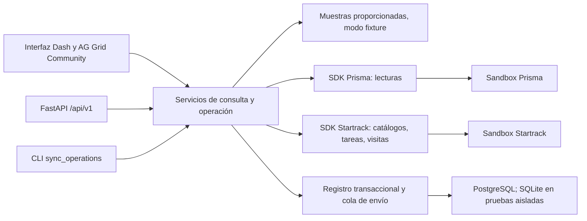

# Solución de integración y operación local

Actualizado el **13 de septiembre de 2026**: se añadieron
[tiempos del traslado](#tiempos-del-traslado-qué-se-sabe-y-qué-no),
[un worker por IP y candado de ciclo](#un-worker-por-ip-candado-de-ciclo-y-poda-de-cortes)
y las preguntas ampliadas a los proveedores. Este documento describe el código
implementado y su operación local. Una prueba con respuestas controladas no
acredita que las credenciales o los contratos completos de los sandboxes hayan
sido validados. El contexto de negocio se conserva en
[contexto vigente](contexto-vigente.md).

## Responsabilidad de cada aplicación

**Prisma**, presentada también como Nexus ECON, sigue siendo la aplicación donde
se crean proyectos y solicitudes y donde Logística aprueba y asigna una unidad
concreta. El contrato proporcionado publica consultas y aprobación, pero no
documenta un POST para crear proyectos o solicitudes. ECON no inventa esas rutas,
no replica esa aplicación ni inserta las muestras en Prisma.

**ECON** conserva las correspondencias revisadas por el operador, prepara los
movimientos, controla su envío y reúne evidencia. **Startrack** administra la
tarea, sus estados y el seguimiento del activo GPS. La recepción se registra
como declaración explícita del proyecto, separada de la presencia del GPS y del
estado de tarea.

La asignación del kit es **RE-03 / MOT-006 / PROY-006**. No se cambia por los IDs de
otros ejemplos. Los ejemplos proporcionados del contrato no contienen una cadena
completa que acredite solicitud, asignación, traslado y recepción de ese caso.

## Arquitectura implementada



- `apps/api/app/dashboard`: páginas, formularios, navegación y tablas. Dash y
  FastAPI comparten el mismo servicio Python.
- `app/api`: contratos HTTP tipados. El hub consulta las fuentes;
  `/api/v1/operations` permite consultar movimientos y, con una sesión cuyo rol
  tenga `manage_transfers` (recepción: `declare_reception`), guardar planes,
  ponerlos en cola, sincronizar y registrar recepción. `/api/v1/auth` y
  `/api/v1/users` gestionan sesión y usuarios ([ADR 0005](adr/0005-session-auth-and-roles.md)).
- `app/services/transfers.py`: valida solicitud aprobada, unidad y correspondencias
  antes de producir un borrador. No llama al proveedor.
- `app/services/workflow.py`: aplica habilitaciones, consulta vigencia y catálogos,
  coordina envío y seguimiento. Dash, HTTP y CLI utilizan este mismo servicio.
- `app/services/ledger.py`: transacciones, identidad del movimiento, eventos,
  fotografías de lectura y cola duradera. Cada llamada usa su propia sesión SQL.
- `app/services/intervals.py`, `graph.py`, `indicators.py` y `suggestions.py`:
  comparación de intervalos por día, proyección de grafo (`GET /api/v1/graph`),
  indicadores por fila (`GET /api/v1/indicators`) y sugerencias de unidad
  (`GET /api/v1/requests/{id}/suggestions`). Son puros: leen el hub y una página
  del registro; no consultan proveedores ni escriben.
- `app/cli/prune_snapshots.py`: poda explícita de cortes antiguos del hub; nunca
  toca movimientos ni eventos ([ADR 0006](adr/0006-postgresql-unica-infraestructura-de-estado.md)).
- `app/integrations`: clientes HTTP acotados y muestras locales. Las credenciales
  permanecen en el servidor; los mensajes públicos no incluyen respuestas crudas
  de error, cookies ni secretos.

La base contiene `operation_movements`, `operation_events`,
`operation_snapshots` y `users`. Conserva IDs originales, entorno, clase de
evidencia, fechas del proveedor, instantes de consulta, hashes, cobertura y el
actor de cada transición (`actor_*`, `declared_by_*`). La migración `0004`
añade los índices parciales `uq_operation_movements_inflight_machine` (un
movimiento `queued`/`sending`/`unknown` por máquina, modo y entorno) y
`uq_operation_movements_job_identity` (un `job_id` por modo y entorno) y, en
PostgreSQL, el trigger que hace `operation_events` append-only. Las consultas
del registro siempre separan `fixture` y `live`; un fallo live no recurre a
muestras. Arrancar la aplicación no crea tablas ni ejecuta migraciones.

## De la solicitud a la recepción

1. Crear o localizar el proyecto y la solicitud en Prisma. Registrar la aprobación
   y la maquinaria concreta en esa plataforma. Una fecha de uso no se toma como
   fecha programada de traslado.
2. Seleccionar la solicitud en ECON y revisar sus IDs de proyecto, solicitud y
   maquinaria. Introducir la geocerca de destino, usuarios asignables de
   Startrack, referencia del movimiento y programación. El activo GPS es
   opcional: sin su correspondencia explícita no se atribuyen visitas al traslado.
3. Guardar el plan local. Puede quedar `draft` si tiene los datos requeridos o
   `blocked` si falta aprobación, asignación o hay una contradicción. La
   sincronización vuelve a consultar los planes pendientes; una aprobación
   posterior puede desbloquearlos, conservando la evidencia anterior.
4. Poner el movimiento en cola. Se vuelven a comprobar solicitud, unidad,
   catálogos y tareas previas. La búsqueda por referencia debe terminar dentro
   del alcance disponible y no encontrar otra tarea. Guardar un plan no lo envía.
5. Ejecutar un ciclo de sincronización desde la interfaz o la CLI. El trabajador
   reclama el movimiento de forma atómica, confirma la transacción y después
   emite un único POST a Startrack. La tarea se prepara sin notificar al contacto.
6. Consultar la tarea por su ID persistido. Se conserva su estado y el
   `workflow_role` del catálogo. Para observar presencia en destino se requieren
   geocerca y activo GPS coincidentes, además de una fecha de evento interpretable.
7. Registrar la recepción con persona receptora, fecha y hora, y referencia de la
   constancia. Se guarda como `manual_declaration`; requiere un movimiento live
   con tarea enviada. No se generan recepciones para muestras.

La correspondencia es por IDs, nunca por nombres. Una solicitud puede tener
varios movimientos con referencias distintas. La identidad local es
`(mode, environment, movement_reference)`: repetir el mismo plan es idempotente;
reutilizar esa referencia con otra correspondencia o contenido produce conflicto.
La unicidad local no convierte `remote_id` en una garantía del proveedor.

## Estados de envío y evidencia independiente

| Estado del registro | Significado y siguiente acción |
| --- | --- |
| `draft` | Borrador preparado; revisar correspondencias y poner en cola. |
| `blocked` | Faltan hechos o hay contradicciones; corregir en la fuente o revisar el plan. |
| `queued` | Preparado para que un ciclo reclame el envío. |
| `sending` | La reclamación ya se confirmó en SQL; el envío puede estar en curso. |
| `sent` | Existe un ID de tarea confirmado; no significa llegada ni recepción. |
| `unknown` | El resultado puede haber sido aceptado por el proveedor; conciliar sin reenviar. |
| `failed` | El intento quedó detenido o rechazado; revisar la causa antes de otro movimiento. |

Un timeout o una respuesta ambigua deja el movimiento en `unknown`. Una
reclamación `sending` con más de diez minutos pasa a `unknown` durante la
sincronización. Ninguno de esos casos vuelve automáticamente a la cola. Mientras
un movimiento esté en vuelo (`queued`, `sending` o `unknown`) ninguna otra
encolada para la misma máquina prospera (409). La salida de `unknown` es
explícita: la conciliación vincula la tarea si existe, o el operador la cierra
como `failed` con `POST /api/v1/operations/{id}/resolve` (código cerrado, actor
registrado) tras comprobar Startrack a mano; nunca se repite el POST.
La conciliación puede vincular una tarea existente únicamente cuando hay una
coincidencia única de referencia y contenido suficiente. Una tarea cuyo formato
no permita probar esa correspondencia conserva la incertidumbre.

La maquinaria puede seguir administrativamente `OCUPADA` cuando la tarea figura
completada. Una visita de geocerca puede pertenecer al transportador. Ambos
hechos se muestran sin inferir descarga o aceptación física. La recepción puede
registrarse sin observación GPS, pero siempre requiere su declaración explícita.
Los eventos conservan por separado fecha del hecho, fecha de observación y fecha
de registro; una lectura nueva no rejuvenece una posición antigua.

## Tiempos del traslado: qué se sabe y qué no

«¿Cuánto puede tardar el vehículo?» tiene dos respuestas distintas y hoy solo
una está disponible. Lo **planificado** (cuándo debería salir y cuánto debería
durar) se declara al crear la tarea. Lo **observado** (cuándo llegó de verdad,
cuándo se recibió) se reconstruye con instantes de tres sistemas. Lo que **no
existe** en los contratos consultados es el trayecto: ETA en ruta, distancia
recorrida y tiempo de viaje medido. La página `/integracion` muestra los tres
bloques con esa separación.

### Instantes que existen en las fuentes

| Instante | Dónde vive (nombre exacto) | Qué significa y qué no |
| --- | --- | --- |
| Salida programada | `TransferMapping.scheduled_date` + `scheduled_time` → `StartrackJob.start_date` + `start_time` | Decisión humana registrada en ECON y enviada a la tarea. `start_time` es `HH:mm:ss` **sin zona**: la de la cuenta Startrack debe confirmarse antes de restar horas. |
| Duración esperada | `StartrackJob.duration`, en **segundos** (formulario: «Duración», en minutos) | Valor planificado que la doc oficial publica en el Job Data Object. Hoy `StartrackJob` no lo lee ni `TransferMapping` lo produce. **No** es una duración medida ni un ETA. |
| Creación de la tarea | `StartrackJob.creation_date` (solo lectura) | Cuándo Startrack registró la tarea. No es cuándo se preparó el plan en ECON ni cuándo arrancó el vehículo. |
| Último cambio | `StartrackJob.changed_date`, `last_status_change_date` | Cuándo se modificó la tarea o cambió su estado. Un cambio de estado no dice a qué estado ni por quién. |
| Cierre de la tarea | `StartrackJob.closed_date` (solo lectura), con `completed_lat`/`completed_lon` o `x`/`y` | Cuándo se **completó o canceló**. Los dos casos comparten campo: sin `status` + `workflow_role` no se sabe cuál. El punto de cierre es dónde se pulsó el botón. |
| Llegada observada al destino | `StartrackVisit.start_date` y `end_date`, con `poi_id` de la geocerca de destino y `vehicle_id`/`driver_id` | Presencia acotada del activo rastreado en la geocerca. El informe **no** devuelve `job_id`: la atribución al traslado la hace ECON por correspondencia explícita, y el GPS puede ser del transportador. |
| Despacho desde ECON | `Movement.queued_at`, `sending_at`, `sent_at` | Cuándo se encoló, se reclamó y se confirmó el envío. `sent_at` acredita una tarea creada, **no** una salida física. |
| Recepción declarada | `ReceiptRecord.received_at` (con `receiver` y `reference`) | Declaración explícita del proyecto, con zona horaria obligatoria. Ni el GPS ni una tarea completada la generan. |
| Fechas de cada evidencia | `OperationEvent.event_time`, `observed_at`, `recorded_at` | Cuándo ocurrió el hecho, cuándo se leyó y cuándo se guardó. Una lectura nueva no rejuvenece una posición antigua. |

Las fechas ISO del proveedor tienen el formato `YYYY-MM-DD HH:mm:ss±hh:mm`, con
espacio en lugar de `T`: un parser ISO estricto las rechaza. Un texto sin zona
se conserva como texto y no acredita un instante comparable.

### Las dos duraciones que muestra `/integracion`

Se calculan solo cuando ambos extremos existen y son interpretables; si falta
uno, la página muestra el faltante en lugar de un número.

1. **Programado → llegada observada**: de `start_date` + `start_time` a
   `StartrackVisit.start_date` en la geocerca de destino. Mide desfase respecto
   al plan, no tiempo de viaje: el vehículo pudo salir antes o después.
2. **Llegada → recepción**: de `StartrackVisit.start_date` a
   `ReceiptRecord.received_at`. Mide cuánto tardó el destino en acreditar la
   entrega después de que se observó presencia. Con recepción sin visita
   correlacionada, la primera duración queda vacía y la segunda no se calcula.

Ambas son **observaciones de una muestra sintética**, no indicadores. No se
publican como promedios ni se comparan entre proyectos mientras no estén
definidos población, exclusiones y política de reprogramaciones
([analítica](analitica-decisiones.md)).

### Lo que hoy no se puede afirmar

| Pregunta | Por qué no hay respuesta |
| --- | --- |
| ¿Cuál es el ETA del vehículo en ruta? | Ningún campo del Job Data Object ni del informe de visitas publica una estimación de llegada. |
| ¿Cuántos kilómetros son y cuánto se tarda en recorrerlos? | El contrato consultado no expone distancia ni tiempo de viaje del traslado. El «Mapa de rastreo» y el «Listado de rutas» de Startrack muestran telemetría, pero **esa telemetría no está expuesta en la API que usamos**. |
| ¿Hay fecha límite de entrega? | «Completar antes de» existe en el formulario real y **no aparece** en el Job Data Object público. `Solicitud.fecha_fin` es fin de uso, no vencimiento del traslado. |
| ¿Hay ventana horaria comprometida? | «Ventana horaria de entrega» existe en el formulario real y **no aparece** en el objeto público. No se reutiliza `start_time` con otro significado. |
| ¿Desde dónde sale? | «Origen» existe en el formulario y el objeto público tiene una sola geocerca (`poi_id`). Sin origen no hay trayecto que medir. |
| ¿Cuánto duró realmente el traslado? | `duration` es esperada, no medida; `closed_date` cubre completar o cancelar; la visita acredita presencia, no salida. Faltaría un instante de salida acreditado. |

### Qué pedir al proveedor para poder responderlo

Ninguna de estas peticiones está implementada; se enumeran para la conversación
con Startrack y con MAIC, con el campo y su unidad, para no inventar nombres.

1. **Confirmar `duration`**: unidad exacta (segundos), si es editable después de
   crear la tarea y si el producto la usa para calcular algo. Con eso, ECON
   podría enviar una duración esperada y contrastarla con la observada.
2. **Fecha límite y ventana**: nombre de API de «Completar antes de» y de la
   «Ventana horaria de entrega» (inicio y fin), o confirmación de que solo
   existen en la interfaz. Sin contrato no se envían.
3. **Origen**: si el objeto admite una geocerca de salida o si la práctica del
   producto es crear dos tareas. Determina si el trayecto es modelable.
4. **Telemetría de ruta**: qué endpoint publica recorridos, distancia y
   velocidad por vehículo y ventana (el centro de recursos lista *Rutas*,
   *Ubicaciones* e *Informes*), con sus límites de consulta y su formato de
   fecha.
5. **Instante de salida acreditado**: si un cambio de estado a un valor con
   `workflow_role` `0` intermedio (por ejemplo «En ruta») queda registrado con
   su fecha, o si `last_status_change_date` es el único disponible. Un histórico
   de cambios de estado permitiría medir el traslado sin telemetría.
6. **Zona horaria de la cuenta Startrack**: para poder restar `start_time` y
   visitas sin suponer `America/El_Salvador`, y saber en qué zona se expresan
   `creation_date`, `changed_date` y `closed_date` cuando llegan sin desfase.
7. **Prisma**: si `PATCH /api/maquinaria/requests/{id}/approve` o el historial
   registran un instante de entrega o de puesta a disposición distinto de
   `approved_at`.
8. **Instantes por transición del flujo de falla** (`/maquinaria/fallas`): fecha
   de cada paso `SIN_REVISAR` → `PENDIENTE_INTERVENCION` → `EN_PROCESO` →
   `ESPERA_REPUESTOS` → `TRASLADO_STD` → `EN_PRUEBAS` → `FINALIZADO`/`RECHAZADO`
   y del cambio de `active_failure_is_paro`. Sin ellos no hay edad de falla ni
   tiempo de paro (hoy `failure_age` queda `null`).
9. **`rejected_at` y motivo de rechazo** de la solicitud: el contrato solo
   publica `approved_at`; sin instante de rechazo el tiempo de decisión de las
   RECHAZADA no se calcula.
10. **Catálogo de `event_type` de `/history`** (historial de maquinaria): valores
    posibles, qué transición representa cada uno y si `gps_captured_at` acompaña
    siempre a `gps_latitude`/`gps_longitude`. Sin catálogo no se interpreta el
    motivo de un cambio de `estado`.
11. **Endpoint de última posición** del vehículo en Startrack (nombre, campos,
    unidad de precisión, instante de la posición y límites de consulta): el SDK
    solo lee el informe de visitas a POI, por lo que la antigüedad de posición
    propuesta no puede calcularse.

## Un worker por IP, candado de ciclo y poda de cortes

Startrack publica un límite de 240 peticiones por IP cada dos minutos, así que
la invariante operativa es **un solo worker por IP**: el presupuesto del
proveedor, no la cola, es el cuello de botella. La aplicación lo defiende en dos
capas: un `Lock` de proceso (un ciclo a la vez por servidor) y, en PostgreSQL, el
candado de sesión `pg_try_advisory_lock(hashtext(clave))` de
`app/core/database.py::cycle_lock`, que se toma sin esperar y se libera con la
sesión; un segundo proceso sobre la misma base recibe un rechazo explícito en
lugar de ejecutar el ciclo en paralelo. SQLite no ofrece este candado y no
acredita el comportamiento concurrente. Detalle en
[ADR 0006](adr/0006-postgresql-unica-infraestructura-de-estado.md).

Cada ciclo guarda un corte del hub solo si su huella estable cambió; una
relectura idéntica actualiza `last_confirmed_at` y `last_sync_at` refleja la
última lectura. La retención es una decisión explícita del operador:

```powershell
uv run --directory apps/api python -m app.cli.prune_snapshots --mode live --keep-days 30 --keep-latest 1 --dry-run
```

Sin `--dry-run` elimina los cortes del modo cuya última lectura sea anterior a
`--keep-days`, conservando siempre los `--keep-latest` más recientes; nunca toca
`operation_events` ni `operation_movements`, y la aplicación no poda sola.

## SDK, sincronización y límites de cobertura

El SDK valida y ejecuta llamadas HTTP. La sincronización decide cuándo consultar,
qué movimiento corresponde y qué conservar. El servidor web no inicia un
trabajador periódico de forma automática: la CLI con `--watch` ejecuta ciclos.

La detección de cambios de aprobación y la actualización de tareas usan consultas
periódicas acotadas. No se ha documentado un webhook de aprobaciones de Prisma ni
un webhook de cambios de estado de tareas Startrack. Los webhooks de telemetría
documentados por Startrack no acreditan esas dos capacidades. No se configura
un receptor ficticio ni se presenta el polling como entrega instantánea.

Cada ciclo procesa un número acotado de registros y como máximo diez envíos.
El seguimiento de visitas consulta una ventana de hasta siete días. Una consulta
incompleta, un movimiento fuera de ese período o un contrato sin zona horaria
mantienen la falta de evidencia visible. El registro previo se conserva si una
fuente falla; no se presenta como una nueva lectura satisfactoria.

## Preparar el entorno local

Desde la raíz del repositorio, conservar el `.env` existente y su `DATABASE_URL`.
Si falta, partir de `apps/api/.env.example`. No modificar el nombre del proyecto
Compose ni borrar su volumen.

```sh
uv sync --project apps/api --locked
docker compose up -d --wait db
uv run --directory apps/api alembic upgrade head
./scripts/dev.sh   # PowerShell: .\scripts\dev.ps1
```

La migración es explícita y se ejecuta sobre la base indicada por `DATABASE_URL`.
La aplicación carga `apps/api/.env` independientemente del directorio de trabajo.
Para desarrollo con SQLite se usa una base separada; las pruebas crean sus
propias bases temporales. No se aplica un downgrade sobre datos operativos como
parte del arranque o de las verificaciones normales.

La interfaz local está en `http://localhost:8050` y el contrato HTTP en
`http://localhost:8050/docs`. Si el registro indica que no está disponible,
comprobar la conexión y la migración antes de guardar o sincronizar.

## Habilitaciones del servidor

| Variable | Valor inicial | Efecto |
| --- | --- | --- |
| `AUTH_REQUIRED` | `true` | Exige sesión en toda ruta salvo salud y `/login`. `false` solo en desarrollo. |
| `SESSION_SECRET` | — | Obligatorio con `AUTH_REQUIRED=true`; firma la cookie `econ_session`. |
| `SESSION_HTTPS_ONLY` | `false` | `true` tras TLS: la cookie solo viaja por HTTPS. |
| `SESSION_MAX_AGE_SECONDS` | `28800` | Caducidad de la sesión. |
| `ALLOW_LOCAL_MANAGEMENT` | `false` | Solo con `AUTH_REQUIRED=false`: concede gestión a peticiones loopback del mismo origen. |
| `ALLOW_LIVE_READS` | `false` | Permite las consultas reales del sandbox; requiere las credenciales correspondientes. |
| `ALLOW_LIVE_WRITES` | `false` | Permite enviar tareas Startrack tras las comprobaciones del flujo. |
| `AUTO_QUEUE_TRANSFERS` | `false` | Permite poner en cola planes guardados que se validen durante un ciclo. |

Prisma utiliza `NEXUS_EMAIL` y `NEXUS_PASSWORD`. Startrack utiliza
`STARTRACK_API_KEY` y `STARTRACK_PASSWORD`. No introducir secretos en formularios,
URLs, código, capturas o registros. Una sesión abierta de
Startrack en el navegador no prueba que las credenciales de su API funcionen.

Los roles de usuario y las habilitaciones del servidor son capas distintas.
El rol de la sesión decide **quién** puede actuar: `admin` y `logistica`
guardan planes, encolan y sincronizan (`manage_transfers`); `admin`,
`logistica` y `gerencia_proyecto` declaran recepción (`declare_reception`);
`mantenimiento`, `control_costos` y `lectura` consultan; solo `admin`
administra usuarios. Las habilitaciones deciden **qué puede hacer el
servidor**: ningún rol enciende lecturas o escrituras remotas, y un flag del
navegador no concede permisos. No publicar el servicio con live habilitado.
En despliegues públicos de muestras, mantener `ALLOW_LIVE_READS`,
`ALLOW_LIVE_WRITES` y `AUTO_QUEUE_TRANSFERS` en `false`.

## Ejecutar ciclos

El worker CLI no tiene sesión de usuario: actúa con autoridad de proceso sobre
la base configurada y solo lo lanza quien administra el servidor. Para
comprobar persistencia con las muestras proporcionadas:

```powershell
$env:ALLOW_LIVE_READS = "false"
$env:ALLOW_LIVE_WRITES = "false"
$env:AUTO_QUEUE_TRANSFERS = "false"
uv run --directory apps/api python -m app.cli.sync_operations --mode fixture
```

Ese comando conserva una fotografía local de las muestras y su cobertura. No
consulta los proveedores, no crea registros en Prisma, no envía tareas ni
registra recepciones. El archivo de muestras permanece en
`app/integrations/data/sandbox_samples.json`, con procedencia y hash documental;
no se convierte en un script de carga del sandbox.

Después de configurar las credenciales en el servidor y habilitar expresamente
las lecturas reales, un ciclo live se ejecuta con:

```powershell
uv run --directory apps/api python -m app.cli.sync_operations --mode live
```

Para mantener consultas periódicas:

```powershell
uv run --directory apps/api python -m app.cli.sync_operations --mode live --watch --interval 120
```

El intervalo admite 60–3600 segundos. `Ctrl+C` termina el proceso. Las banderas del
servidor siguen aplicándose en cada ciclo. Con escrituras deshabilitadas se
consulta y conserva evidencia sin despachar la cola. Habilitar escrituras permite
al siguiente ciclo procesar los movimientos ya puestos en cola; activar además
la cola automática permite evaluar y encolar planes guardados válidos. No crea
correspondencias nuevas a partir de coincidencias de nombres.

## Validación y trabajo pendiente con proveedores

`scripts/check.sh` (o `check.ps1`) ejecuta Ruff, formato, pytest,
`generar_diccionario.py --check` (RF-01) y `exportar_matrices.py --check`
(RNF-02). Las pruebas de integración usan respuestas HTTP controladas y bases
SQLite aisladas; incluyen concurrencia de reclamaciones, idempotencia, resultados
ambiguos, aislamiento de evidencia y separación de recepción. Sus IDs
artificiales viven en tests y no se sirven como datos de operación. Con
`ECON_TEST_POSTGRES_URL` y `ECON_TEST_POSTGRES_MIGRATIONS_URL` definidas
(`postgresql+psycopg://econ@127.0.0.1:54329/econ_test` y `…/econ_test_migrations`)
se ejecutan además `tests/test_postgres_*.py`: exclusividad en vuelo, `SKIP
LOCKED`, trigger append-only, `timestamptz`, candado de ciclo y el ida y vuelta
de la migración `0004`; CI levanta `postgres:16` para no omitirlas. SQLite no
acredita ese comportamiento. El SQL de PostgreSQL puede revisarse sin conexión
mediante `alembic upgrade head --sql`.

La siguiente validación con proveedores debe comprobar credenciales API,
permisos y respuestas reales de los catálogos y de creación de tarea. En
particular, la codificación de listas en el formulario de Startrack, como
usuarios y formularios, requiere cotejo autenticado con el sandbox. Los tests
del cliente prueban la codificación implementada, no su aceptación real. Antes
de cualquier envío, revisar las tareas existentes y los IDs del caso concreto;
la incertidumbre de un POST no se resuelve repitiéndolo.

El SDK no consulta respuestas de formularios de Startrack (la lectura sin uso
se retiró). Una respuesta de formulario no se toma como aceptación empresarial
automática: el criterio de recepción y su correspondencia deben acordarse
expresamente antes de implementar esa lectura.
Tampoco se afirma cobertura exhaustiva de registros, sincronización en tiempo
real ni validación productiva a partir de estas pruebas locales.
