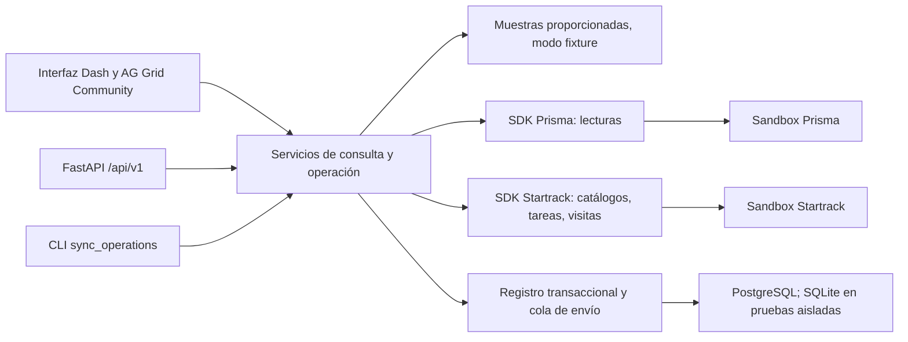

# Solución de integración y operación local

Actualizado el **12 de septiembre de 2026**. Este documento describe el código
implementado y su operación local. Una prueba con respuestas controladas no
acredita que las credenciales o los contratos completos de los sandboxes hayan
sido validados. El contexto de negocio se conserva en
[contexto vigente](contexto-vigente.md).

## Responsabilidad de cada aplicación

**Prisma**, presentada también como Nexus ECON, sigue siendo la aplicación donde
se crean proyectos y solicitudes y donde Logística aprueba y asigna una unidad
concreta. El contrato proporcionado publica consultas y aprobación, pero no
documenta un POST para crear proyectos o solicitudes. ECON no inventa esas rutas,
no replica esa aplicación ni inserta las muestras en Prisma.

**ECON** conserva las correspondencias revisadas por el operador, prepara los
movimientos, controla su envío y reúne evidencia. **Startrack** administra la
tarea, sus estados y el seguimiento del activo GPS. La recepción se registra
como declaración explícita del proyecto, separada de la presencia del GPS y del
estado de tarea.

La asignación del kit es **RE-03 / MOT-006 / PROY-006**. No se cambia por los IDs de
otros ejemplos. Los ejemplos proporcionados del contrato no contienen una cadena
completa que acredite solicitud, asignación, traslado y recepción de ese caso.

## Arquitectura implementada



- `apps/api/app/dashboard`: páginas, formularios, navegación y tablas. Dash y
  FastAPI comparten el mismo servicio Python.
- `app/api`: contratos HTTP tipados. El hub consulta las fuentes;
  `/api/v1/operations` permite consultar movimientos y, con gestión local
  habilitada, guardar planes, ponerlos en cola, sincronizar y registrar recepción.
- `app/services/transfers.py`: valida solicitud aprobada, unidad y correspondencias
  antes de producir un borrador. No llama al proveedor.
- `app/services/workflow.py`: aplica habilitaciones, consulta vigencia y catálogos,
  coordina envío y seguimiento. Dash, HTTP y CLI utilizan este mismo servicio.
- `app/services/ledger.py`: transacciones, identidad del movimiento, eventos,
  fotografías de lectura y cola duradera. Cada llamada usa su propia sesión SQL.
- `app/integrations`: clientes HTTP acotados y muestras locales. Las credenciales
  permanecen en el servidor; los mensajes públicos no incluyen respuestas crudas
  de error, cookies ni secretos.

La base contiene `operation_movements`, `operation_events` y
`operation_snapshots`. Conserva IDs originales, entorno, clase de evidencia,
fechas del proveedor, instantes de consulta, hashes y cobertura. Las consultas
del registro siempre separan `fixture` y `live`; un fallo live no recurre a
muestras. Arrancar la aplicación no crea tablas ni ejecuta migraciones.

## De la solicitud a la recepción

1. Crear o localizar el proyecto y la solicitud en Prisma. Registrar la aprobación
   y la maquinaria concreta en esa plataforma. Una fecha de uso no se toma como
   fecha programada de traslado.
2. Seleccionar la solicitud en ECON y revisar sus IDs de proyecto, solicitud y
   maquinaria. Introducir la geocerca de destino, usuarios asignables de
   Startrack, referencia del movimiento y programación. El activo GPS es
   opcional: sin su correspondencia explícita no se atribuyen visitas al traslado.
3. Guardar el plan local. Puede quedar `draft` si tiene los datos requeridos o
   `blocked` si falta aprobación, asignación o hay una contradicción. La
   sincronización vuelve a consultar los planes pendientes; una aprobación
   posterior puede desbloquearlos, conservando la evidencia anterior.
4. Poner el movimiento en cola. Se vuelven a comprobar solicitud, unidad,
   catálogos y tareas previas. La búsqueda por referencia debe terminar dentro
   del alcance disponible y no encontrar otra tarea. Guardar un plan no lo envía.
5. Ejecutar un ciclo de sincronización desde la interfaz o la CLI. El trabajador
   reclama el movimiento de forma atómica, confirma la transacción y después
   emite un único POST a Startrack. La tarea se prepara sin notificar al contacto.
6. Consultar la tarea por su ID persistido. Se conserva su estado y el
   `workflow_role` del catálogo. Para observar presencia en destino se requieren
   geocerca y activo GPS coincidentes, además de una fecha de evento interpretable.
7. Registrar la recepción con persona receptora, fecha y hora, y referencia de la
   constancia. Se guarda como `manual_declaration`; requiere un movimiento live
   con tarea enviada. No se generan recepciones para muestras.

La correspondencia es por IDs, nunca por nombres. Una solicitud puede tener
varios movimientos con referencias distintas. La identidad local es
`(mode, environment, movement_reference)`: repetir el mismo plan es idempotente;
reutilizar esa referencia con otra correspondencia o contenido produce conflicto.
La unicidad local no convierte `remote_id` en una garantía del proveedor.

## Estados de envío y evidencia independiente

| Estado del registro | Significado y siguiente acción |
| --- | --- |
| `draft` | Borrador preparado; revisar correspondencias y poner en cola. |
| `blocked` | Faltan hechos o hay contradicciones; corregir en la fuente o revisar el plan. |
| `queued` | Preparado para que un ciclo reclame el envío. |
| `sending` | La reclamación ya se confirmó en SQL; el envío puede estar en curso. |
| `sent` | Existe un ID de tarea confirmado; no significa llegada ni recepción. |
| `unknown` | El resultado puede haber sido aceptado por el proveedor; conciliar sin reenviar. |
| `failed` | El intento quedó detenido o rechazado; revisar la causa antes de otro movimiento. |

Un timeout o una respuesta ambigua deja el movimiento en `unknown`. Una
reclamación `sending` con más de diez minutos pasa a `unknown` durante la
sincronización. Ninguno de esos casos vuelve automáticamente a la cola.
La conciliación puede vincular una tarea existente únicamente cuando hay una
coincidencia única de referencia y contenido suficiente. Una tarea cuyo formato
no permita probar esa correspondencia conserva la incertidumbre.

La maquinaria puede seguir administrativamente `OCUPADA` cuando la tarea figura
completada. Una visita de geocerca puede pertenecer al transportador. Ambos
hechos se muestran sin inferir descarga o aceptación física. La recepción puede
registrarse sin observación GPS, pero siempre requiere su declaración explícita.
Los eventos conservan por separado fecha del hecho, fecha de observación y fecha
de registro; una lectura nueva no rejuvenece una posición antigua.

## SDK, sincronización y límites de cobertura

El SDK valida y ejecuta llamadas HTTP. La sincronización decide cuándo consultar,
qué movimiento corresponde y qué conservar. El servidor web no inicia un
trabajador periódico de forma automática: la CLI con `--watch` ejecuta ciclos.

La detección de cambios de aprobación y la actualización de tareas usan consultas
periódicas acotadas. No se ha documentado un webhook de aprobaciones de Prisma ni
un webhook de cambios de estado de tareas Startrack. Los webhooks de telemetría
documentados por Startrack no acreditan esas dos capacidades. No se configura
un receptor ficticio ni se presenta el polling como entrega instantánea.

Cada ciclo procesa un número acotado de registros y como máximo diez envíos.
El seguimiento de visitas consulta una ventana de hasta siete días. Una consulta
incompleta, un movimiento fuera de ese período o un contrato sin zona horaria
mantienen la falta de evidencia visible. El registro previo se conserva si una
fuente falla; no se presenta como una nueva lectura satisfactoria.

## Preparar el entorno local

Desde la raíz del repositorio, conservar el `.env` existente y su `DATABASE_URL`.
Si falta, partir de `apps/api/.env.example`. No modificar el nombre del proyecto
Compose ni borrar su volumen.

```sh
uv sync --project apps/api --locked
docker compose up -d --wait db
uv run --directory apps/api alembic upgrade head
./scripts/dev.sh   # PowerShell: .\scripts\dev.ps1
```

La migración es explícita y se ejecuta sobre la base indicada por `DATABASE_URL`.
La aplicación carga `apps/api/.env` independientemente del directorio de trabajo.
Para desarrollo con SQLite se usa una base separada; las pruebas crean sus
propias bases temporales. No se aplica un downgrade sobre datos operativos como
parte del arranque o de las verificaciones normales.

La interfaz local está en `http://localhost:8050` y el contrato HTTP en
`http://localhost:8050/docs`. Si el registro indica que no está disponible,
comprobar la conexión y la migración antes de guardar o sincronizar.

## Habilitaciones del servidor

| Variable | Valor inicial | Efecto |
| --- | --- | --- |
| `ALLOW_LOCAL_MANAGEMENT` | `false` | Permite gestión desde el servidor local y ejecución de ciclos CLI. |
| `ALLOW_LIVE_READS` | `false` | Permite las consultas reales del sandbox; requiere las credenciales correspondientes. |
| `ALLOW_LIVE_WRITES` | `false` | Permite enviar tareas Startrack tras las comprobaciones del flujo. |
| `AUTO_QUEUE_TRANSFERS` | `false` | Permite poner en cola planes guardados que se validen durante un ciclo. |

Prisma utiliza `NEXUS_EMAIL` y `NEXUS_PASSWORD`. Startrack utiliza
`STARTRACK_API_KEY` y `STARTRACK_PASSWORD`. No introducir secretos en formularios,
URLs, código, capturas o registros. Una sesión abierta de
Startrack en el navegador no prueba que las credenciales de su API funcionen.

<!-- TODO(auth): sustituir este párrafo por la relación entre roles de usuario y habilitaciones del servidor. -->
La autenticación y los roles se administran en la aplicación; las habilitaciones
de esta tabla siguen siendo del servidor. La gestión HTTP exige conexión
loopback, nombre de host local y controles de origen; un indicador del navegador
no concede permisos.
No publicar el servicio con live habilitado ni reenviar un origen público hacia
la gestión local. CORS no sustituye una barrera de acceso a datos privados.
En despliegues públicos de muestras, mantener las cuatro habilitaciones en
`false`.

## Ejecutar ciclos

Para comprobar persistencia con las muestras proporcionadas, habilitar únicamente
la gestión local en el proceso que ejecuta la CLI:

```powershell
$env:ALLOW_LOCAL_MANAGEMENT = "true"
$env:ALLOW_LIVE_READS = "false"
$env:ALLOW_LIVE_WRITES = "false"
$env:AUTO_QUEUE_TRANSFERS = "false"
uv run --directory apps/api python -m app.cli.sync_operations --mode fixture
```

Ese comando conserva una fotografía local de las muestras y su cobertura. No
consulta los proveedores, no crea registros en Prisma, no envía tareas ni
registra recepciones. El archivo de muestras permanece en
`app/integrations/data/sandbox_samples.json`, con procedencia y hash documental;
no se convierte en un script de carga del sandbox.

Después de configurar las credenciales en el servidor y habilitar expresamente
las lecturas reales, un ciclo live se ejecuta con:

```powershell
uv run --directory apps/api python -m app.cli.sync_operations --mode live
```

Para mantener consultas periódicas:

```powershell
uv run --directory apps/api python -m app.cli.sync_operations --mode live --watch --interval 120
```

El intervalo admite 60–3600 segundos. `Ctrl+C` termina el proceso. Las banderas del
servidor siguen aplicándose en cada ciclo. Con escrituras deshabilitadas se
consulta y conserva evidencia sin despachar la cola. Habilitar escrituras permite
al siguiente ciclo procesar los movimientos ya puestos en cola; activar además
la cola automática permite evaluar y encolar planes guardados válidos. No crea
correspondencias nuevas a partir de coincidencias de nombres.

## Validación y trabajo pendiente con proveedores

`scripts/check.sh` (o `check.ps1`) ejecuta Ruff, formato y pytest. Las pruebas de integración
usan respuestas HTTP controladas y bases SQLite aisladas; incluyen concurrencia
de reclamaciones, idempotencia, resultados ambiguos, aislamiento de evidencia y
separación de recepción. Sus IDs artificiales viven en tests y no se sirven como
datos de operación. La migración también se comprueba contra una base de prueba;
el SQL de PostgreSQL puede revisarse sin conexión mediante `alembic upgrade head
--sql`.

La siguiente validación con proveedores debe comprobar credenciales API,
permisos y respuestas reales de los catálogos y de creación de tarea. En
particular, la codificación de listas en el formulario de Startrack, como
usuarios y formularios, requiere cotejo autenticado con el sandbox. Los tests
del cliente prueban la codificación implementada, no su aceptación real. Antes
de cualquier envío, revisar las tareas existentes y los IDs del caso concreto;
la incertidumbre de un POST no se resuelve repitiéndolo.

Los formularios de Startrack tienen soporte de consulta en el SDK. Todavía no
se toma una respuesta de formulario como aceptación empresarial automática:
el criterio de recepción y su correspondencia deben acordarse expresamente.
Tampoco se afirma cobertura exhaustiva de registros, sincronización en tiempo
real ni validación productiva a partir de estas pruebas locales.
