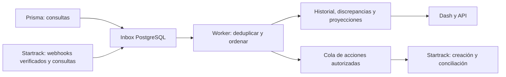

# Revisión integral de ECON y backlog de eventos

Auditoría del **12 de septiembre de 2026**, con tres agentes **gpt-6-astra** y revisión cruzada. Rama `feat/operations-hub-foundation`, commit base `e851c7ec01890eda54d736d4d9eeaa161a8a8fce`. Se incluyó el trabajo documental local previo, que todavía no está publicado en Git.

**Resultado:** existe una base funcional de Dash/FastAPI, PostgreSQL, planes, historial, cola de salida y conciliación. El reto todavía no está completamente acreditado: RF-02 es parcial; falta demostrar RF-04/RF-05 con datos relacionados de ambas plataformas y entregar la presentación final. Se crearon **13 issues**, con cuerpo y URL verificados después de cada creación.

## Informes y evidencia

- [Cobertura RF/RNF, documentos y entregables](../../docs/auditoria-requisitos-2026-09-12.md).
- [Arquitectura de eventos, defectos y evolución propuesta](../../docs/auditoria-arquitectura-eventos-2026-09-12.md).
- [Registro verificable de los 13 issues creados](issues-creados.json).
- [Contenido de los issues](issues-propuestos.json); cada cuerpo publicado se conserva en `cuerpos/`.

La revisión abarcó `apps/api/app`, pruebas, migraciones, configuración, CI/Docker, scripts, documentación actual, los 21 Markdown de OneDrive y los tres PDFs de output. Se contrastaron el [OpenAPI Prisma](../../econ-hackathon-openapi.json) —25 rutas, 30 operaciones—, el [manual API Prisma](../../Prisma-Sandbox-API.pdf) —23 páginas, texto completo y revisión visual focal— y la [introducción oficial Startrack](https://support.gps-platform.com/api/intro/), con sus páginas de tareas, ubicaciones, visitas y webhooks.

## Solución recomendada

Conservar FastAPI, Dash y PostgreSQL. Corregir primero recorrido, orden temporal y cobertura; después añadir una bandeja duradera de eventos, procesamiento por entidad, incidencias y una lectura común de la evidencia persistida. Mantener la cola actual que evita repetir un POST de resultado incierto.

Prisma se detecta mediante consultas periódicas mientras no exista un contrato de eventos confirmado. Startrack ofrece alertas y ubicaciones por webhook, pero la documentación revisada no acredita un webhook general de cambios de tareas; estas conservan consultas de conciliación. Es una recomendación derivada de los contratos disponibles. [Webhooks oficiales](https://support.gps-platform.com/admin/webhooks/), [API de tareas](https://support.gps-platform.com/api/jobs/).

La identidad de maquinaria conserva el UUID de origen; los vínculos con proyecto, tarea y dispositivo son explícitos y tienen vigencia. Estado administrativo, mantenimiento, traslado, posición y recepción se conservan separados. No interpretar GPS del transportador como ubicación o actividad propia de la máquina sin evidencia.

El diagrama representa la ampliación recomendada, no componentes ya instalados. Kafka/ClickHouse y almacenamiento de telemetría separado permanecen como evolución condicionada a volumen, retención, recuperación y costos medidos. PostgreSQL permite reclamación de filas para consumidores de una cola; ese mecanismo necesita una política adicional para asegurar recorrido justo. [Documentación PostgreSQL](https://www.postgresql.org/docs/current/sql-select.html#SQL-FOR-UPDATE-SHARE).

## Issues creados

Las prioridades son de ejecución propuesta: P1 para completar corrección/entrega; P2 para mejoras acotadas de trazabilidad o herramientas. No representan incidentes de producción. Se usaron etiquetas existentes; no se asignaron personas ni fechas por suposición.

| Issue | Prioridad | Trabajo | Frente sugerido |
| --- | --- | --- | --- |
| [#1](https://github.com/Los-Filosofos/econ-operations/issues/1) | P1 | Evitar que la sincronización abandone movimientos fuera de los 100 más recientes | Backend e integraciones |
| [#2](https://github.com/Los-Filosofos/econ-operations/issues/2) | P1 | Aplicar observaciones de tareas con orden temporal determinista y actualización atómica | Backend y datos |
| [#3](https://github.com/Los-Filosofos/econ-operations/issues/3) | P1 | Detectar cambios de Prisma posteriores al envío y conservar discrepancias con resolución | Integraciones y negocio |
| [#4](https://github.com/Los-Filosofos/econ-operations/issues/4) | P1 | Persistir cobertura por fuente y recuperar ventanas de visitas omitidas | Integraciones y backend |
| [#5](https://github.com/Los-Filosofos/econ-operations/issues/5) | P1 | Añadir una bandeja duradera de eventos con deduplicación, procesamiento y replay | Arquitectura e integraciones |
| [#6](https://github.com/Los-Filosofos/econ-operations/issues/6) | P1 | Mostrar evidencia desconocida cuando el registro de operaciones no está disponible | Frontend |
| [#7](https://github.com/Los-Filosofos/econ-operations/issues/7) | P2 | Usar una identificación legible y consistente de maquinaria sin perder clave ni activo | Frontend y contratos |
| [#8](https://github.com/Los-Filosofos/econ-operations/issues/8) | P2 | Conservar approved_by_user_id en el contrato de solicitudes y sus snapshots | Backend y contratos |
| [#9](https://github.com/Los-Filosofos/econ-operations/issues/9) | P1 | Completar RF-02 con correspondencia explícita de las 51 definiciones del diccionario | Integraciones y documentación |
| [#10](https://github.com/Los-Filosofos/econ-operations/issues/10) | P1 | Demostrar RF-04 y RF-05 con evidencia vinculada de Prisma y Startrack | Integraciones y aceptación |
| [#11](https://github.com/Los-Filosofos/econ-operations/issues/11) | P1 | Entregar la presentación final del reto con máximo diez diapositivas | Documentación y presentación |
| [#12](https://github.com/Los-Filosofos/econ-operations/issues/12) | P2 | Hacer reproducibles los tres PDFs publicados desde sus fuentes editables | Documentación y herramientas |
| [#13](https://github.com/Los-Filosofos/econ-operations/issues/13) | P1 | Reflejar en el hub los vínculos y la evidencia que ya conserva el worker | Backend y frontend |

## Orden y dependencias

1. **Corrección inmediata:** #1, #2, #4 y #6. Pueden abordarse por backend/integraciones y frontend en paralelo.
2. **Trazabilidad y lectura coherente:** #3, #8 y #13. #13 debe consumir el estado de cobertura corregido en #4. #7 es una corrección independiente de identificación.
3. **Arquitectura por eventos:** #5 reutiliza las garantías de #2/#4 y preserva el envío seguro. La preparación y las pruebas controladas pueden avanzar antes de habilitar webhooks del proveedor.
4. **Cierre del reto:** #9 y #12 pueden avanzar en paralelo. #10 requiere evidencia de ambas fuentes y lectura coherente de #13; #11 incorpora los resultados demostrados y sus límites, sin esperar infraestructura masiva.

## Trabajo previo conservado

Se consultaron todos los issues abiertos/cerrados de `econ-operations` —sin issues antes de esta creación— y los 15 issues de `econ-protocol`. La rama actual sigue el remoto `operations`; por eso el nuevo backlog está en ese repositorio.

No se duplicaron solicitudes generales de credenciales, SDK o frontend. Los nuevos cuerpos explican su relación con el backlog anterior. Continúan como antecedentes:

- [econ-protocol#2](https://github.com/Los-Filosofos/econ-protocol/issues/2): acceso y contrato soportado.
- [econ-protocol#7](https://github.com/Los-Filosofos/econ-protocol/issues/7): sincronización recuperable, supervisión y presupuesto compartido; #1/#2/#4 concretan fallos del código actual.
- [econ-protocol#8](https://github.com/Los-Filosofos/econ-protocol/issues/8): proyección durable, lectura sin llamadas al proveedor y paginación; #13 corrige específicamente el diagnóstico fijo que ignora evidencia ya guardada.
- [econ-protocol#10](https://github.com/Los-Filosofos/econ-protocol/issues/10): validación autenticada Startrack y ubicación.
- [econ-protocol#14](https://github.com/Los-Filosofos/econ-protocol/issues/14): aceptación integrada y PostgreSQL.

Los issues antiguos sobre login, React y cards necesitan revisión del equipo frente a las decisiones actuales. Se documentó la contradicción; no se cambiaron, cerraron ni reasignaron esos issues.

## Comprobaciones y límites

- `scripts/check.ps1 -Container`: **308 pruebas aprobadas**, Ruff/formato correctos e imagen `econ-hub:check` construida. Dos advertencias de deprecación de dependencias de pruebas, sin fallos.
- `generar_diccionario.py --check`: aprobado; 25 modelos/242 campos en el alcance declarado.
- `verified_data()`: coincidencia con hash, referencias, IDs, valores y paginación del OpenAPI; cinco equipos y dos solicitudes.
- PDFs existentes: 2, 15 y 34 páginas; extracción e inspección visual focal. No se afirma revisión visual de cada página.
- Reproducción aislada adicional del defecto #2 en SQLite en memoria. La suite aprobada no cubre todavía esa secuencia ni demuestra concurrencia PostgreSQL.
- Cuerpos, títulos, estados y URLs de los 13 issues leídos desde GitHub tras su creación.
- No se modificó código de aplicación, no se implementaron los issues, no se ejecutaron escrituras de negocio ni pruebas live, ni se publicó un despliegue. Los cambios previos de documentación y los datos se conservaron.

La diapositiva aportada orienta correctamente el uso del color. Las gráficas actuales de cantidades y períodos son monocromáticas y no presentan una desviación ficticia: no se detectó un defecto que justifique recolorearlas. Mantener categorías estables cuando se distingan grupos, escala secuencial para magnitudes y divergente solo alrededor de una referencia válida, siempre con texto y alternativas accesibles.
